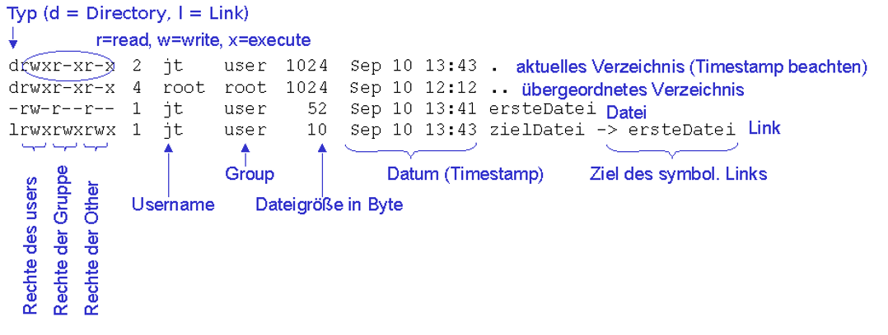

# 2.5.6 Rechte ändern

Übersicht über die Befehle auf dieser Seite  (in **fett** bedeutet prüfungsrelevant):

| Befehl | Beispiel | Beschreibung |
|--------|----------|--------------|
| umask  | `umask 022` | Setzt die Standard-Dateiberechtigungen |
| **chmod**  | `chmod 755 datei.txt` | Setzt die Berechtigungen der Datei datei.txt auf 755 |
| **chown**  | `chown user:gruppe datei.txt` | Ändert den User und die Gruppe der Datei datei.txt |

Linux ist ein Multiuser-System, was bedeutet, dass mehrere Benutzer gleichzeitig auf demselben System arbeiten können. Um die Sicherheit und Integrität des Systems zu gewährleisten, ist es wichtig, die Dateirechte und -berechtigungen korrekt zu verwalten. Dies erfolgt durch die Verwendung von Befehlen wie `umask`, `chmod` und `chown`, die es ermöglichen, die Zugriffsrechte und den Besitz von Dateien und Verzeichnissen festzulegen.

### Dateiberechtigungen

In Linux werden Dateiberechtigungen in drei Kategorien unterteilt: User, Gruppe und andere. Jede Kategorie hat drei Arten von Berechtigungen: Lesen (r), Schreiben (w) und Ausführen (x).

- **User**: Derjenige User, dem die Datei gehört.
- **Gruppe**: Eine Gruppe von Usern, die Zugriff auf die Datei haben.
- **Andere**: Alle anderen User (zu denen z.B. auch der Apache-Webserver gehört)

| Berechtigung | Symbolisch | Binär | Dezimal |
|--------------|------------|-------|---------|
| Keine        | ---        | 000   | 0       |
| Ausführen    | --x        | 001   | 1       |
| Schreiben    | -w-        | 010   | 2       |
| Schreiben, Ausführen | -wx | 011   | 3       |
| Lesen        | r--        | 100   | 4       |
| Lesen, Ausführen | r-x    | 101   | 5       |
| Lesen, Schreiben | rw-    | 110   | 6       |
| Lesen, Schreiben, Ausführen | rwx | 111   | 7       |

Erklärung der Spalten

- **Symbolisch**: Die symbolische Darstellung der Berechtigungen in Form von `r`, `w`, `x` (Lesen, Schreiben, Ausführen).
- **Binär**: Die Binärdarstellung, bei der jeder der drei Bits für eine Berechtigung steht:
  - Das erste Bit steht für Lesen (r).
  - Das zweite Bit steht für Schreiben (w).
  - Das dritte Bit steht für Ausführen (x).
- **Dezimal**: Die entsprechende Dezimalzahl, um die Berechtigungen darzustellen. 

### Beispiele für Dateiberechtigungen

- `rwxr-xr--` wird als `755` dargestellt:
    - User: `rwx` (7 in Dezimal).
    - Gruppe: `r-x` (5 in Dezimal).
    - Andere: `r--` (4 in Dezimal).

- `rw-r--r--` wird als `644` dargestellt:
    - User: `rw-` (6 in Dezimal).
    - Gruppe: `r--` (4 in Dezimal).
    - Andere: `r--` (4 in Dezimal).

Die Dateiberechtigungen in Linux bestehen also aus drei Teilen für User, Gruppe und andere. Jeder Teil kann als eine Kombination aus Lesen, Schreiben und Ausführen dargestellt werden. 

### Befehle "**umask**", "**chmod**" und "**chown**"

Der Befehl **`umask`** wird verwendet, um die Standard-Dateiberechtigungen für neue Dateien und Verzeichnisse festzulegen. 

Der Befehl **`chmod`** wird verwendet, um die Berechtigungen einer Datei oder eines Verzeichnisses zu ändern.

Der Befehl **`chown`** wird verwendet, um den User und die Gruppe einer Datei oder eines Verzeichnisses zu ändern.

**Beispiele**

- `umask 022`: Setzt die Standardberechtigungen so, dass neue Dateien mit den Berechtigungen 644 (rw-r--r--) erstellt werden.
- `chmod 755 datei.txt`: Setzt die Berechtigungen der Datei `datei.txt` auf 755 (rwxr-xr-x).
- `chmod u+rwx,g+rx,o+rx datei.txt`: Fügt Lese-, Schreib- und Ausführungsrechte für den User hinzu und Lese- und Ausführungsrechte für Gruppe und andere.
- `chown joerg:hochschule datei.txt`: Ändert den User der Datei `datei.txt` zu `joerg` und die Gruppe zu `hochschule`.
- `chown -R joerg:hochschule verzeichnis`: Ändert rekursiv den User und die Gruppe aller Dateien und Unterverzeichnisse im Verzeichnis `verzeichnis`.

### Zwei Übungen

a) Wechseln Sie in das Verzeichnis /var/www/html

1. Wem gehört die Datei "index.html"?
2. Wann wurde die Datei "index.html" erstellt?
3. Was ist der Inhalt der Datei "index.html"?
4. Wer (User oder Group) darf die Datei "index.html" ausführen?

b) Im folgenden Spiel sollen Sie die Befehle `umask`, `chmod` und `chown` anwenden, um verschiedene Aufgaben zu erfüllen. Führen Sie die Schritte in der angegebenen Reihenfolge aus und überprüfen Sie nach jedem Schritt die Berechtigungen und den Besitz der Dateien.

1. Überprüfen Sie die aktuelle umask-Voreinstellung mit dem Befehl `umask`
2. Ändern Sie `umask` auf 027.
3. Erstellen Sie eine neue Datei `spiel.txt`.
4. Überprüfen Sie die Berechtigungen der Datei `spiel.txt`.
5. Ändern Sie die Berechtigungen der Datei `spiel.txt` auf `644`.
6. Erstellen Sie ein neues Verzeichnis `spiel_verzeichnis`.
7. Überprüfen Sie die Berechtigungen des Verzeichnisses `spiel_verzeichnis`.
8. Ändern Sie den User der Datei `spiel.txt` in einen anderen Besitzer.
8. Ändern Sie die Gruppe der Datei `spiel.txt` in eine andere Gruppe.
9. Ändern Sie `umask` wieder auf 022.
