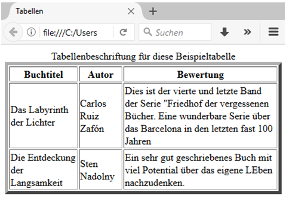

# 4.2.12 Tabellen erstellen

Tabellen sollen heutzutage ausschließlich dazu verwendet werden, um Daten oder Texte tabellarisch darzustellen. Das Grundgerüst einer Tabelle besteht, wie Sie vermutlich wissen, aus Zeilen und Spalten.

### `<table>...</table>`
Zunächst wird die Tabelle „eingeleitet“ mit dem Element `<table>`. Um später das End-Tag nicht zu vergessen, schreiben Sie es am besten gleich dahinter und beginnen anschließend mit dem Schreiben der Zeilen dazwischen. Mit dem Attribut `border=...` lässt sich die Größe der Rahmenlinien festlegen, beispielsweise `<table border="5">`.

### `<caption>...</caption>` Tabellenbeschriftung
Wie auch in normalen Dokumenten ist es sinnvoll, Tabellen eine Beschriftung mitzugeben. Die Beschriftung wird definiert durch das Element `<caption>(...)</caption>`, die direkt nach dem `<table>`-Tag folgen muss und eine Beschriftung über der Tabelle erzeugt.
Um die Beschriftung unter der Tabelle zu platzieren, fügen Sie das Attribut `align="bottom"` ein: `<caption align="bottom">`.

### `<th>...</th>` (table header)
Diese stehen für eine Art Überschriftsspalte (`th` = table header). Der Text darin wird als Spaltenüberschrift gehandhabt und dementsprechend formatiert. Sie müssen eine Tabelle jedoch nicht zwingend mit Spaltenüberschriften versehen.

### `<tr>...</tr>` (table row)
Hiermit wird eine neue Tabellenzeile (`tr` = table row) begonnen, die Sie nun mit beliebig vielen Spalten (`td` = table data) füllen können, indem Sie entsprechend viele `<td>`-Elemente einfügen. Um eine neue Zeile zu beginnen, schließen Sie das `<tr>`-Tag und öffnen Sie ein neues.

### `<td>...</td>` (table data)
Mit `<td>` werden die Daten der Tabelle eingefügt. Die Informationen sind beliebig, es können Texte, Bilder oder auch neue Tabellen sein.


### Beispiel einer Tabelle

```html linenums="1"
<!doctype html>												
<html lang="de">
<head>
    <title>Tabellen</title>
    <meta charset="utf-8">
    <meta name="author" content="JT">
</head>

<body>
    <table border="5">
    <caption>Tabellenbeschriftung für diese Beispieltabelle</caption>
      <tr>
        <th>Buchtitel</th>
        <th>Autor</th>
        <th>Bewertung</th>
      </tr>
      <tr>
        <td>Das Labyrinth der Lichter</td>
        <td>Carlos Ruiz Zafón</td>
        <td>Dies ist der vierte und letzte Band der Serie "Friedhof der vergessenen Bücher". 
          Eine wunderbare Serie über das Barcelona des letzten Jahrhunderts.</td>
      </tr>
      <tr>
        <td>Die Entdeckung der Langsamkeit</td>
        <td>Sten Nadolny</td>
        <td>Ein sehr gut geschriebenes Buch mit viel Potential 
          über das eigene Leben nachzudenken.</td>
      </tr>
    </table>
</body>
</html>
```



Beachten Sie, dass jede Zeile die gleiche Anzahl Spalten haben sollte, damit es im Browser nicht zu Darstellungsfehlern kommt. Oder Sie können Zeilen und Spalten miteinander verbinden.

!!! note
    Die Elemente `<th>`, `<tr>` und `<td>` sind "self-closing" und somit kann das abschließende Tag entfallen. Dies macht den Tabellen-Sourcecode übersichtlicher, ist aber für viele HTML-Profis noch ungewohnt.

    ```html linenums="1"
    <table border="5">
      <caption>Tabellenbeschriftung für diese Beispieltabelle</caption>
      <tr>
        <th>Buchtitel
        <th>Autor
        <th>Bewertung
      <tr>
        <td>Das Labyrinth der Lichter
        <td>Carlos Ruiz Zafón
        <td>Dies ist der vierte ...
      <tr>
        <td>Die Entdeckung der Langsamkeit
        <td>Sten Nadolny
        <td>Ein sehr gut geschriebenes Buch ...
    </table>
    ```

### Zeilen oder Spalten verbinden

Sie können entweder Zeilen, Spalten oder beides gleichzeitig verbinden. 
Um Zeilen zu verbinden, benötigen Sie das HTML-Attribut `rowspan`, das Sie als Attribut hinter die erste zu verbindende Zelle (nicht Zeile!) setzen.

```html linenums="1"
<td rowspan="Anzahl der zu verbindenden Zellen" >(...)</td>
```

Um Spalten zu verbinden müssen Sie mit der Eigenschaft `colspan` arbeiten. Auch diese wird als Attribut hinter die erste zu verbindende Zelle angefügt.

```html linenums="1"
<td colspan="Anzahl der zu verbindenden Zellen" >(...)</td>
```

Um sowohl Zeilen als auch Spalten zu verbinden, setzen Sie einfach beide Attribute hinter die Zelle. Wichtig ist, die Zeilen, die Sie verbinden wollen, nur einmal in der Tabelle aufzuführen.

### Tabellengestaltung
Sie haben, genau wie bei der gesamten Website, auch bei einer Tabelle eine ganze Reihe an Gestaltungsmöglichkeiten. Sie können den Außen- und Innenabstand definieren, die Schrift innerhalb der Tabelle, oder die Ausrichtung der Zeilen. Sie können der Tabelle auch einen Rahmen oder einen Hintergrund geben. Standardmäßig besitzt eine Tabelle weder Rahmen noch Zwischenlinien.

Allerdings sollten die gestalterischen Formatierungen auch hier mit Hilfe von CSS durchgeführt werden. Wie genau Sie Tabellen mit CSS formatieren können, erfahren Sie im entsprechenden Kapitel von [selfhtml.org](https://wiki.selfhtml.org/wiki/CSS/Eigenschaften/Tabellenformatierung). Da die Gestaltung sehr umfangreich werden kann und nur selten benötigt wird, wird sie in diesem Modul nicht vertieft.

!!! info
    Es gibt für Tabellen noch weitere Elemente: `<thead>`, `<tbody>`, `<tfoot>`, `<col>` und `<colgroup>` auf die nicht weiter eingegangen wird, da das Ziel des Moduls im Verständnis für HTML und nicht in der vollständigen Behandlung aller HTML-Elemente liegt.
