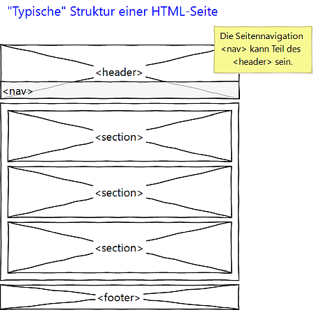

# 4.2.1 HTML Seitenstruktur

Jedes HTML-Dokument sollte sinnvoll strukturiert werden. Hier lernen wir die ersten Elemente zur Strukturierung kennen: `header`, `section` und `footer` als Hauptstrukturelemente sowie `nav` als weiteres Strukturelement.

Viele Webseiten beginnen mit einem Header-Bereich und haben im unteren Teil des Headers die Seitennavigation. Anschließend folgt der Hauptteil mit einzelnen Abschnitten. Am Ende steht der Footer. Die Abbildung veranschaulicht den "typischen" Aufbau. 



In unserem HTML-Grundgerüst sieht dies wie folgt aus. 

```html linenums="1"
<!doctype html>
<html lang="de">
<head>
    <!-- Hier können Meta-Daten und Titel eingefügt werden -->
</head>

<body>
    <header>
        <!-- hier mein Logo und mein Motto -->
        <nav>
            <!-- meine Navigation -->
        </nav>
    </header>

    <section>
        <!-- mein 1. Inhalt -->
    </section>

    <section>
        <!-- mein 2. Inhalt -->
    </section>

    <section>
        <!-- mein 3. Inhalt -->
    </section>

    <footer>
        <!-- jede Seite hat ein Ende -->
    </footer>
</body>
</html>
```

**Regeln**

- Ein `header`, mehrere `section` und ein `footer` sind eine typische Struktur, die man verwenden sollte, sofern Sie keine zwingenden Gründe haben, hiervon abzuweichen.

- `nav` ist in vielen Webseiten ein Element im `header`. Aber `nav` kann öfters vorkommen, beispielsweise für eine Unternavigation.

!!! warning "Wichtig!"
    Der Aufbau einer HTML-Seite beginnt immer mit der Planung des darzustellenden Inhalts. Überlegen Sie sich erst den Inhalt und dann die Struktur!
