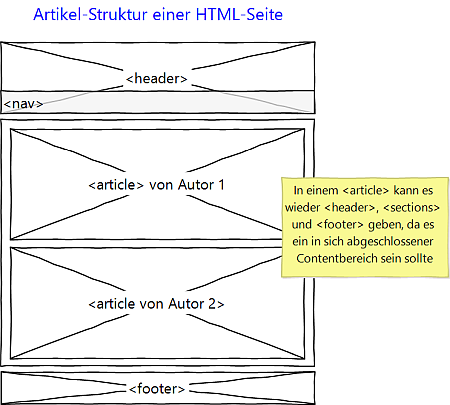

# 4.2.2 HTML Seitenstruktur (Fortsetzung)

Ein weiteres Strukturelement ist `article`. Es ist eine Alternative zu `section` und wird oft für in sich abgeschlossene Beiträge verwendet. In Internetbeiträgen finden Sie viele, teilweise kontroverse Meinungen, wann man `<article>` und wann man `<section>` verwenden sollte. 

**Regeln**

- `<article>` kann sinnvoll eingesetzt werden, wenn es sich um einen in sich abgeschlossenen Beitrag handelt. Also beispielsweise, wenn ein Autor für diesen Beitrag angegeben werden kann.

- `<section>` kann innerhalb von `<article>` vorkommen. Ein Artikel hätte dann verschiedene Abschnitte, was leicht einleuchtet. Ja sogar `<header>` und `<footer>` sind innerhalb von `<article>` gut denkbar.

- Es wäre eventuell auch denkbar, dass `<article>` innerhalb von `<section>` vorkommt. Dies ist in einer sehr komplexen, langen Seite denkbar. Beispielsweise wenn man eine Section "Weltpolitik" hat und darin verschiedene Artikel vorkommen und dann eine Section "Kultur" mit wiederum zugehörigen Artikeln, dann ist eine solche Struktur sinnvoll.
