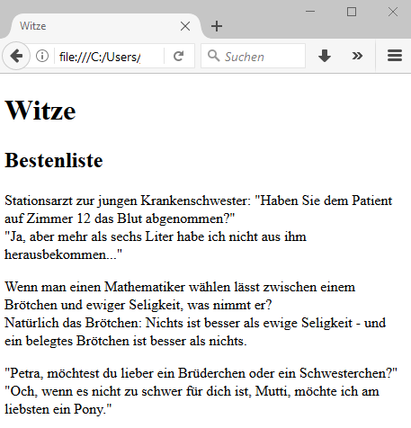

# 4.2.4 HTML Struktur - Kommentare, Zeilenumbrüche und Absätze

### Kommentare `<!-- ... -->`

Wie bei einer jeden guten Programmierung, sind auch in HTML Kommentare sinnvoll. Sie helfen ein Dokument zu strukturieren und zu dokumentieren. Kommentare sind in der normalen Browseransicht nicht sichtbar. 

```html
<section>
    <p>Ein Beispieltext mit <br> und Kommentaren.</p>
    <!-- Dies ist ein Kommentar -->
    
    <!-- Kommentare können einzeilig sein
    oder über mehrere Zeilen gehen -->
</section>
```

!!! note
    Innerhalb eines Kommentars sollten keine Minuszeichen verwendet werden, da bereits die Zeichenfolge "--" einen Kommentar beendet.


### Zeilenumbrüche `<br>` (br wie break)
Ein Zeilenumbruch wird durch `<br>` erreicht.

### Absätze `<p>...</p>` (p wie paragraph)
Für Absätze innerhalb eines Textes.

Im `<p>`-Element dürfen keine anderen "Block-Elemente" wie Überschriften, Tabellen oder Listen enthalten sein. 

```html linenums="1"
<!doctype html>
<html lang="de">
<head>
    <title>Witze</title>
    <meta charset="utf-8">
    <meta name="author" content="JT">
</head>

<body>
    <header>
        <h1>Witze</h1>
        <nav>
            <!-- es gibt noch keine Navigation -->
        </nav>
    </header>

    <section>
        <h2>Bestenliste</h2>
        <p>Stationsarzt zur jungen Krankenschwester: "Haben Sie 
        dem Patienten auf Zimmer 12 das Blut abgenommen?"<br>
        "Ja, aber mehr als sechs Liter habe ich nicht aus ihm
        herausbekommen..."</p>

        <p>Wenn man einen Mathematiker wählen lässt zwischen 
        einem Brötchen und ewiger Seligkeit, was nimmt er?<br> 
        Natürlich das Brötchen: Nichts ist besser als ewige 
        Seligkeit - und ein belegtes Brötchen ist besser als 
        nichts.</p>

        <p>"Petra, möchtest du lieber ein Brüderchen 
        oder ein Schwesterchen?" <br>
        "Och, wenn es nicht zu schwer für dich ist, 
        Mutti, möchte ich am liebsten ein Pony."</p>
    </section>
</body>
</html>
```

In der Browseransicht



