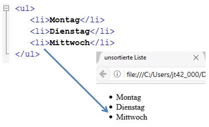
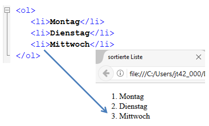

# 4.2.5 HTML Struktur - Listen

**Listen** `<ul>...</ul>`,  `<ol>...</ol>` 
Listen bieten eine Möglichkeit zur strukturierten Darstellung. Es gibt Aufzählungslisten (`ul` = unordered list) und nummerierte Listen (`ol` = ordered list).

## Aufzählungslisten - `ul` = unordered list

Aufzählungslisten werden alle Listeneinträge mit – wie der Name schon sagt – einem Aufzählungszeichen versehen, dass Sie im CSS-Stylesheet anpassen können. 

**Beispiel für eine unnummerierte Liste**

---

## Nummerierte Listen - `ol` = ordered list

Bei nummerierten Listen werden die Aufzählungszeichen durch Zahlen ersetzt. Sie können im CSS-Stylesheet aber die Art bestimmen und beispielsweise römische Ziffern oder Buchstaben verwenden oder diese direkt in Attributen festlegen. 

**Beispiel für eine nummerierte Liste**

Wie bei allen HTML-Elementen wird ohne CSS eine Standardformatierung des Browsers verwendet, die je nach Browser und Endgerät abweicht. In der Abbildung ist eine geschachtelte Aufzählung zu sehen (oben: Mozilla Firefox; unten Microsoft Edge). 

Die Nummerierung der Listen erfolgt automatisch. Manchmal möchte man auf die Numerierung aber Einfluss nehmen, beispielsweise um eine Liste absteigend zu nummerieren oder um nach einer Unterbrechung der Liste die Nummerierung fortzusetzen. Hierzu können die folgenden Attribute verwendet werden. 

| Beispiel               | Beschreibung                               |
|------------------------|-------------------------------------------|
| `<ol start="5">`       | Die Aufzählung beginnt bei "5".            |
| `<ol type="A">`        | Aufzählung erfolgt mit Großbuchstaben.     |
| `<ol reversed>`        | Absteigende Aufzählung.                    |
| `<li value="3">`       | Der aktuelle Eintrag erhält den Wert "3"   |

