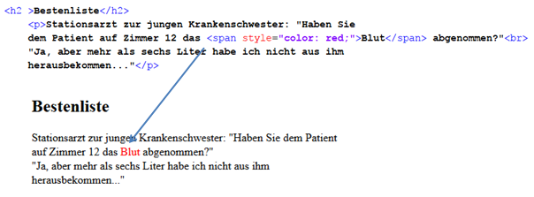

# 4.2.6 HTML Struktur - Elemente für Formatierungen

Die Elemente `
` und `` werden eingesetzt, um die entsprechenden CSS-Formatierungen aufzurufen. Wie wir später sehen werden, enthält eine CSS-Datei einzelne Abschnitte, die beispielsweise über die Attribute `id="..."` oder `class="..."` angesprochen werden. Die Attribute werden also in die HTML-Tags geschrieben und rufen dann den entsprechenden Abschnitt in der CSS-Datei auf. Somit wurden die beiden Elemente `
` und `` geschaffen, damit die Attribute eingebunden werden können. Eine weitere Funktion haben die Elemente nicht.

### `
`
Das Block-Element `
` ist vergleichbar mit dem Absatz-Element `
`. Es erstellt im Prinzip einen eigenen Abschnitt und dient ansonsten der Formatierung. Auch wenn das `
`-Element oft eingesetzt wird, **rät das W3C von seiner Benutzung ab**, da die entsprechenden CSS-Formatierungen auch aus anderen Elementen aufgerufen werden können und semantisch interpretierbar sind.

> Authors are strongly encouraged to view the `
` element as an element of last resort, for when no other element is suitable. Use of more appropriate elements instead of the `
` element leads to better accessibility for readers and easier maintainability for authors. [(W3C source)](https://www.w3.org/TR/html51/grouping-content.html#the-div-element)

### ``
Das Inline-Element `` kann Text oder andere Inline-Elemente enthalten, hat ansonsten allerdings keine Eigenschaften. `` kann mitten im Text stehen und bewirkt einfach gar nichts. Es hat nur die Aufgabe, dass z.B. Formatierungen für einzelne Textabschnitte gewählt werden können.

Anders als im Beispiel beschrieben, sollte in `` keine direkte Formatierung angegeben werden, sondern ein `id`- oder `class`-Attribut aufgerufen werden, und die Formatierung steht dann im zugehörigen Abschnitt der CSS-Datei.

### Universalattribute
Universalattribute sind solche Attribute, die in den meisten HTML-Tags erlaubt sind. Sie beschreiben z.B. eine individuelle Bezeichnung eines HTML-Elements. Die universalen Attribute werden wie andere Attribute im HTML-Tag definiert und sind **sehr nützlich**.

- **class** – zeigt, dass das HTML-Tag zu mindestens einer **Stylesheet-Klasse** gehört (mehr dazu im Kapitel CSS).
- **id** – eine **eindeutige Bezeichnung** (id) für Elemente, sodass diese per CSS formatiert und per JavaScript angesprochen werden können.
- **style** – erlaubt individuelle CSS-Formatierung.
- **title** – stellt den eingegebenen Text als **Tooltip** dar.
