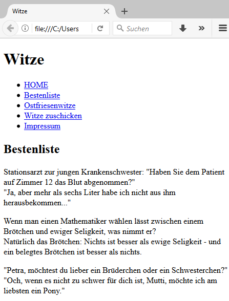

# 4.2.7 Links und Anker im HTML-Dokument

Warum sind Webseiten nach ihrer "Erfindung" eigentlich so erfolgreich geworden?  
Es sind die Verweise (Links und Anker), die anstelle des linearen Dokumentenaufbaus (z. B. in Print-Büchern) nun beliebige Hin- und Rücksprünge zuliesen und damit ein browsen (engl. to browse = durchstöbern) ermöglichten.

Verweise benötigen wir für die "Sprünge" innerhalb einer HTML-Seite als **Anker**, zur **Navigation in der eigenen Website** oder als **Links zu anderen Angeboten**. In allen Fällen ist ein **guter Verweistext wichtig** (=angezeigter Linktext). Dieser sollte kurz und knapp gehalten sein und gleichzeitig das Ziel gut beschreiben.

### Links
Links haben, egal ob als echter Link oder als Anker immer folgende Struktur:
```html
<a href="Pfad zum Ziel" target="Zielfenster">Angezeigter Linktext</a>
```

Das Attribut `target` ist dabei optional. Wird es nicht angegeben, wird der Link im gleichen Fenster geöffnet. Das `target`-Attribut bestimmt, wo das Ergebnis nach dem Anklicken des Links angezeigt wird.

**Mögliche Werte**

- **`_self`**: Öffnet das Ergebnis im gleichen Fenster oder Tab (Standardverhalten).

- **`_blank`**: Öffnet das Ergebnis in einem neuen Fenster oder Tab.

- **`_parent`**: Öffnet das Ergebnis im übergeordneten Frame.

- **`_top`**: Öffnet das Ergebnis im obersten Frame des Fensters.


**Absolute und relative Pfade**

- **absolute Links**, z. B. `href="https://www.thomaschewski.de/publikationen/index.html"` verweisen auf externe Angebote
- **relative Links** `href="index.html"` werden innerhalb der Website für die interne Verlinkung genutzt.

!!! note "Expertenwissen"
    - Über das Attribut `ping` ist es möglich, dass das Anklicken eines Links zusätzlich eine andere Webseite benachrichtigt. Dies kann für ein User-Tracking verwendet werden:  
    `<a href="Pfad zum Ziel" ping="TrackingLink">Text</a>`
    - Mit dem Attribut `type` kann ein Linktype (z. B. `type="video/mp4"`) angegeben und so ein Mime-Type übergeben werden, der beispielsweise einen Download oder ein externes Programm startet. Dies ist für alle Nicht-HTML-Linkziele gut.

### Anker
Anker sind Verweise innerhalb eines HTML-Dokumentes, mit denen Sie auf einer HTML-Seite z. B. weiter nach unten „springen“ können, ohne zu scrollen. Anker können aber auch auf ein anderes HTML-Dokument verweisen. Klickt man einen solchen Anker an, öffnet sich das andere Dokument automatisch an der Stelle, auf die der Anker verwiesen hat.

**Anker definieren** - Innerhalb einer HTML-Datei müssen zuerst Anker als **Verweis-Ziel** definiert werden. Es kann zu einem beliebigen Element gesprungen werden, wenn der Anker mit dem Attribut `id` als Verweis-Ziel verwendet wird:
```html
<h1 id="NameDesAnkers">Witze</h1>
```

Den Namen können Sie frei wählen, vergeben Sie aber möglichst kurze und prägnante Namen. Der Name erscheint zwar nicht in der Darstellung des Dokumentes, Sie benötigen ihn allerdings um den Link zu definieren.

**Anker "anspringen"** - Wenn das Verweis-Ziel definiert ist, dann kann diese wie folgt angesprungen werden:
```html
<a href="#NameDesAnkers">...</a>
```

Lediglich der Wert hinter `href` ist anders als bei normalen Links, da hier ein Rautezeichen (#) gefolgt vom Ankernamen verwendet wird.

### E-Mail-Verweise
Es ist möglich, in einem Link eine E-Mail Adresse anzugeben. Dazu müssen Sie dem Attribut `href` folgenden Wert zuweisen:
```html
<a href="mailto:E-Mail-Adresse">...</a>
```

Wenn ein Besucher auf diesen Link klickt, öffnet sich automatisch sein E-Mail Programm mit der eingegebenen Adresse als Empfänger.

Diese Methode hat jedoch einen Nachteil: viele Privatpersonen rufen ihre E-Mails nicht über ein Programm, sondern online ab. Der Link funktioniert dann nicht richtig. Sie sollten sich daher überlegen, ob Sie zusätzlich ein Kontaktformular anbieten.

Ein weiterer Nachteil ist: Wenn Sie Ihre E-Mail-Adresse in solch einem Link „verstecken“, findet der Benutzer diese zwar schnell, Spam-Bots, die auf der Suche nach E-Mail-Adressen sind, jedoch ebenso schnell. Sie sollten Ihre Adresse daher verstecken oder verschlüsseln. Dazu gibt es bereits vorgefertigte JavaScript-Funktionen.

!!! example
    In diesem Beispiel wurde die Witze-Seite um eine einfache Navigation ergänzt.

    ```html linenums="1"
    <body>
        <header>
            <h1>Witze</h1>
            <nav>
                <ul>
                    <li><a href="index.html">HOME</a></li>
                    <li><a href="topwitze.html">Bestenliste</a></li>
                    <li><a href="ostfriesen.html">Ostfriesenwitze</a></li>
                    <li><a href="formular.html">Witze zuschicken</a></li>
                    <li><a href="impressum.html">Impressum</a></li>
                </ul>
            </nav>
        </header>
        <section>
            <h2>Bestenliste</h2>
            <p>Stationsarzt zur jungen Krankenschwester: "Haben Sie dem Patient auf Zimmer 12 das Blut abgenommen?"<br>
            "Ja, aber mehr als sechs Liter habe ich nicht aus ihm herausbekommen..."</p>
    ...
    ```

    So sieht das Beispiel im Browser aus. Die Listenstruktur ist gut erkennbar und die Formatierung erfolgt später mittels CSS.

    


## Best Practices für Links und Anker in HTML


1. **Verwendung des `id`-Attributs für Anker:**
    Nutzen Sie das `id`-Attribut, um Anker innerhalb eines Dokuments zu definieren. Dies verbessert die Semantik und Zugänglichkeit des Codes.
    ```html 
    <h2 id="kontakt">Kontakt</h2>
    ```

    Um zu diesem Anker zu verlinken, verwenden Sie:
    ```html 
    <a href="#kontakt">Zum Kontaktbereich</a>
    ```

2. **Aussagekräftige Linktexte verwenden:**
    Gestalten Sie Links so, dass sie den Zweck des Links klar beschreiben. Vermeiden Sie generische Texte wie "Hier klicken" oder "Mehr erfahren". Stattdessen sollten Sie präzise und beschreibende Texte verwenden, die dem Nutzer den Inhalt des verlinkten Ziels vermitteln.

    ```html linenums="1"
    <a href="#kontakt">Kontaktieren Sie uns</a>
    ```

3. **Verwendung des `rel`-Attributs bei externen Links:**
    Bei Links zu externen Websites sollten Sie das `rel`-Attribut mit dem Wert `noopener noreferrer` verwenden, um die Sicherheit zu erhöhen und die Leistung zu verbessern. Dies verhindert, dass die verlinkte Seite Zugriff auf das `window.opener`-Objekt hat und schützt vor potenziellen Sicherheitslücken.

    ```html 
    <a href="https://www.abc.de" target="_blank" rel="noopener noreferrer">
        Externe Website
    </a>
    ```

4. **Verwendung von `mailto:`-Links mit Vorsicht:**
    Obwohl `mailto:`-Links es Nutzern ermöglichen, direkt eine E-Mail zu senden, können sie von Spam-Bots ausgelesen werden. Um Ihre E-Mail-Adresse vor automatisierten Programmen zu schützen, sollten Sie alternative Methoden wie Kontaktformulare in Betracht ziehen oder JavaScript-basierte Lösungen verwenden, um die E-Mail-Adresse zu verschleiern.

    ```html linenums="1"
    <a href="mailto:info@example.com">E-Mail senden</a>
    ```

    **Hinweis:** Es gibt auch JavaScript-basierte Methoden, um E-Mail-Adressen zu verschleiern und so vor Spam zu schützen. Eine einfache Methode ist die Verwendung von JavaScript, um die E-Mail-Adresse zusammenzusetzen:

    ```JavaScript linenums="1"
    <script>
        var user = 'info';
        var domain = 'example.com';
        var link = document.createElement('a');
        link.href = 'mailto:' + user + '@' + domain;
        link.innerHTML = 'E-Mail senden';
        document.body.appendChild(link);
    </script>
    ```

    Diese Methode erschwert es Spam-Bots, die E-Mail-Adresse zu extrahieren, da sie nicht im Klartext im HTML-Code vorhanden ist.

