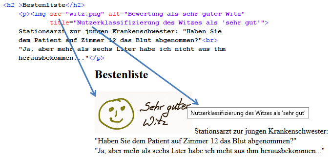

# 4.2.8 Grafiken einbinden

Grafiken sind für jede Website wichtig. Sie können Sachverhalte veranschaulichen oder einfach die Website attraktiver gestalten.

Die gängigsten Grafikformate für Pixelgrafiken sind `*.png`, `*.jpg` und `*.gif`. Zwar ist die Bandbreite des Internets heute wesentlich größer als früher, doch auch heute sind längere Ladezeiten lästig, gerade auf mobilen Endgeräten, wenn unterwegs die Bandbreite dann doch nicht so hoch ist. Einzubindende Grafiken sollten vor der Einbettung hinsichtlich der Datei- und Bildgröße optimiert werden. Grafiken, die feine Details enthalten, beispielsweise Linien oder kleine Symbole, sollten in PNG gespeichert werden. Für Fotos ist JPEG besser geeignet.


Um eine Grafik in eine Seite einzubinden, verwenden Sie das Element ``.

```html linenums="1"

```

```html linenums="1"

```

!!! note
    Das ``-Element dient zur Einbindung von einzelnen Bildern in die HTML-Seite. Ein Hintergrund-Bild in die gesamte Seite wird mit CSS `background-image` eingebunden.

## Attribute

Die Attribute im Zusammenhang mit dem ``-Tag sind:


| Attribut       | Beschreibung                                                                                                 |
|----------------|-------------------------------------------------------------------------------------------------------------|
| `src`          | (Pflichtattribut) Gibt die Quelle (den Pfad) zum Bild an.                                                   |
| `alt`          | Definiert einen Alternativtext, der angezeigt wird, wenn das Bild nicht geladen werden kann oder von Screen-Readern vorgelesen wird. |
| `title`        | Zeigt einen Tooltip an, wenn der Benutzer mit der Maus über das Bild fährt.                                  |
| `width`        | Gibt die Breite des Bildes in Pixeln an. Mit diesem Attribut kann der Browser die Seite schneller rendern, da er die Bildgröße vorab kennt. |
| `height`       | Gibt die Höhe des Bildes in Pixeln an. Ähnlich wie `width` hilft dieses Attribut, die Seite vorab zu gestalten.|
| `srcset`       | Ermöglicht es, verschiedene Bildgrößen für unterschiedliche Bildschirmauflösungen und -größen bereitzustellen. |
| `sizes`        | Gibt an, wie groß das Bild in verschiedenen Layouts angezeigt werden soll.                                   |
| `loading="lazy"`| Verzögert das Laden des Bildes, bis es im sichtbaren Bereich des Viewports erscheint.                       |


## Ausrichtung der Grafik

Das Element `` erzeugt keine neue Zeile im Textfluss (= inline-Element). Grafiken lassen sich mit Hilfe von CSS horizontal und vertikal ausrichten. Außerdem lässt sich mit CSS bestimmen, wie der umliegende Text die Grafik umfließen soll und welche Abstände zu anderen Elementen vorhanden sein sollen.

## Grafiken als Links

Grafiken können sehr einfach als Links dienen. Anstelle es Link-Textes wird die Grafik eingebunden.

```html linenums="1"
<a href="Pfad zum Ziel">
  
</a>
```

!!! note
    Man kann auch externe Bilder einfügen, wenn im `src`-Attribut die absolute URL angegeben wird. Aber Vorsicht, dann ist die Grafik von einem anderen Server abhängig und man muss sicherstellen, dass die Grafik an der angegebenen Stelle auch vorhanden ist. Außerdem sollte man wie bei allen eingesetzten Grafiken auch dann die entsprechenden Rechte an der Grafik besitzen.

!!! note
    Es lassen sich sogar klickbare Image-Maps erstellen, sodass unterschiedliche Bereiche der Grafik mit verschiedenen Links versehen sind. Mehr dazu finden Sie bei [selfhtml](https://wiki.selfhtml.org/wiki/HTML/Multimedia_und_Grafiken/verweissensitive_Grafiken)

## Responsive Images mit `srcset` und `sizes`

Um Bilder auf verschiedenen Geräten und Bildschirmgrößen optimal darzustellen, können die Attribute `srcset` und `sizes` im ``-Tag verwendet werden. Mit `srcset` geben Sie dem Browser verschiedene Bildquellen an, aus denen er die passende auswählen kann. Das `sizes`-Attribut definiert, wie groß das Bild im Layout angezeigt wird, sodass der Browser die optimale Bildgröße basierend auf der Bildschirmauflösung und dem Layout auswählen kann.

```html linenums="1"

```

In diesem Beispiel:

- `srcset` listet verschiedene Bildgrößen mit ihren jeweiligen Breitenangaben auf.
- `sizes` gibt an, dass bei einer maximalen Bildschirmbreite von 600 Pixeln das Bild die volle Breite des Viewports einnehmen soll (`100vw`), andernfalls eine Breite von 800 Pixeln.

Diese Technik ermöglicht es dem Browser, das am besten geeignete Bild basierend auf der aktuellen Bildschirmgröße und dem Layout auszuwählen, was die Ladezeiten optimiert und die Benutzererfahrung verbessert.

## Lazy Loading von Bildern

Um die Ladezeiten der Seite zu verbessern, können Bilder erst dann geladen werden, wenn sie im sichtbaren Bereich des Viewports erscheinen. Dies wird als Lazy Loading bezeichnet. Seit HTML5 gibt es das `loading`-Attribut für das ``-Tag, mit dem Sie das Verhalten des Bildlades steuern können.

```html linenums="1"

```

Das `loading="lazy"`-Attribut weist den Browser an, das Bild erst zu laden, wenn es in den sichtbaren Bereich des Viewports kommt. Dies reduziert die anfängliche Ladezeit der Seite und spart Bandbreite, insbesondere auf mobilen Geräten oder langsamen Verbindungen.

**Hinweis:** Nicht alle Browser unterstützen das `loading`-Attribut. Daher ist es wichtig, die Kompatibilität zu überprüfen und gegebenenfalls Fallback-Lösungen zu implementieren.

## Barrierefreiheit und automatische Auswertbarkeit von Bildern

Die Barrierefreiheit von Bildern ist ein wichtiger Aspekt, damit alle Benutzer:innen (einschließlich Menschen mit visuellen Einschränkungen) die Inhalte interpretieren können. Auch Suchmaschinen sind 'blind' und benötigen eine sinnvolle Beschreibung des Bildes. Das `alt`-Attribut im ``-Tag sollte somit genutzt werden, um eine inhatliche Beildbeschreibung vorzunehmen. Das `alt`-Attribut sollte somit eine präzise und aussagekräftige Beschreibung des Bildinhalts enthalten. 

```html linenums="1"

```


**Beispiele für Alternativtexte:**

- Für ein Bild eines Hundes: `alt="Brauner Hund läuft im Park"`
- Für ein Bild eines Schreibtisches: `alt="Holzschreibtisch mit Laptop und Notizbuch"`

Durch die Anwendung dieser modernen Praktiken stellen Sie sicher, dass Ihre Webseite sowohl schnell lädt als auch für alle Nutzer zugänglich ist.
```