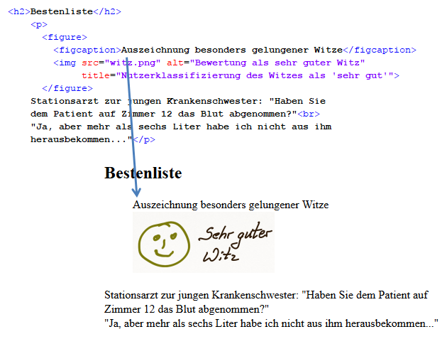

# 4.2.9 Die Elemente figure und figcaption nutzen

Um Grafiken (oder andere multimediale Elemente) sauber einzubinden, sollten Sie die Abbildungen auch immer beschreiben. Für die Beschreibung wird das Element `<figcaption>...</figcaption>` verwendet.

Damit klar wird, zu welcher Abbildung die Beschreibung gehört, werden `<figcaption>` und `` zu einer Abbildung zusammengefügt. Dies erfolgt mit dem Element `<figure>...</figure>`.

Sehen wir uns das Beispiel nochmals mit `<figcaption>` und `<figure>` an.

- Abbildungen mit einem beschreibbaren Inhalt (also Grafiken, Balkendiagramme etc.) sollten immer eine Beschreibung mit `<figcaption>` bekommen. Dann ist immer auch das Element `<figure>` einzusetzen.
- Fotos zur "Verschönerung der Webseite" sowie Bilder für Buttons etc. werden ohne `<figure>` und `<figcaption>` eingebunden.
- Die Abbildungsbeschreibung erfolgt in einer anderen Schrift als der Fließtext, und die Formatierung der Abbildungsbeschreibung wird wieder mit CSS vorgenommen.

!!! tip "Setzen Sie Grafiken richtig ein!"
    Jeder, der keine virtuelle Galerie seiner Kunstwerke im hochauflösenden Format erstellt, sollte davon absehen, zu viele große Bilder zu verwenden. Grafiken sind auf einer Website sehr wichtig für das Gesamtbild. Zu viele, und zusätzlich nichtssagende und grelle Grafiken verkürzen eher den Aufenthalt auf der Seite. Prüfen Sie also, ob das Bild, das Sie gerade eingefügt haben, wirklich notwendig ist. Anschließend überprüfen Sie, ob es die richtige Größe hat und seine Platzierung gelungen scheint. Wenn dies alles gegeben ist, dann überlegen Sie, ob die Grafik eine aussagekräftige Beschreibung mit `<figcaption>` bekommen sollte. .
