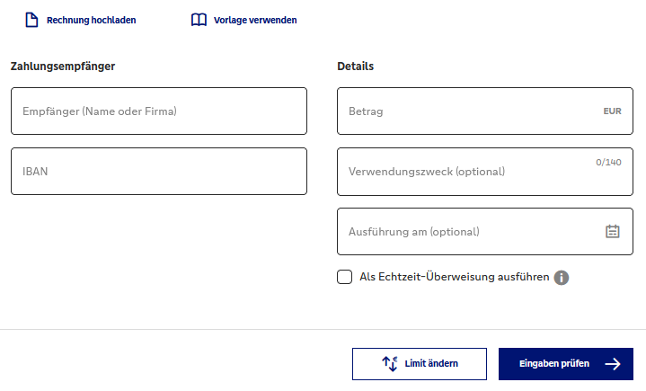

# 4.3.1 Formulare erstellen

Mit Onlineformularen sind Sie mit Sicherheit schon oft in Berührung gekommen: Kontaktformulare, Bestellungen mit Adresseingabe, Upload von Bildern, Überweisungen, und so weiter.



Wie Sie solche Formulare selbst erstellen können und wie es funktioniert, dass das, was Sie als Benutzer in ein Formular eingeben, beim Empfänger ankommt, wird nun erklärt.

### Formulare definieren

Formulare haben meist einen gleichen Grundaufbau: es gibt Eingabefelder, Felder für mehrzeiligen Text, Listen zum Auswählen und natürlich immer einen Button zum Absenden der Daten. Ein Formular wird generell eingeleitet mit `<form>(...)</form>`, dazwischen stehen alle HTML-Elemente, die zum Formular gehören. Allerdings sind hier auch Elemente wie Überschriften oder Textabsätze erlaubt.

```html linenums="1"
<form action="datenverarbeitung.php" method="get">
  <!-- hier folgen die Formularelemente -->
</form>
```

Das Attribut `action` im `<form>`-Tag gibt an, wohin die Daten nach dem Absenden übertragen werden sollen (dazu später mehr). Das zweite Attribut `method` beschreibt die Art der HTTP-Methode, mit der die Daten zwischen Client und Web-Server übertragen werden. Wird dort der Wert `get` eingesetzt, hängt der Browser die Daten als Parameter an die Zieladresse, beim Wert `post` werden die Daten im HTTP-Body verschickt.

Hier ist eine Tabelle der Attribute des HTML-`<form>`-Tags:

| Pflicht-Attribute         | Beschreibung                                                                                     |
|------------------|--------------------------------------------------------------------------------------------------|
| **`action`**         | Definiert die URL, an die die Formulardaten gesendet werden sollen.                              |
| **`method`**         | Gibt die HTTP-Methode an, die beim Senden des Formulars verwendet wird. Mögliche Werte sind `get`, `post` und `dialog`. Mit `get` und `post` werden die Daten an die in `action` angegebenen URL gesendet. Mit `dialog` werden die Daten nicht an den Server, sondern Browserintern an ein zugehöriges JavaScript-Programm gesendet.


| weitere Attribute         | Beschreibung                                                                                     |
|------------------|--------------------------------------------------------------------------------------------------|
| `accept-charset` | Gibt die Zeichencodierungen an, die beim Senden des Formulars verwendet werden sollen.           |
| **`autocomplete`**   | Legt fest, ob das automatische Ausfüllen von Formularfeldern aktiviert (`autocomplete="on"`) oder deaktiviert (`autocomplete="off"`) ist. |
| `enctype`        | Bestimmt, wie die Formulardaten beim Senden kodiert werden. Gültige Werte sind `application/x-www-form-urlencoded`, `multipart/form-data` und `text/plain`. |
| `name`           | Definiert den Namen des Formulars.                                                                |
| `novalidate`     | Ein Boolean-Attribut, das angibt, dass die Formulardaten beim Absenden nicht validiert werden sollen. |
| `rel`            | Gibt die Beziehung zwischen dem aktuellen Dokument und der verlinkten Ressource an.               |
| **`target`**         | Bestimmt, wo die Antwort nach dem Absenden des Formulars angezeigt wird. Mögliche Werte sind `_self`, `_blank`, `_parent`, `_top` und der Name eines Browsing-Kontexts. |


Das `target`-Attribut bestimmt, wo das Ergebnis nach dem Absenden des Formulars angezeigt wird.

**Mögliche Werte**

- **`_self`**: Öffnet das Ergebnis im gleichen Fenster oder Tab (Standardverhalten).

- **`_blank`**: Öffnet das Ergebnis in einem neuen Fenster oder Tab.

- **`_parent`**: Öffnet das Ergebnis im übergeordneten Frame.

- **`_top`**: Öffnet das Ergebnis im obersten Frame des Fensters.


