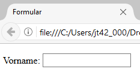
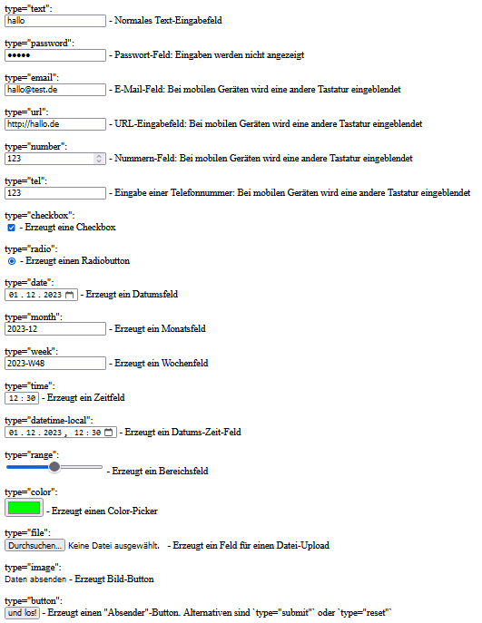

# 4.3.2 Eingabefelder erstellen

Kommen wir nun zu den eigentlichen Inhalten des Formulars, den Eingabefeldern. Das HTML-Element `<input>` definiert Eingabefelder.



Es gibt immer einen Text vor dem Eingabefeld. Hier lautet der Text 'Vorname:' und dieser zum Eingabefeld zugehörige Text wird mit dem Element `<label>` gekennzeichnet. Das `for`-Attribut von `<label>` muss mit dem `id`-Attribut von `<input>` übereinstimmen. Somit ist semantisch klar, dass `<label>` und `<input>` zusammengehören.

Der Wert im `name`-Attribut von `<input>` wird später bei der Übertragung zum Webserver via HTTP zu einem Parameter. Wir wissen damit, dass es einen Parameter `vorname` geben wird, der als Wert den vom User in das Feld eingegebenen Inhalt enthält.

```html linenums="1"
<form action="datenverarbeitung.php" method="get">
  <p>
    <label for="vorname">Vorname:</label>
    <input type="text" name="vorname" id="vorname">
  </p>
</form>
```

Das Element `<input>` kann unterschiedliche Typen von Eingabefeldern erstellen, die auf unterschiedlichen Geräten mit unterschiedlichen Browsern teilweise sehr unterschiedlich dargestellt werden.

| Attribut `type=...`      | Beschreibung                                                                 |
|---------------------------|-----------------------------------------------------------------------------|
| `type="text"`             | Normales Eingabefeld.                                                      |
| `type="password"`         | Passwortfeld: Eingaben werden nicht angezeigt oder nur kurz sichtbar.      |
| `type="email"`            | E-Mail-Feld: Bei mobilen Geräten andere Tastatur; Überprüfung auf E-Mail.  |
| `type="url"`              | URL-Feld: Bei mobilen Geräten andere Tastatur; Überprüfung auf URL.        |
| `type="number"`           | Nummernfeld: Bei mobilen Geräten andere Tastatur.                         |
| `type="tel"`              | Telefonnummerfeld: Bei mobilen Geräten andere Tastatur.                   |
| `type="checkbox"`         | Erzeugt eine Checkbox.                                                     |
| `type="radio"`            | Erzeugt einen Radiobutton.                                                 |
| `type="date"`             | Erzeugt ein Datumsfeld.                                                   |
| `type="month"`            | Erzeugt ein Monatsfeld.                                                   |
| `type="week"`             | Erzeugt ein Wochenfeld.                                                   |
| `type="time"`             | Erzeugt ein Zeitfeld.                                                     |
| `type="datetime-local"`   | Erzeugt ein Datums-Zeit-Feld.                                              |
| `type="range"`            | Erzeugt ein Bereichsfeld.                                                 |
| `type="color"`            | Erzeugt einen Color-Picker.                                               |
| `type="file"`             | Erzeugt ein Feld für einen Datei-Upload.                                  |
| `type="image"`            | Erzeugt einen Bild-Button.                                                |
| `type="button"`           | Erzeugt einen allgemeinen Button; Alternativen: `type="submit"`, `reset`. |


??? info "`<input type=...>` Attribute testen"
    Hier das HTML-Dokument mit dem man das unterschiedliche Aussehen testen kann. Das HTML-Dokument in einer Datei test.html auf dem lokalen System abspeichern und mit einem Browser öffnen.

    ```html linenums="1"
    <form>
    <p>type="text":<br>
        <input type="text" value="hallo"> - Normales Text-Eingabefeld
    </p>

    <p>type="password":<br>
        <input type="password" value="hallo"> - Passwort-Feld: Eingaben werden nicht angezeigt
    </p>

    <p>type="email":<br>
        <input type="email" value="hallo@test.de"> - E-Mail-Feld: Bei mobilen Geräten wird eine andere Tastatur eingeblendet
    </p>

    <p>type="url":<br>
        <input type="url" value="http://hallo.de"> - URL-Eingabefeld: Bei mobilen Geräten wird eine andere Tastatur eingeblendet
    </p>

    <p>type="number":<br>
        <input type="number" value="123"> - Nummern-Feld: Bei mobilen Geräten wird eine andere Tastatur eingeblendet
    </p>

    <p>type="tel":<br>
        <input type="tel" value="123"> - Eingabe einer Telefonnummer: Bei mobilen Geräten wird eine andere Tastatur eingeblendet
    </p>

    <p>type="checkbox":<br>
        <input type="checkbox" checked> - Erzeugt eine Checkbox
    </p>

    <p>type="radio":<br>
        <input type="radio" checked> - Erzeugt einen Radiobutton
    </p>

    <p>type="date":<br>
        <input type="date" value="2023-12-01"> - Erzeugt ein Datumsfeld
    </p>

    <p>type="month":<br>
        <input type="month" value="2023-12"> - Erzeugt ein Monatsfeld
    </p>

    <p>type="week":<br>
        <input type="week" value="2023-W48"> - Erzeugt ein Wochenfeld
    </p>

    <p>type="time":<br>
        <input type="time" value="12:30"> - Erzeugt ein Zeitfeld
    </p>

    <p>type="datetime-local":<br>
        <input type="datetime-local" value="2023-12-01T12:30"> - Erzeugt ein Datums-Zeit-Feld
    </p>

    <p>type="range":<br>
        <input type="range" value="50"> - Erzeugt ein Bereichsfeld
    </p>

    <p>type="color":<br>
        <input type="color" value="#00ff00"> - Erzeugt einen Color-Picker
    </p>

    <p>type="file":<br>
        <input type="file"> - Erzeugt ein Feld für einen Datei-Upload
    </p>

    <p>type="image":<br>
        <input type="image" src="media/abschicken.jpg" alt="Daten absenden"> - Erzeugt Bild-Button
    </p>

    <p>type="button":<br>
        <input type="button" value="und los!"> - Erzeugt einen "Absender"-Button. Alternativen sind `type="submit"` oder `type="reset"`
    </p>
    </form>
    ```




Die Screenshots können das dynamische Verhalten nicht abbilden und somit sollten Sie den Sourcecode selbst ausprobieren.
