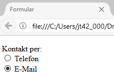
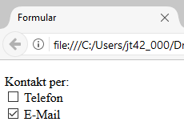

# 4.3.4 Radio-Buttons und Checkboxen

## Radio-Buttons

Radio-Buttons sind beschriftete „Knöpfe“ oder Auswahlfelder, von denen immer nur eines aktiviert werden kann. Radio-Buttons sind Eingabefelder mit dem Typ `type="radio"`, wie im folgenden Beispiel zu erkennen:

```html linenums="1"
<form action="datenverarbeitung.php" method="get">
  <p>
   <label>Kontakt per:<br>
     <input type="radio" name="kontakt" value="telefon"> Telefon<br>
     <input type="radio" name="kontakt" value="email" checked> E-Mail
   </label>
  </p>
</form>
```



### Wichtige Hinweise

- Wenn Sie möchten, dass einer der Buttons bereits aktiviert ist, setzen Sie das Attribut `checked`.
- Wenn das Element `<label>` den gesamten Bereich umschließt, wird kein `for`-Attribut benötigt.

---

## Checkboxen

Checkboxen sind kleine Quadrate, die ankreuzbar sind und bei denen der Benutzer mehrere Optionen auswählen kann. Eine Checkbox wird mit `<input type="checkbox">` deklariert und benötigt ebenfalls das Attribut `name`.

Es ergibt keinen Sinn, mehrere Checkboxen mit dem gleichen Namen zu belegen, da aufgrund der Mehrfachauswahl alle Checkboxen individuell (angekreuzt oder nicht-angekreuzt) übertragen werden.

```html linenums="1"
<form action="datenverarbeitung.php" method="get">
  <p>
   <label>Kontakt per:<br>
     <input type="checkbox" name="telefon" value="telefon"> Telefon<br>
     <input type="checkbox" name="email" value="email" checked> E-Mail
   </label>
  </p>
</form>
```



### Wichtige Hinweise

- Wenn Sie eine Checkbox als selektiert markieren möchten, müssen Sie das Attribut `checked` hinzufügen. Hier können jedoch mehrere Checkboxen vorselektiert werden.
- Um mehrere Checkboxen übersichtlicher zu verwalten, können Sie ein Array für das `name`-Attribut verwenden, wie im folgenden Beispiel:

    ```html linenums="1"
    <form action="datenverarbeitung.php" method="get">
    <p>
    <label>Kontakt per:<br>
        <input type="checkbox" name="check[]" value="telefon"> Telefon<br>
        <input type="checkbox" name="check[]" value="email" checked> E-Mail
    </label>
    </p>
    </form>
    ```
