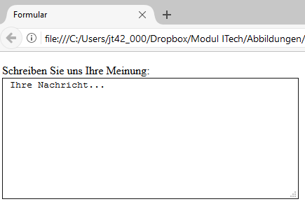

# 4.3.5 Eingabebereiche erstellen

Ein mehrzeiliges Eingabefeld für Text, ein Eingabebereich, wird durch das HTML-Element `<textarea>(...)</textarea>` beschrieben.

```html linenums="1"
<form action="datenverarbeitung.php" method="get">
  <p>
    <label for="info">Schreiben Sie uns Ihre Meinung:</label><br>
    <textarea name="textfeld" cols="50" rows="10" id="info">
      Ihre Nachricht...
    </textarea>
  </p>
</form>
```



Zum Element `<textarea>` werden normalerweise die Zeilen- und Spaltenanzahl über die Attribute `rows` und `cols` angegeben. Auch der Eingabebereich kann mit Text gefüllt werden, indem Sie zwischen das Anfangs- und End-Tag einen Text schreiben. Geben Sie allerdings keine dieser Eigenschaften an, so erhalten Sie ein leeres Textfeld mit zwei Zeilen.
