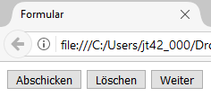

# 4.3.7 Buttons und Absenden von Formularen

Ist das Formular fertig ausgefüllt, sollen die Daten an den Webserver übermittelt werden. Der Benutzer soll die Möglichkeit haben, das ausgefüllte Formular abzuschicken. Dazu hat HTML einen bestimmten Typ eines `<input>`-Elementes vorgesehen: `type="submit"`. Damit erstellen Sie einen Button, der alles an die vorgesehene Adresse schickt. Diesem Button können Sie noch einen "Wert" hinzufügen, der im Browser auf dem Button angezeigt wird. Diesen Wert können Sie durch das Attribut `value` bestimmen.

```html linenums="1"
<input type="submit" value="Abschicken">
```

Möchten Sie auch einen Button bestimmen, mit dem der Benutzer seine Daten wieder löschen kann, müssen Sie nur den Typ ändern. Mit `type="reset"` wird ein Button erstellt, der die Daten wieder löscht. Auch diesen können Sie mit einem Wert, also einem Text versehen.

```html linenums="1"
<input type="reset" value="Löschen">
```

Oftmals wird aber der Button ohne Default-Funktion verwendet, bei dem die Funktionalität durch JavaScript erzeugt wird.

```html linenums="1"
<input type="button" value="Weiter" onclick="javaScript_methode_tu_was()">
```



## Bilder als Buttons verwenden

Das Element `<input type="image">` hat die gleiche Wirkung wie `<input type="submit">` und schickt die Daten ebenfalls mit der in `<form>` angegebenen Methode an den Webserver.

```html linenums="1"
<input type="image" src="abschicken.jpg" alt="Abschicken">
```

## Das `<button>`-Element

Was bisher mit `<input type="submit">`, `<input type="reset">`, `<input type="button">` oder `<input type="image">` beschrieben wurde, ist zwar gültiges HTML und kommt in Webseiten sehr oft vor, doch es gibt das **geniale `<button>`-Element**.

In einem Formular hat das `<button>`-Element dieselbe Funktionsweise wie `<input type="submit">`. Der große Vorteil ist, dass zwischen dem öffnenden und schließenden `<button>`-Tag andere HTML-Elemente oder Texte verwendet werden können. Somit kann der Button mittels CSS formatiert werden oder es kann ein Bild eingefügt werden.

```html linenums="1"
<button type="submit" name="seite1" id="seite1">
 <span>Abschicken</span>
</button>
```

oder

```html linenums="1"
<button type="submit" name="seite1" id="seite1">
 
</button>
```

## Formulardaten absenden

Wenn der Besucher das Formular ausgefüllt hat und auf den Absendebutton klickt, werden die Daten über HTTP an die eingetragene URL geschickt.

Es ist aber auch möglich, im Attribut `action` ein `mailto` einzubauen. Dazu schreiben Sie anstelle der URL `action="mailto:max@mustermann.de"`, zusammen mit den weiteren Attributen `method="post"` und `enctype="text/plain"`. Der Browser versendet die Formulardaten dann an die E-Mail-Adresse. In diesem Fall gibt es allerdings oft einige Schwierigkeiten (z.B. Umlaute oder ähnliches), sodass Sie Ihr Formular zunächst ausreichend testen sollten.

```html linenums="1"
<form action="mailto:max@mustermann.de" method="post" enctype="text/plain">
<!-- weitere Formularinhalte -->
</form>
```
