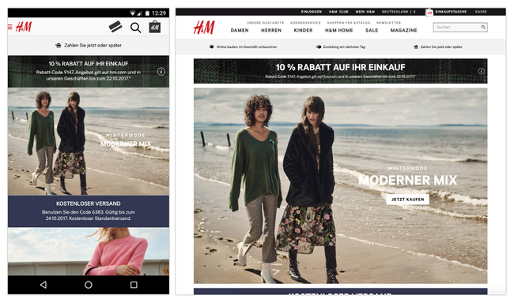
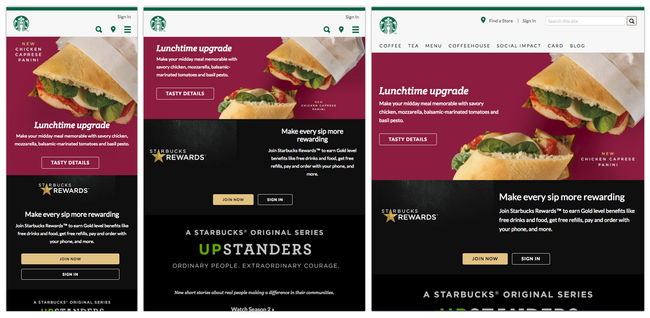

# 4.4.1 Responsive Design und Mobile First

Mit der Einführung voll internetfähiger mobiler Endgeräte wie Smartphones und Tablets ab 2007 stiegen die Anforderungen an die mobile Nutzbarkeit von Webseiten. In der Zeit vor Smartphones wurden Internetseiten häufig für Desktops und damit für eine feste Auflösungsbreite gestaltet, was man heutzutage bei ganz alten Seiten noch erkennen kann. 

## Entwicklung der mobilen Nutzung

Nach den Daten (Stand 2022) liegt die Internetnutzungsquote in Deutschland bei etwa 93 % der Bevölkerung. Die Verbreitung mobiler Endgeräte hat in den letzten Jahren weiter zugenommen. Folgende Endgeräte werden genutzt (Mehrfachnennungen möglich):

- **88 %** Smartphones
- **70 %** Laptops
- **50 %** Desktop-PCs
- **60 %** Tablets

Der Anstieg der mobilen Internetnutzung hat das Webdesign nachhaltig beeinflusst und die Notwendigkeit für mobile Optimierungen verstärkt.

---

## Responsive Design und Adaptive Design

Die zunehmende mobile Nutzung erforderte eine Weiterentwicklung des Webdesigns, um eine gute Darstellung auf unterschiedlichen Geräten und Bildschirmgrößen zu gewährleisten.

### Adaptive Design

Beispiel für ein Adaptive Design: Es existieren separate Versionen der Webseite für mobile Geräte und Desktop-Computer.

- **Definition**: Auf der Grundlage fester Größen wird für verschiedene Gerätetypen jeweils ein eigenes Design bereitgestellt, zum Beispiel eine Version für Smartphones, eine für Tablets und eine für Desktop-Computer.
- **Vorteile**: Optimale Darstellung für spezifische Geräte.
- **Nachteile**: Erhöhter Entwicklungsaufwand für jede zusätzliche Gerätevariante.

### Responsive Design

Beispiel für ein Responsive Design: Das Design passt sich dynamisch an die Bildschirmbreite an, wobei es an bestimmten "Breakpoints" (Media Queries) zu Änderungen im Layout kommt.

- **Definition**: Basierend auf flexiblen, relativen Größen passt sich das Design dynamisch an unterschiedliche Auflösungen und Bildschirmgrößen an.
- **Vorteile**: Einfache Anpassung für eine Vielzahl von Geräten.
- **Nachteile**: Eventuell weniger optimiert für einzelne Gerätetypen im Vergleich zum Adaptive Design.

In der Praxis werden häufig Mischformen beider Konzepte eingesetzt, bei denen bestimmte Elemente adaptiv und andere responsiv gestaltet sind.

---

## Mobile First

Das Konzept **„Mobile First“** hat sich in den letzten Jahren etabliert. Dabei steht die mobile Nutzung im Vordergrund. Statt zunächst eine Desktop-Version zu entwickeln und diese nachträglich für mobile Geräte anzupassen, beginnt die Entwicklung direkt mit einer voll funktionsfähigen mobilen Version. Die Desktop-Version wird anschließend erweitert.

### Vorteile von Mobile First

- **Optimale Unterstützung mobiler Geräte**
- **Fokussierung auf wesentliche Funktionen und Inhalte**
- **Verbesserte Ladezeiten**

Mobile First wird oft in Kombination mit Responsive Design verwendet, um eine optimale Nutzung auf verschiedenen Bildschirmgrößen zu ermöglichen.