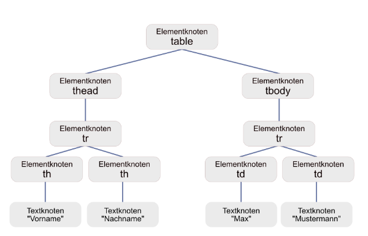
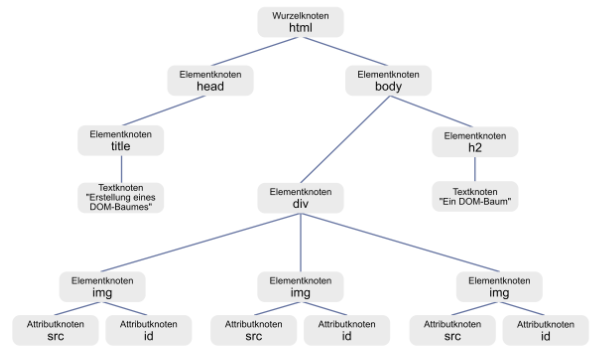

# 5.2 Grundlagen von DOM

Das Grundprinzip in DOM ist, dass jede Auszeichnungssprache (wie HTML oder XML) als Baum darstellbar ist. **Die Bestandteile der Baumstruktur bezeichnet man als Knoten (engl. "node")**, "node" wird auch das zentrale Objekt in DOM genannt.

Die Struktur des Dokumentes wird dargestellt, wie ein Familienstammbaum. Es gibt **Vorfahren, Nachfahren, Eltern, Kinder** und **Geschwister**. Die Spezialisierung innerhalb des Baumes nimmt von oben nach unten hin zu. Jedes HTML-Element und auch jeder Text wird in einen Knoten umgewandelt. Kindknoten sind Elemente, die innerhalb eines anderen Elements stehen. So entsteht die Hierarchie.

Natürlich gibt es nicht nur eine Art Knoten, sondern verschiedene Knotentypen. Innerhalb eines HTML-Dokumentes sind dies meist drei unterschiedliche: **Elementknoten, Attributknoten** und **Textknoten**.

Zur Veranschaulichung ein Beispiel, in dem aus dem folgenden HTML-Code ein DOM-Baum entsteht.

```html linenums="1"
<table>
    <thead>
        <tr>
            <th>Vorname</th>
            <th>Nachname</th>
        </tr>
    </thead>
    <tbody>
        <tr>
            <td>Max</td>
            <td>Mustermann</td>
        </tr>
    </tbody>           
```



Die Schnittstellen, die mit DOM definiert wurden, beschreiben Methoden, mit denen auf die "nodes" zugegriffen wird, um den Inhalt von Dokumenten zu verändern. Das wichtigste dabei ist, dass die Daten der Struktur logisch in einen Zusammenhang gestellt werden können.

Es gibt verschiedene Arten von Knoten. Die wichtigsten hierbei sind:

- Der **Dokumentknoten** stellt die gesamte Struktur dar.

- Der **Wurzelknoten** ist der Beginn des Dokumentes.

- Ein **Dokumentfragmentknoten** zeigt nur einen Teil der Baumstruktur.

- Ein **Elementknoten** entspricht einem Element aus HTML oder XML.

- Ein **Attributknoten** entspricht einem Attribut aus der HTML- oder XML-Sprache.

- Ein **Textknoten** stellt lediglich den Textinhalt eines Elementes bzw. eines Attributes dar.

Eine **Besonderheit** sind hierbei die **Attributknoten**, die nicht als Knoten in der Baumstruktur vorkommen, sondern lediglich Eigenschaften der Elementknoten sind.

## Ein Beispiel für das Grundprinzip

Wie ein DOM-Baum aussieht, haben wir bereits im vorherigen Kapitel behandelt. Wie wir jedoch mit Elementknoten, Attributknoten und Textknoten umgehen, wurde bisher noch nicht besprochen. Daher sehen wir hier ein Beispiel, das eben diese Knoten enthält.

```html linenums="1"
<!DOCTYPE html>
<html lang="de">
<head>
  <meta charset="utf-8">
  <title>Erstellung eines DOM-Baumes</title>
</head>
<body>
  <h2>Ein DOM-Baum</h2>
  <div>
    
    
    
  </div>
</body>
</html>
```



Jedes Element, das ein „inneres Element“ ist, wird eine Ebene unter das Elternelement gesetzt. Alle Elemente werden durch Linien (oder Pfeile) miteinander verbunden. Meist kann sowohl vor als auch zurück navigiert werden. Beispielsweise können wir mithilfe eindeutiger IDs (als HTML-Attribut) Elemente unterscheiden und mit JavaScript ansprechen. Diese ID, also dieses Attribut, ist ebenfalls Teil der DOM-Darstellung.

Der gezeigte **Wurzelknoten** `html` besitzt als **Kinder** ("child nodes") die Elementknoten `head` und `body`, ist also ein **Elternteil** ("parent nodes") von ihnen. `head` und `body` werden **Geschwister** ("siblings") genannt. Vom Wurzelknoten ausgehend kann man jeden anderen Knoten erreichen. Des Weiteren ist `html` ein **Vorfahrenelement** von `h1` und `title` ein Nachfahrenelement von `html`.