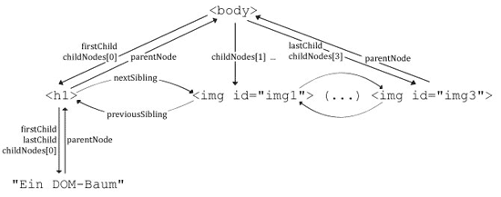

# 5.3 Navigieren im DOM-Baum

Damit Sie die Anwendungsbeispiele des nächsten Kapitels nachvollziehen können, ist es wichtig zu wissen, wie man mit DOM arbeitet.

Zunächst wird ein bestehendes Dokument eingelesen und ein Dokumentobjekt erzeugt, von genau den HTML-Elementen, die verwendet werden sollen. 
So kann man auf die Inhalte, die Struktur und die Darstellung dieser Elemente zugreifen.

Nun können Sie zwischen den Knoten (die innerhalb des HTML-Elements sind) navigieren, sie verschieben oder löschen oder den Textinhalt ändern 
oder löschen, und noch vieles mehr.

Sie können auf die Elemente des Baumes zugreifen und von Ebene zu Ebene "springen". Die Kindknoten eines DOM-Baumes liegen in einem Array, 
das `childNodes` heißt. Mit diesem Wissen und den folgenden Eigenschaften können Sie mit den Elementen arbeiten.

## Eigenschaften zur Navigation im DOM-Baum

| **Eigenschaft**   | **Erläuterung**                                                                   |
|--------------------|-----------------------------------------------------------------------------------|
| `nodeName`        | HTML-Element eines Knotens wird als Zeichenkette ausgegeben (z. B. "body").       |
| `nodeType`        | Tag = 1, Attribut = 2, Text = 3                                                  |
| `firstChild`      | Erstes Element im `childNodes`-Array, erster Kindknoten, `childNodes[0]`.         |
| `lastChild`       | Letztes Element im `childNodes`-Array, letzter Kindknoten, `childNodes[n]`.       |
| `nextSibling`     | Das nächste Kind des Elternknotens.                                              |
| `previousSibling` | Das vorherige Kind des Elternknotens.                                            |
| `parentNode`      | Der Elternknoten.                                                                |

Die ersten beiden Eigenschaften, `nodeName` und `nodeType` liefern nähere Informationen über einen bestimmten Knoten, 
mit den restlichen Eigenschaften können Sie auf die anderen Knoten zugreifen.

## Den DOM-Baum verändern

Innerhalb eines DOM-Baumes lassen sich **Elemente entfernen** oder auch **neu einfügen**, die Baumintegrität wird dadurch nicht gefährdet. 
Damit Sie den DOM-Baum verändern können, gibt es in JavaScript diverse Methoden.

| **Methode**        | **Syntax**                                         | **Erläuterung**                                                                 |
|---------------------|----------------------------------------------------|---------------------------------------------------------------------------------|
| `appendChild`      | `[Elternknoten].appendChild([Kindknoten]);`         | Hängt den Kindknoten an den Elternknoten an.                                    |
| `hasChildNodes`    | `[Knotenname].hasChildNodes();`                     | Gibt einen booleschen Wert aus, der aussagt, ob Kinder vorhanden sind oder nicht. |
| `createElement`    | `document.createElement([HTML-Element]);`           | Erzeugt einen Knoten, der aus dem HTML-Element besteht.                         |
| `removeNode`       | `[Knotenname].removeNode([alles?]);`               | Entfernt den Knoten aus dem Baum, steht `true` in Klammern, werden auch alle Kindknoten entfernt. |
| `cloneNode`        | `[Knotenname].cloneNode([alles?]);`                | Erzeugt ein Duplikat des angegebenen Knotens, ist der Wert `true`, werden auch alle Kindknoten dupliziert. |
| `replaceNode`      | `[Alter Knoten].replaceNode([Neuer Knoten]);`      | Der alte Knoten wird durch den neuen ersetzt.                                   |
| `setAttribute`     | `[Knotenname].setAttribute([Attributname], [Attributwert]);` | Der Knoten erhält ein zusätzliches Attribut.                                    |
| `insertBefore`     | `[Elternknoten].insertBefore([neuer Kindknoten], [folgender Kindknoten]);` | Fügt ein neues Kind in den Elternknoten ein, vor dem folgenden Knoten.          |

## Auf Elemente zugreifen

Um auf HTML-Elemente zugreifen zu können, reicht es nicht, Elementen eine ID oder einen Namen zu geben, Sie benötigen auch die **entsprechenden JavaScript-Funktionen**:

Durch das `document`-Objekt in JavaScript können Sie auf diese Elemente, die Tags, zugreifen. Dazu gibt es eine JavaScript-Methode, die `getElementsByTagName();` 
heißt und die ein Array zurückgibt, das alle HTML-Elemente mit dem gegebenen Tag-Namen aus dem DOM enthält. Die Reihenfolge ergibt sich dabei nach dem Vorkommen im Dokument.

Um auf einzelne Elemente zugreifen zu können, müssen Sie die obige Methode etwas verändern. Sie heißt nur `getElementsById();` und kann nur auf ein Element zugreifen, 
wenn dieses die entsprechende ID besitzt.

Zum folgenden DOM-Baum würde

- **document.getElementsByTagName("img")** als Ergebnis ein Array mit allen HTML-Images-Elementen [img1, img2, img3] liefern,

- **document.getElementsById("img2")** als Ergebnis das HTML-Image-Element mit dem HTML-Attribut id="img2" liefern.