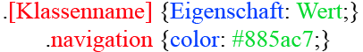
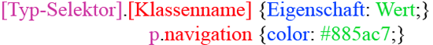

# 6.2.10 Klassenselektoren

Mit Selektoren lassen sich HTML-Elemente direkt formatieren. Individuelle Formatierungen, also eigene Regeln, können wir über Klassen erreichen. Dadurch wird der Sourcecode insgesamt strukturierter und übersichtlicher.

## Globale Klassen

HTML-Elemente wie z. B. `div`, `span` oder `p` lassen sich durch die Verwendung des `class`-Attributs zu einer Art Gruppe zusammenfassen. Die Elemente übernehmen Formate, die zentral für diese Klassen definiert wurden. Klassen können auch mehrfach verwendet werden.

Beispiel:

```html linenums="1"
<p class="hinweis">Achtung, hier kommt ein Hinweis!</p>
<h1 class="hinweis">Hinweis!</h1>
```

Eine Klasse wird durch einen Punkt (`.`) vor dem Namen des Selektors erzeugt. Die Syntax dafür ist:


*Syntax für globale Klassen*

So weisen wir allen Elementen einer Klasse einen Style zu, unabhängig davon, welche Elemente es sind. Das nennt man auch **globale Klassen**.


### Definition im Stylesheet

```css linenums="1"
.hinweis {
    color: red;
}
```

### Anwendungsbeispiel mit einem `p`-Element

```html linenums="1"
<p class="hinweis">Achtung, hier kommt ein Hinweis!</p>
```


Um mehrere Klassen auf ein HTML-Element anzuwenden, schreiben wir diese hintereinander in das `class`-Attribut, getrennt durch ein Leerzeichen:

```css linenums="1"
.hinweis {
    color: red;
}
.wichtig {
    font-size: 120%;
}
```

```html linenums="1"
<h1 class="hinweis wichtig">Hinweis!</h1>
```

---

## Tag-spezifische Klassen

Um Klassen nur für bestimmte HTML-Typen zu definieren, setzen wir den Typ-Selektor vor den Punkt der Klassendefinition.



### Definition im Stylesheet

```css linenums="1"
p.hinweis {
    color: red;
}
```

### Anwendungsbeispiel mit einem `<p>`-Tag

Hier gilt die Definition und der Text wird rot dargestellt:

```html linenums="1"
<p class="hinweis">p: Achtung, hier kommt ein Hinweis!</p>
```

### Anwendungsbeispiel mit einem `<h1>`-Tag

Hier wird das Format nicht übernommen, es erscheint nicht rot:

```html linenums="1"
<h1 class="hinweis">h1: Achtung, hier kommt ein Hinweis!</h1>
```


---

**Hinweis:** Durch globale und tag-spezifische Klassen erhalten wir Flexibilität in der Gestaltung, sollten jedoch darauf achten, nicht unnötig viele spezifische Selektoren zu definieren, um die Wiederverwendbarkeit des Codes zu fördern.

## "Vererbung" 

In CSS werden bestimmte Eigenschaften von Elternelementen an ihre Kindelemente "vererbt". Dies betrifft insbesondere textbezogene Eigenschaften wie `color`, `font-family` und `line-height`. Andere Eigenschaften, wie beispielsweise `margin`, `padding` oder `border`, werden nicht vererbt.

**Beispiel zur Vererbung mit Klassenselektoren**

Betrachten wir ein Beispiel, in dem wir sowohl Texte als auch Überschriften mit Klassenselektoren formatieren und die Vererbung von Eigenschaften zeigen.

**Stylesheet `style.css`**

```css linenums="1"
body {
  background-color: aliceblue; /* Helles Blau */
}

.hinweis {
  color: red;
  font-family: Verdana, sans-serif;
}

.wichtig {
  font-weight: bold;
}

p {
  color: darkgray; /* Dunkelgrau */
}

h1 {
  color: green;
}
```

**HTML-Dokument**

```html linenums="1"
<!DOCTYPE html>
<html lang="de">
<head>
  <meta charset="UTF-8">
  <meta name="viewport" content="width=device-width, initial-scale=1.0">
  <title>Vererbung und Klassenselektoren</title>
  <link rel="stylesheet" href="style.css">
</head>
<body>
  <h1 class="hinweis">Eine grüne Überschrift mit <span>rotem hervorgehobenem Teil</span></h1>
  <p class="wichtig">
    Dies ist ein wichtiger Absatz in dunkelgrauer Schrift mit 
    <span>fett formatiertem Text</span>.
  </p>
</body>
</html>
```

**Erläuterung**

- **Globale Klasse `.hinweis`:** Diese Klasse setzt die Textfarbe auf Rot und die Schriftart auf Verdana. Das `<h1>`-Element mit der Klasse `.hinweis` übernimmt diese Stile. Das `<span>`-Element innerhalb des `<h1>` erbt die `color`-Eigenschaft und wird ebenfalls rot dargestellt.

- **Globale Klasse `.wichtig`:** Diese Klasse setzt die Schrift auf fett. Das `<p>`-Element mit der Klasse `.wichtig` übernimmt diesen Stil. Das `<span>`-Element innerhalb des `<p>` erbt die `font-weight`-Eigenschaft und wird ebenfalls fett dargestellt.

Durch dieses Beispiel wird die Vererbung von Eigenschaften in CSS verdeutlicht: Kindelemente erben bestimmte Stileigenschaften von ihren Elternelementen, sofern diese Eigenschaften nicht explizit überschrieben werden. 