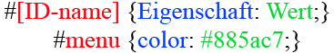
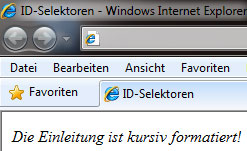

# 6.2.11 ID-Selektoren – Individualformate definieren

Die zweite Methode, um HTML-Elemente wie z. B. `div` oder `p` individuell zu formatieren, sind die **ID-Attribute**. Mit solch einem ID-Attribut können wir einem HTML-Element einen individuellen Bezeichner zuweisen:

```html linenums="1"
<p id="einleitung">Dieser Abschnitt ist die Einleitung.</p>
```

Um eine ID zu erstellen, müssen wir den ID-Namen im Stylesheet mit einem vorangestellten Rautezeichen (`#`) mit Eigenschaften versehen.



Ein ID-Attribut ist im gesamten Dokument einzigartig; es darf innerhalb des HTML-Dokuments nur einmal verwendet werden. IDs können auch als Anker innerhalb des Dokuments verwendet werden. Wir sollten bei den Ankern auf Groß-/Kleinschreibung achten.

### Definition im Stylesheet

```css linenums="1"
#einleitung {
    font-style: italic;
}
```

### Anwendungsbeispiel mit einem `div`-Tag

```html linenums="1"
<div id="einleitung">
  Die Einleitung ist kursiv formatiert!
</div>
```



---

!!! warning "Wenn möglich class-Selektoren statt ID-Selektoren verwenden"
    **Vermeiden Sie die Verwendung von ID-Selektoren** und setzen wir besser auf Klassenselektoren.

    - **IDs** können nur einmal angegeben werden, was sie weniger flexibel macht:
        ```css linenums="1"
        #logo {...}
        ```
        ```html linenums="1"
        <head id="logo" ...>
        ```

    - **class** kann mehrfach verwendet und ineinander verschachtelt werden:
        ```css linenums="1"
        .element.active {...}
        ```
        ```html linenums="1"
        <li class="element active">
        <a class="element active">
        ```

### Gründe gegegen ID-Selektoren

1. **Spezifität:** ID-Selektoren haben eine hohe Spezifität in CSS, wodurch sie schwer zu überschreiben sind, was die Wartbarkeit erschwert. Was die Spezifizität bedeutet, wird später noch behandelt.

2. **Komponenten-basiertes Design:** In modernen Frameworks setzen wir auf Klassen oder Shadow DOM für die Isolation von Styles, um globale Konflikte zu vermeiden.

---


## Ankerlinks mit ID-Selektoren

Ein häufiges Anwendungsbeispiel für ID-Selektoren ist die Verwendung von **Ankerlinks**, um innerhalb eines HTML-Dokuments zu bestimmten Abschnitten zu springen. Dieses Konzept ist besonders nützlich für lange Seiten mit mehreren Abschnitten, wie z. B. bei Wikipedia.

### So funktioniert ein klassischer Ankerlink
Ein Anker wird durch ein ID-Attribut im Ziel-HTML-Element und einen entsprechenden Link definiert. Der Link verweist mit einem `#`-Zeichen auf den ID-Namen des Ziels.

Beispiel der klassischen Umsetzung:

```html
<!-- Inhaltsverzeichnis -->
<a href="#ziel">Springe zum Ziel</a>

<!-- Zielabschnitt -->
<h2 id="ziel">Hier ist das Ziel</h2>
```

Beim Klick auf den Link springt der Browser direkt zu dem Element mit der ID `ziel`. Allerdings führt der Link zu einem sehr abrupten Sprung im Seitenverlauf. Das kann verwirrend wirken, insbesondere bei längeren Dokumenten.


### Moderne Umsetzung mit Smooth Scrolling
Heutzutage nutzen wir **CSS Smooth Scrolling**, um einen flüssigeren Verlauf in der Seite zu schaffen. Mit der CSS-Eigenschaft `scroll-behavior: smooth;` können wir das Verhalten von Ankerlinks verbessern.

#### So aktivieren wir Smooth Scrolling
Wir fügen einfach eine CSS-Regel für das `html`-Element hinzu:

```css
html {
    scroll-behavior: smooth;
}
```

Nun gleitet der Seiteninhalt sanft zum Zielabschnitt, anstatt abrupt zu springen.

```html
<!-- Inhaltsverzeichnis -->
<a href="#ziel">Springe zum Ziel</a>

<!-- Mehr Text für Scroll-Effekt -->
<div style="height: 1000px;">Langer Inhalt...</div>

<!-- Zielabschnitt -->
<h2 id="ziel">Hier ist das Ziel</h2>
```

---

### Best Practices bei der Verwendung von Ankerlinks

1. **Zugänglichkeit sicherstellen:** Jeder Ankerlink und Zielabschnitt so einen klaren, beschreibenden Namen haben.

    Beispiel: Anstelle von `id="ziel"` verwenden wir `id="zumKontaktfeld"`.

2. **Kombination mit Klassen:** Für Styling und Funktionalität verwenden wir bevorzugt Klassen, während die ID nur als Anker dient.

    ```html
    <a href="#zumKontaktfeld" class="btn">Kontakt</a>
    <h2 id="zumKontaktfeld" class="section-title">Kontakt</h2>
    ```

3. **Für ältere Browser:** Smooth Scrolling wird von modernen Browsern unterstützt, jedoch nicht von älteren Versionen. Wenn wir ältere Browser unterstützen müssen, können wir JavaScript verwenden (z. B. eine Bibliothek wie `scrollIntoView` oder Smooth Scroll Polyfills).
