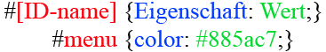
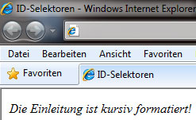

# 6.2.12 ID-Selektoren – Individualformate definieren

Die zweite Methode, um HTML-Elemente wie z. B. `div` oder `p` individuell zu formatieren, sind die **ID-Attribute**. Mit solch einem ID-Attribut können Sie einem HTML-Element einen individuellen Bezeichner zuweisen:

;;;html
<p id="einleitung">Dieser Abschnitt ist die Einleitung.</p>
;;;

Um eine ID zu erstellen, müssen Sie den ID-Namen im Stylesheet mit einem vorangestellten Rautezeichen (`#`) mit Eigenschaften versehen.



Ein ID-Attribut ist im gesamten Dokument einzigartig; es darf innerhalb des HTML-Dokuments nur einmal verwendet werden. IDs können auch als [[Anker]] innerhalb des Dokumentes verwendet werden. Achten Sie bei den [[Anker]]n allerdings auf Groß-/Kleinschreibung!

## Definition im Stylesheet

;;;css
#einleitung {
    font-style: italic;
}
;;;

### Anwendungsbeispiel mit einem `div`-Tag:

;;;html
<div id="einleitung">
  Die Einleitung ist kursiv formatiert!
</div>
;;;



---

!!! warning
    **Vermeiden Sie die Verwendung von ID-Selektoren** und verwenden Sie besser Klassenselektoren:
    - **IDs** können nur einmal angegeben werden:
        ```css
        #logo {...}
        ```
        ```html
        <head id="logo" ...>
        ```

    - **class** kann mehrfach verwendet und ineinander verschachtelt werden:
        ```css
        .element.active {...}
        ```
        ```html
        <li class="element active">
        <a class="element active">
        ```
