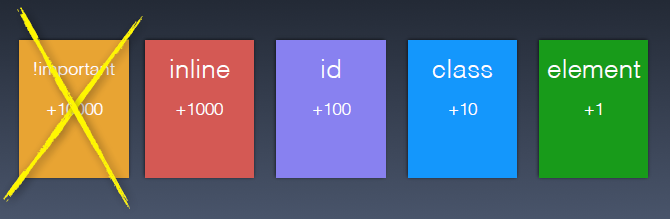

# 6.2.14 Selektoren und Spezifität

Im Folgenden wird ein Überblick über die Selektoren gegeben. Es gibt:

- den **Universalselektor** (`*`), mit dem alle Elemente angesprochen werden.
- **Element-Selektoren** (`h1`, `p`, `img`), also alle **HTML-Elemente**.
- **Klassenselektoren** (`.hinweis`), die als `class`-Attribut in ein HTML-Element geschrieben werden, z. B. `<p class="hinweis">`.
- **ID-Selektoren** (`#main-content`, `#logo`), die als `id`-Attribut in ein HTML-Element geschrieben werden, z. B. ``.
- **Attribut-Selektoren** (`[type=submit]`, `[title]`), die darauf reagieren, wenn ein HTML-Attribut vorkommt oder einen bestimmten Wert hat.
- **Pseudoklassen** (`:hover`, `:visited`, `:first-child`), die auf den Mauszeiger oder DOM-Elementstrukturen reagieren. Diese Selektoren gibt es "automatisch", und sie müssen in HTML nicht hinzugefügt werden.

!!! note "Attribut-Selektoren"
    **Attribut-Selektoren** werden in diesem Modul nicht weiter behandelt. Beispiele hierzu gibt es bei [selfhtml](https://wiki.selfhtml.org/wiki/CSS/Selektoren/Attributselektor).

---

## Spezifität

Unter **Spezifität** versteht man die Rangfolge der Regeln. Es wird spezifiziert, welche Regel ausgeführt wird, wenn verschiedene Regeln auf ein HTML-Element wirken. Um diese Regel-Reihenfolge zu betrachten, müssen wir noch zwei Anweisungen hinzufügen:

- **Inline-Styling** (`<a style="color:red">`): Dies ist kein CSS-Selektor, sondern wird direkt in das HTML-Dokument geschrieben. **Inline-Styling ist verboten.**
- **!important-Regel** (`color:black !important`): Diese Regel hat die höchste Wertigkeit und überschreibt alles. **Die Verwendung sollte mit absoluter Vorsicht erfolgen, da sie die Struktur und Wartbarkeit des CSS beeinträchtigen kann.**

### Rangfolge und Werte

Die Rangfolge kann in Zahlen ausgedrückt werden. Je höher die Zahl, desto spezifischer ist es und wird entsprechend angewandt:

- **Element-Selektoren**: Wert 1
- **Klassenselektoren**: Wert 10
- **ID-Selektoren**: Wert 100
- **Inline-Styling**: Wert 1000
- **!important-Regel**: Überschreibt alles (bitte nicht nutzen!)


*Spezifizität (=Wichtigkeitsreihenfolge) von Selektoren*


### Spezifizität der Selektoren ermitteln

Beispiel:
```css linenums="1"
#header .info ul li {...} // 1*100 + 1*10 + 2*1 = 112
#header #menu li {...}    // 2*100 + 1*1 = 201
```
---

!!! question "Spezifizität ermitteln"

    Welche Farbe wird der Text haben?

    ### HTML-Datei:
    ```html linenums="1"
    <div class="color">
        <span>Text</span> 
    </div>
    ```

    ### CSS-Datei:
    ```css linenums="1"
    span {color: red;}            
    div span {color: blue;}       
    .color span {color: green;}   
    ```

    ??? example "Lösung"
        ```css linenums="1"
        span {color: red;}            /* Spezifizität 1 */
        div span {color: blue;}       /* Spezifizität 2 */
        .color span {color: green;}   /* Spezifizität 11 "gewinnt" */
        
        // Der Text wird grün dargestellt.
        ```

---

**Wichtig:** Bei gleicher Spezifizität "gewinnt" die Regel, die in der CSS-Datei weiter unten steht.
