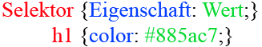
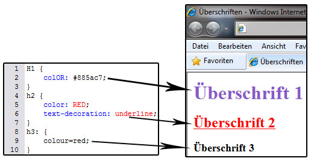

# 6.2.1 CSS Syntax – Befehle definieren

Um eine fremde Sprache zu lernen, benötigen Sie sowohl Kenntnisse über die Vokabeln als auch über den Satzbau. Ebenso bei CSS: die Deklaration, also den Aufbau eines CSS-Befehls und die Schreibweise sind grundlegend, da ein Stylesheet andernfalls nicht erkannt und bearbeitet wird.

Ein Stylesheet besteht aus einer bzw. mehreren Anweisungen zur Darstellung von Elementen. Solch eine Anweisung besteht aus zwei Teilen, dem **Selektor** und der **Deklaration**. Der Selektor bestimmt, auf welches HTML-Element die Anweisung angewendet werden soll. Die Deklaration beschreibt, was auf das Element angewendet wird. Sie besteht aus einer **Eigenschaft** (oder mehreren), die das Element besitzt, und meist einem **Wert**, den die Eigenschaft bekommen soll.

Wenn im Folgenden von „Elementen“ die Rede ist, sind damit die HTML-Elemente im HTML-Dokument gemeint. Selektoren gehören zu den CSS-Dokumenten, haben allerdings die gleiche Bezeichnung: HTML-Element: `<h1>...</h1>`, dazugehöriger Selektor: `h1 { ... }`.

## Regeln zur Syntax:

- Hinter dem **Selektor** steht die **Deklaration** in geschweifte Klammern eingeschlossen `{ ... }`
- Eine **Eigenschaft** wird durch einen Doppelpunkt (`:`) vom **Wert** getrennt
- Wertdeklarationen werden **mit einem Semikolon** abgeschlossen (wichtig bei mehreren Werten)
- Mehrere Eigenschaft/Wert-Paare werden zur Übersichtlichkeit untereinander geschrieben

CSS ist nicht **case-sensitive**, aber Eigenschaften und Werte sollten immer klein geschrieben werden. Wie in jeder anderen Programmierung auch, muss die **Syntax** stimmen, denn andernfalls funktioniert der Befehl nicht.

Die Anweisungen in diesem Beispiel sind direkt aus dem Stylesheet. Sie müssen zunächst in das HTML-Dokument eingebettet werden. Sie können das Beispiel eingebettet betrachten, wenn Sie den Sourcecode des Anzeigebeispiels aufrufen. Die Einbettung lernen Sie allerdings schon in den nächsten Kapiteln.

Des Weiteren können Sie CSS-Farben auf fünf verschiedene Weisen definieren. In den Quellcodebeispielen oben haben Sie bereits zwei bemerkt, die auch weiterhin in Beispielen genutzt werden.
