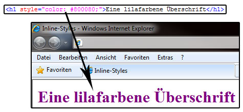

# 6.2.2 CSS in HTML einbinden – Möglichkeiten

Um CSS-Anweisungen in eine HTML-Datei einzubinden, haben wir drei Möglichkeiten.


## Möglichkeit 1 – Inline-Styles (HTML-Elemente direkt formatieren)

HTML-Elemente formatieren wir mit einer eigenen Style-Anweisung direkt. Dazu fügen wir innerhalb des HTML-Tags ein `style`-Attribut ein. Der Wert des Attributs ist eine normale CSS-Anweisung aus Eigenschaft/Wert-Paaren, jedoch ohne geschweifte Klammern.



*Beispiel für Inline-Styles mit Browseransicht*

---

## Möglichkeit 2 – Formate zentral für ein Dokument definieren

Ein Stylesheet betten wir direkt in eine HTML-Datei ein, indem wir die Anweisungen innerhalb eines `style`-Elements im Dokumentkopf (`head`-Bereich) platzieren. Zwischen den `<style>`-Tags schreiben wir dann unser CSS-Dokument. Hier können wir auch CSS-Kommentare verwenden:

```html linenums="1" hl_lines="6-9"
<!doctype html>										
<html lang="de">
<head>
  <meta charset="utf-8">
  <title>Stylesheet im Dokument</title>
  <style type="text/css">
    /* Hier werden die Formate definiert */
    body { font-family: Arial, sans-serif; }
  </style>
</head>
<body>
  <h1>Beispielseite</h1>
  <p>Mit eingebettetem Stylesheet.</p>
</body>
</html>
```

---

## Möglichkeit 3 – Formate zentral im externen Stylesheet definieren

Mit externen Stylesheets schaffen wir die Möglichkeit, für mehrere HTML-Dokumente nur ein Stylesheet zu verwenden. Dadurch sind Stile leichter wiederverwendbar und zentral wartbar. Externe Stylesheets binden wir auf zwei Arten ein:

#### Mit dem `@import`-Befehl
  
  ```html linenums="1" hl_lines="3"
  <head>
    <style type="text/css">
      @import url('style.css');
    </style>
  </head>
  ```

**Hinweis zu `@import`**: Der `@import`-Befehl führt zu einer langsameren Ladezeit, da der Browser zusätzliche HTTP-Anfragen durchführen muss. Daher sollten wir ihn nur in speziellen Fällen einsetzen, wenn keine direkte Verlinkung möglich ist.

---

#### Mit dem `link`-Tag
  
  ```html linenums="1" hl_lines="2"
  <head>
    <link rel="stylesheet" type="text/css" href="style.css">
  </head>
  ```


!!! important "Beste Version: `<link rel=stylesheet...` nutzen"
    Die beste Variante ist die Verlinkung der CSS Datei mit `<link rel="stylesheet" type="text/css" href="style.css">`

---

### Moderne Alternativen

Neben den klassischen Ansätzen gibt es heute Alternativen wie **CSS-Module** und **Scoped Styles**:

- **CSS-Module:** Erlauben es, Stile lokal und modular in Projekten wie React oder Angular zu verwenden. Mehr dazu: [CSS Modules auf css-tricks.com](https://css-tricks.com/css-modules-part-1-need/).

- **Scoped Styles:** Besonders in Vue.js beliebt, da sie CSS-Regeln auf bestimmte Komponenten beschränken. Mehr dazu: [Scoped Styles auf vuejs.org](https://vuejs.org/guide/scaling-up/scoped-styles.html).

