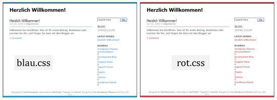

# 6.2.3 CSS in HTML einbinden – Fazit

Die sinnvollste Möglichkeit ist die **Möglichkeit 3**: Die Formate zentral in einem externen Stylesheet zu definieren. Die Austauschmöglichkeiten sind am größten, die Gefahr ein paar Seiten beim Ändern zu „vergessen“ ist praktisch nicht mehr vorhanden.

## Ein Beispiel:

Sie haben eine Website für einen Kunden entworfen, das Stylesheet haben Sie ausgelagert. Das Design ist durchgehend in roter Farbe, der Kunde möchte es allerdings, als er es ganz fertig sieht, lieber blau haben. Hätten Sie das Stylesheet jetzt implementiert, würde ein großer Berg Arbeit auf Sie zukommen. So allerdings können Sie das Stylesheet leicht austauschen und das Design ändern. Das zeigt, wie flexibel CSS ist.

Sollten Sie allerdings eine Formatierung wirklich einmalig im gesamten Dokument für nur ein Element, an einer Stelle definieren müssen, können Sie dies auch direkt zuweisen. Die Gefahr, dass Sie später Probleme beim Ändern haben, besteht allerdings weiterhin.
