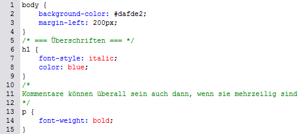

# 6.2.4 Kommentare im Stylesheet

Wie auch bei HTML können Sie ein CSS-Dokument kommentieren und dadurch strukturieren. Kommentare werden mit einem Schrägstrich und einem Sternchen begonnen und hören mit einem Sternchen und einem Schrägstrich auf.

;;;
/* Dies ist ein Kommentar */
;;;

Sie können Kommentare im gesamten Dokument platzieren, um die Übersichtlichkeit zu erhöhen, z. B. um die Strukturierung anzugeben.

!!! note
    **Kommentare sind Pflicht!** Auch wenn Sie ein Dokument für sich selbst erstellen. Wenn Sie es sich nach einem Jahr noch einmal ansehen, werden Sie es ohne Kommentare nur noch schwer nachvollziehen können.
