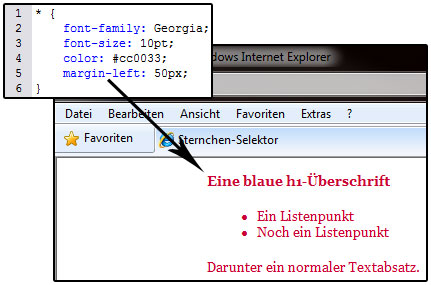

# 6.2.5 CSS-Formate auf HTML-Elemente anwenden

In einem Stylesheet können wir mit Hilfe von **Element-Selektoren** z. B. Absatztypen, Tabellen oder Texte formatieren. Verwenden wir die formatierten HTML-Elemente innerhalb des HTML-Dokumentes, werden alle definierten Formate angewendet.


### Beispiel: Sourcecode des Stylesheets style.css

```css linenums="1"
body {
	background-color: #dafde2;
	margin-left: 200px;
}
h1 {
	font-style: italic;
	color: blue;
	border-bottom: 2px solid #000000;
}
li {
	font-family: Helvetica, sans-serif;
	font-size: 120%;
	color: #885ac7;
}
p {
	font-weight: bold;
	background-color: #c0c0c0;
}
```

### Sourcecode des HTML-Dokuments

```html linenums="1"
<!doctype html>												  
<html lang="de">
<head>
  <meta charset="utf-8">
  <title>Element-Selektoren</title>
  <link rel="stylesheet" type="text/css" href="css_bsp_formateaufelemente.css" />
</head>
<body>
  <h1>Eine blaue h1-Überschrift</h1>
  <ul>
      <li>Ein Listenpunkt</li>
      <li>Noch ein Listenpunkt</li>
  </ul>
  <p>Darunter ein normaler Textabsatz in fetter Schrift auf einem grauen Hintergrund.</p>
</body>
</html>
```


### So sieht es im Browser aus

<iframe id="static-preview-frame" 
        style="width: 100%; height: 200px; border: 1px solid #ccc;"
        srcdoc="
<!DOCTYPE html>
<html lang='de'>
<head>
  <meta charset='UTF-8'>
  <meta name='viewport' content='width=device-width, initial-scale=1.0'>
  <title>Beispiel</title>
  <style>
    body {
      background-color: #dafde2;
      margin-left: 200px;
    }
    h1 {
      font-style: italic;
      color: blue;
      border-bottom: 2px solid #000000;
    }
    li {
      font-family: Helvetica, sans-serif;
      font-size: 120%;
      color: #885ac7;
    }
    p {
      font-weight: bold;
      background-color: #c0c0c0;
    }
  </style>
</head>
<body>
  <h1>Eine blaue h1-Überschrift</h1>
  <ul>
      <li>Ein Listenpunkt</li>
      <li>Noch ein Listenpunkt</li>
  </ul>
  <p>Darunter ein normaler Textabsatz in fetter Schrift auf einem grauen Hintergrund.</p>
</body>
</html>
">
</iframe>


---

Ein zentrales Format für alle HTML-Elemente des gleichen Typs wird mit einem **Selektor** definiert, der den Namen des HTML-Elementtyps trägt. Das obige Beispiel zeigt die Selektoren:

- `body` (gesamtes Dokument, auch Hintergrund)

- `h1` (Überschrift 1. Ordnung)

- `li` (Listenpunkt)

- `p` (Textabsatz), die auf diese Weise formatiert werden

Das Ergebnis

- Das body-Element bekommt so z.B. eine hellgrüne Hintergrundfarbe und einen linken Randabstand von 200 Pixeln.

- Das h1-Element wird unter anderem kursiv geschrieben und der Textabsatz hat nun einen grauen Hintergrund. Zusätzlich haben diese Elemente noch weitere Formate bekommen, diese zu erklären würde allerdings den späteren Lektionen vorgreifen.

Auf diese Art und Weise können Sie alle HTML-Elemente, welche Sie nutzen, mit Eigenschaften versehen. Welche Eigenschaften sie genau auf welche Elemente anwenden können, erfahren Sie in den weiteren Kapiteln.

### Der Selektor *

Ein Format für wirklich alle HTML-Elemente wird mit dem **Selektor `*`** erzeugt. Jedes Element nimmt sich alle Eigenschaften und Werte raus, die es verwenden kann. 




*Beispiel für den `*`-Selektor - alles 10pt und in rot*

**Hinweis:** Obwohl der `*`-Selektor praktisch ist, sollte er sparsam eingesetzt werden. Insbesondere in großen Dokumenten oder komplexen Projekten kann er die Performance beeinträchtigen.

---

### CSS-Resets und Normalizer

Wichtige Konzepte sind **CSS-Resets** und **Normalizer**. Browser interpretieren Standardstile wie Abstände, Schriftgrößen oder Ränder unterschiedlich. Das führt zu Inkonsistenzen in der Darstellung. Resets und Normalizer helfen dabei, dies zu vermeiden.

- **CSS-Resets:** Setzen die Stile aller Elemente auf ein Minimum zurück, um eine konsistente browserübergreifende Basis zu schaffen. Ein Beispiel ist der bekannte [Reset von Eric Meyer](https://meyerweb.com/eric/tools/css/reset/).

- **Normalizer:** Passen nur die inkonsistenten Stile an, während sinnvolle Standardstile erhalten bleiben. Ein bekanntes Beispiel ist [normalize.css](https://necolas.github.io/normalize.css/).

---

#### Beispiel: Vergleich mit und ohne Reset

Um die Wirkung von Resets zu veranschaulichen, vergleichen wir eine Website mit und ohne CSS-Reset.

#### HTML-Dokument
```html linenums="1"
<!doctype html>
<html lang="de">
<head>
  <meta charset="utf-8">
  <title>Ohne Reset</title>
  <link rel="stylesheet" href="ohne-reset.css">
</head>
<body>
  <h1>Überschrift</h1>
  <p>Dies ist ein Absatz mit Standardstilen des Browsers.</p>
</body>
</html>
```

#### CSS ohne Reset
```css linenums="1"
body {
  font-family: Arial, sans-serif;
}

h1 {
  color: blue;
}
```

#### CSS mit Reset (Meyer Reset)
```css linenums="1"
* {
  margin: 0;
  padding: 0;
  box-sizing: border-box;
}

body {
  font-family: Arial, sans-serif;
}

h1 {
  color: blue;
}
```

**Ergebnis**

- Ohne Reset: Die Browser setzen Standardabstände und Schriftarten, die variieren können.

- Mit Reset: Alle Elemente beginnen ohne Abstände, und wir können konsistent von einer neutralen Basis aus gestalten.

Durch den Einsatz von Resets oder Normalizern schaffen wir eine stabile Grundlage für unsere Layouts. Welche Variante wir wählen, hängt davon ab, ob wir mehr Kontrolle über die Stile benötigen (Reset) oder von den Standards ausgehen möchten (Normalizer). Beides trägt dazu bei, konsistente Designs über verschiedene Browser hinweg zu gewährleisten.
