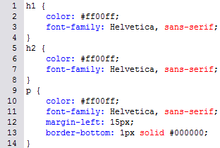

# 6.2.6 Gruppierung

Haben Sie mehreren HTML-Elementen eine gleiche Formatierung zugewiesen, so können Sie diese gruppieren. Das Stylesheet wird dadurch übersichtlicher, da die zusammengefassten Eigenschaften (selbst wenn es nur eine einzelne ist) für die ganze Gruppe der Element-Selektoren gelten.

Das bedeutet: Haben mehrere CSS-Selektoren gleiche Eigenschaften, so können Sie all diese Eigenschaften zwischen geschweifte Klammern schreiben und alle beteiligten Selektoren, mit einem Komma voneinander getrennt, davor stellen:

;;;
p, div, li {font-weight: bold;}
;;;

Alle Schriftteile innerhalb der `p`-, `div`- oder `li`-Elemente haben nun die Eigenschaft „fett“ zugewiesen bekommen.

Darüber hinaus können den einzelnen Elementen weitere Eigenschaften zugewiesen werden.

## Aufgabe 6

Sie haben mehrere Selektoren, die alle mindestens eine gleiche Eigenschaft haben…

… diese können Sie bei genauerem Betrachten gruppieren.

**Kürzen Sie den 14-Zeiler auf die kleinstmögliche Zeilengröße!**

## Lösung

Sie sehen, auch das `p`-Element kann „gekürzt“ werden. Vergessen Sie hier jedoch nicht, die weiteren Eigenschaften stehen zu lassen! So wird aus dem 14-Zeiler ein kurzer 8-Zeiler, und Ihr Stylesheet hat an Übersichtlichkeit gewonnen.
