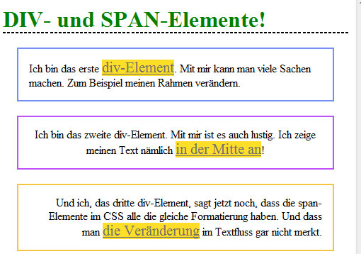

# 6.2.9 Die Elemente div und span

Das **allgemeine Block-Element** `div` und das **allgemeine Inline-Element** `span` gehören zu den wichtigsten Elementen beim „Bau“ eines CSS-Layouts, da sie selber recht eigenschaftslos sind. Der Unterschied zwischen ihnen besteht darin, dass ein `div`-Element einen neuen Absatz erzwingt, während ein `span`-Element auch innerhalb eines Textes verwendet werden kann, da es keinen neuen Absatz erzeugt.

- Das div-Block-Element wird immer in einer neuen, eigenen Zeile dargestellt und beeinflusst das Layout aller darin enthaltenen Elemente entsprechend der definierten CSS-Eigenschaften.

- Das `span`-Inline-Element wird direkt im Textfluss dargestellt und beeinflusst nur den Bereich, auf den es angewendet wird, ohne das umgebende Layout zu verändern.

---

### Sourcecode des Stylesheets

```css linenums="1"
h1 {
  border-bottom: thin dashed #000000; /* Rahmenlinie nur unten */
  color: green;
}
div {
  border: 2px solid; /* Rahmen rundherum */
  padding: 15px; /* Innenabstand */
  margin: 20px; /* Außenabstand */
}
span {
  text-decoration: underline;
  color: #71706b;
  font-size: 130%;
  background-color: #ffde28;
}
```

### Sourcecode des HTML-Dokuments

```html linenums="1"
<!doctype html>										
<html lang="de">
<head>
  <meta charset="utf-8">
  <title>DIV und SPAN im Vergleich</title>
  <link rel="stylesheet" type="text/css" href="css_bsp_divundspan.css">
</head>

<body>
  <h1>DIV- und SPAN-Elemente!</h1>
  <div style="border-color: #728ff9; text-align: left;">
    Ich bin das erste <span>div-Element</span>. 
    Mit mir kann man viele Sachen machen. 
    Zum Beispiel meinen Rahmen verändern.
  </div>
  <div style="border-color: #be54fa; text-align: center;">
    Ich bin das zweite div-Element. 
    Mit mir ist es auch lustig.
    Ich zeige meinen Text nämlich 
    <span>in der Mitte an</span>!
  </div>
  <div style="border-color: #f7c53d; text-align: right;">
    Und ich, das dritte div-Element, 
    sagt jetzt noch, dass die
    span-Elemente im CSS alle die gleiche 
    Formatierung haben.
    Und dass man <span>die Veränderung</span> 
    im Textfluss gar nicht merkt.
  </div>
</body>
</html>
```



*So sieht das Beispiel im Browser aus.*

---

### Erklärung: Verwendung von div- und span-Elementen

Das obige Beispiel zeigt, wie wir `div`- und `span`-Elemente verwenden können. Es wird deutlich, dass `div`-Elemente immer eine neue Zeile erzeugen, auch wenn im Sourcecode kein `<br>` oder ähnliches vorkommt. Die `span`-Elemente hingegen können einfach im Text verwendet werden. 

Das Beispiel zeigt auch, dass den einzelnen `div`-Tags eigene style-Attribute gegeben wurden (`border-color` und `text-align`), um sie individuell zu machen. Eine solche individuelle Anpassung ermöglicht uns große Flexibilität bei der Gestaltung.

---


### Fazit

#### `div`

- Ermöglicht die Gruppierung von Elementen für eine zentrale Formatierung.

- Wichtig für die Strukturierung von Layouts, insbesondere in Kombination mit CSS.

####  `span`

- Perfekt für kleine Anpassungen innerhalb von Texten.

- Keine zusätzlichen Zeilenumbrüche, wodurch das Textlayout erhalten bleibt.