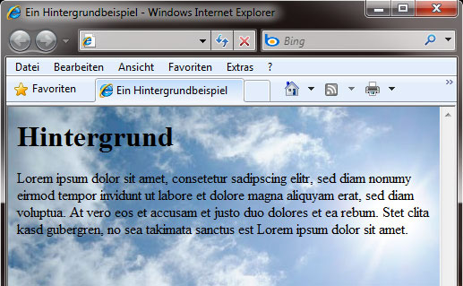
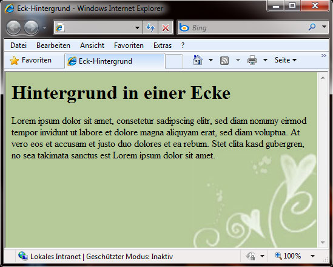

# 6.3.1 Hintergrundformatierung

Da der Hintergrund auch ein HTML-Element ist, können Sie diesen per CSS verändern und nach Ihren Vorstellungen anpassen. Mit etwas Übung können Sie damit sehr hübsche Effekte erzielen.


*So kann man mit CSS einen Hintergrund gestalten (moargh.de)*


*So ebenfalls, hier ist nur der obere Teil Hintergrund (anke-art.de)*

*Screenshots mit freundlicher Genehmigung von: www.moargh.de & www.anke-art.de*

---

## Hintergrundfarbe (`background-color`)

Nahezu jedem HTML-Element können Sie diese Eigenschaft zuweisen. Die Hintergrundfarbe wird genauso deklariert wie jede andere Farbe:

```css
background-color: (Farbwert);
background-color: #c0c0c0;
```

Erlaubt ist auch hier eine Farbangabe oder der Wert `transparent`.

---

## Hintergrundbild (`background-image`)

Um ein Hintergrundbild einzubinden, benötigen Sie lediglich den Pfadnamen des Bildes und folgende Syntax:

```css
background-image: URL([Pfadangabe]);
```

Als Datentypen sollten Sie `png`, `jpg` oder `gif` benutzen.



*Ein Vollbild-Hintergrund*

---

## Wiederholung des Hintergrundbildes (`background-repeat`)

Die Standardeinstellung wiederholt ein Hintergrundbild sowohl horizontal (x-Achse) als auch vertikal (y-Achse). Dies können Sie mit `background-repeat` beeinflussen. Die Schlüsselwörter sind:

- `repeat` – Wiederholung in x- und y-Achsen-Richtung
- `repeat-x` – Wiederholung in x-Achsen-Richtung (waagerecht)
- `repeat-y` – Wiederholung in y-Achsen-Richtung (senkrecht)
- `no-repeat` – keine Wiederholung, Bild wird nur einmal angezeigt

### Beispiele für `repeat` und `repeat-y`


*Die einzelne Hintergrunddatei... (Quelle: www.squidfingers.com/patterns/)*


*...und das Ergebnis mit `repeat`*

---


*Die einzelne Hintergrunddatei...*


*...und das Ergebnis mit `repeat-y`*


---

## Wasserzeicheneffekt (`background-attachment`)

Ein scrollbares Element mit einem Hintergrund scrollt standardmäßig mit. Dies können Sie verhindern, indem Sie einen Wasserzeicheneffekt (`background-attachment`) verwenden:

- `scroll` – Hintergrund scrollt mit (Position am Element orientiert)
- `fixed` – Hintergrund bleibt stehen (Position am Browserfenster orientiert)

---

## Hintergrundposition (`background-position`)

Die Position des Hintergrundes ist vor allem bei einem Hintergrund ohne Wiederholung interessant. Bei der Hintergrundposition legen Sie fest, an welcher Position die linke obere Ecke der Grafik stehen soll. Dabei können wir zwei numerische Werte angeben, den horizontalen und den vertikalen, oder folgende Schlüsselwörter: 

- `top` – bündig mit dem oberen Rand
- `bottom` – bündig mit dem unteren Rand
- `center` – zentriert
- `left` – bündig mit dem linken Rand
- `right` – bündig mit dem rechten Rand



*Hintergrund in der rechten unteren Ecke*

```css linenums="1"
body {
    background-color: #b5c998;
    background-image: URL(./eckbg.jpg);
    background-repeat: no-repeat;
    background-position: bottom right;
    background-attachment: fixed;
}
```

Auch die Formatierungen des Hintergrunds können Sie als Sammeleigenschaft zusammenfassen. Dabei werden die oben genannten Formatierungen in genau dieser Reihenfolge hinter `background` geschrieben. Angaben werden mit Leerzeichen getrennt:

```css linenums="1"
background: #b5c998 URL(./eckbg.jpg) no-repeat bottom right fixed;
```


---

## Hintergrundgröße (`background-size`)

Mit der Eigenschaft `background-size` können wir die Größe des Hintergrundbildes festlegen. Gängige Werte sind:

- `cover` – skaliert das Bild, sodass es den gesamten Container abdeckt, ohne das Seitenverhältnis zu verändern. Teile des Bildes können dabei abgeschnitten werden.

- `contain` – skaliert das Bild, sodass es vollständig im Container sichtbar ist, ohne das Seitenverhältnis zu verändern. Es können dabei Ränder entstehen.

```css linenums="1"
body {
    background-image: url(./eckbg.jpg);
    background-size: cover;
}
```

---

## Hintergrundüberblendung (`background-blend-mode`)

Die Eigenschaft `background-blend-mode` definiert, wie ein Element's Hintergrundbilder miteinander und mit der Hintergrundfarbe vermischt werden.  Gängige Werte sind:

- `normal` – Standardmodus, keine Überblendung.

- `multiply` – multipliziert die Farbwerte der Hintergrundbilder und -farben, was zu einem dunkleren Ergebnis führt.

- `screen` – invertiert die Farbwerte, multipliziert sie und invertiert sie erneut, was zu einem helleren Ergebnis führt.


```css linenums="1"
body {
    background-image: url(./eckbg.jpg), url(./muster.png);
    background-blend-mode: multiply;
}
```

Durch die Kombination von `background-size` und `background-blend-mode` können wir flexible und ansprechende Hintergrundgestaltungen realisieren. 
