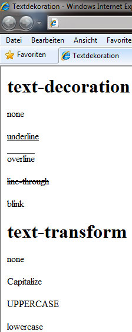

# 6.3.2 Schriftformatierung

Unter Schriftformatierung verstehen wir die Festlegung von Eigenschaften wie Schriftart, Schriftgröße, Schriftfarbe und weiteren Merkmalen. Mit diesen Angaben können wir alle HTML-Elemente formatieren, die Text enthalten, z. B. Absätze, Tabellen oder das `body`-Element.

Wenn nichts anderes angegeben ist, bleibt die Syntax wie bei allen anderen CSS-Eigenschaften:


---

## Schriftstil (`font-style`)

Der Schriftstil definiert die Neigung der Schrift. Folgende Werte sind möglich:

| **Wert**    | **Beschreibung**               |
|-------------|--------------------------------|
| `normal`    | Normale Schrift, keine Änderung |
| `italic`    | Kursive Schrift                |
| `oblique`   | Schräggestellte Schrift (noch etwas schräger als kursiv)        |

---

## Schriftvarianten (`font-variant`)

Mit `font-variant` können wir zwischen normaler Schrift und Kapitälchen (kleine Großbuchstaben) wählen.

| **Wert**         | **Beschreibung**             |
|------------------|-----------------------------|
| `normal`         | Normale Schrift             |
| `small-caps`     | Kapitälchen                 |
| `all-small-caps`   | Kapitälchen für alle Buchstaben       |
| `petite-caps`      | Kleinere Kapitälchen                 |
| `unicase`          | Vereinheitlichte Groß- und Kleinbuchstaben |
| `titling-caps`     | Großbuchstaben für Titel             |

---

## Schriftgewicht (`font-weight`)

Das Schriftgewicht bestimmt die Dicke der Schrift.

| **Wert**      | **Beschreibung**                     |
|---------------|-------------------------------------|
| `normal`      | Normale Schrift (entspricht `400`)  |
| `bold`        | Fette Schrift (entspricht `700`)    |
| `bolder`      | Fetter als der übergeordnete Text   |
| `lighter`     | Dünner als der übergeordnete Text   |
| `100`–`900`   | Werte von sehr dünn bis sehr fett   |

---

## Schriftgröße (`font-size`)

Bei der Angabe der Schriftgröße (also die Darstellungsgröße der Schrift) können Sie sowohl numerische Angaben, als auch Prozentwerte angeben. Alternativ dazu beinhaltet diese Eigenschaft Schlüsselworte, die eine ähnliche Wirkung haben. Tipp: Orientieren Sie sich hier an Kleidergrößen von XXS bis XXL. 

### Absolute Schlüsselwörter

| **Wert**       | **Beschreibung**  |
|----------------|-------------------|
| `xx-small`     | Winzig            |
| `x-small`      | Sehr klein        |
| `small`        | Klein             |
| `medium`       | Mittel            |
| `large`        | Groß              |
| `x-large`      | Sehr groß         |
| `xx-large`     | Riesig            |

### Relative Schlüsselwörter

| **Wert**       | **Beschreibung**                            |
|----------------|--------------------------------------------|
| `smaller`      | Kleiner als die Schriftgröße des Elternelements |
| `larger`       | Größer als die Schriftgröße des Elternelements |

### Empfehlung 

Wir empfehlen die Verwendung der Einheit `rem`, da sie sich auf die Schriftgröße des Wurzelelements (`<html>`) bezieht und konsistente Designs ermöglicht.

```css linenums="1"
html {
    font-size: 16px;
}

p {
    font-size: 1.5rem; /* entspricht 24px */
}
```

---

## Schriftart (`font-family`)

Mit `font-family` legen wir die Schriftart fest. Es ist empfehlenswert, mehrere Schriftarten in absteigender Präferenz anzugeben, gefolgt von einer generischen Schriftfamilie.

```css linenums="1"
p {
    font-family: 'Helvetica', 'Arial', sans-serif;
}
```

| **Generische Familie** | **Beschreibung**                   |
|------------------------|-------------------------------------|
| `serif`               | Serifenschrift, z. B. Times New Roman |
| `sans-serif`          | Serifenlose Schrift, z. B. Arial   |
| `monospace`           | Schrift mit fester Breite, z. B. Courier |
| `cursive`             | Handschriftstil, z. B. Comic Sans  |
| `fantasy`             | Dekorative Schrift, z. B. Impact   |

**Hinweis:** Schriftartnamen mit Leerzeichen sollten in Anführungszeichen gesetzt werden.

---

## Zusammenfassung von Schriftformatierungen (`font`-Shorthand)

Die `font`-Eigenschaft ermöglicht es, mehrere Schrift-Eigenschaften in einer einzigen Deklaration zusammenzufassen. Die Reihenfolge der Werte ist:

1. `font-style`
2. `font-variant`
3. `font-weight`
4. `font-size`
5. (`line-height`)
6. `font-family`


!!! question "CSS übersichtlicher gestalten"
    In ein Stylesheet hat jemand in aller Eile ein paar Eigenschaften für ein `div`-Tag eingefügt, ohne darüber nachzudenken, diese zu ordnen oder gar zu sammeln.

    ```css linenums="1"
    div {
        font-size: 1.2em;
        background-color: #c0c0c0;
        text-align: center;
        line-height: 120%;
        border-style: solid;
        font-variant: small-caps;
        border-bottom-color: #ffff00;
        font-family: Helvetica;
        color: #000000;
        font-style: normal;
        border-width: 2px;
        font-weight: bold;
    }
    ```
    Die Übersichtlichkeit geht völlig verloren, vor allem weil die Schrifteigenschaften ebenfalls bunt durcheinander gewürfelt werden.

    ??? example "Lösung"
        Alle font-Anweisungen sind nun in der richtigen Reihenfolge in einer Zeile

        ```css linenums="1"
        div {
            font: normal small-caps bold 1.2em/120% Helvetica;
            background-color: #c0c0c0;
            text-align: center;
            border: 2px solid;
            border-bottom-color: #ffff00;
            color: #000000;
        }
        ```

        Sie sehen, beim Sammeln müssen Sie nicht nur erkennen, welche Eigenschaften Sie nehmen dürfen, sondern auch in welche Reihenfolge sie gebracht werden müssen! Haben Sie auch die Zeilenhöhe (`line-height`) beachtet? Da sie in der großen Version vorkommt, können Sie diese natürlich beim Sammeln mit einbeziehen.


---

## Textdekoration (`text-decoration`)

Die Eigenschaft `text-decoration` bietet folgende Werte:

| **Wert**        | **Beschreibung**        |
|-----------------|------------------------|
| `none`          | Keine Dekoration        |
| `underline`     | Unterstreicht den Text  |
| `overline`      | Überstreicht den Text   |
| `line-through`  | Streicht den Text durch |

### Erweiterte Textdekoration

Mit `text-decoration-style` und `text-decoration-thickness` können wir die Art und Dicke der Dekoration anpassen:

```css linenums="1"
h1 {
    text-decoration: underline wavy;
    text-decoration-thickness: 2px;
}
```

---

## Text-Transformation (`text-transform`)

Mit `text-transform` können wir den Text dekorieren:

| **Wert**        | **Beschreibung**                            |
|-----------------|--------------------------------------------|
| `none`          | Keine Transformation                      |
| `capitalize`    | Jedes Wort beginnt mit einem Großbuchstaben |
| `uppercase`     | Alle Buchstaben werden großgeschrieben     |
| `lowercase`     | Alle Buchstaben werden kleingeschrieben    |



---

## Wort- und Zeichenabstand (`word-spacing`, `letter-spacing`)

Mit diesen Eigenschaften können wir den Abstand zwischen Wörtern und Zeichen steuern:

```css linenums="1"
p {
    word-spacing: 0.5em;
    letter-spacing: 0.1em;
}
```

---

## Textfarbe (`color`)

Die Farbe des Textes wird mit `color` definiert. Moderne Farbnotionen wie `rgba` und `hsla` werden unterstützt:

```css linenums="1"
body {
    color: rgba(128, 0, 128, 0.8); /* Transparentes Lila */
}
```
Dies bestimmt, dass die Schriftfarbe im body-Bereich lila sein wird. 