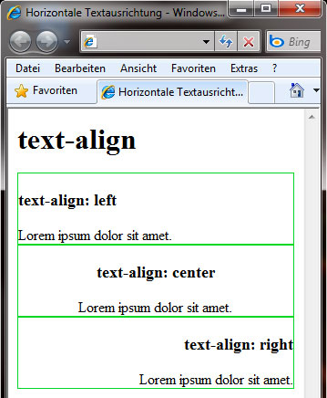
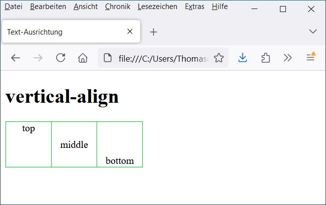

# 6.3.3 Absätze und Ausrichtungen

Um Texte zu formatieren, ist es hilfreich, typische Eigenschaften für Absätze zu definieren. Diese funktionieren ähnlich wie in einem Textverarbeitungsprogramm. Das gleiche gilt für Tabellen und andere Elemente, die Text enthalten. Häufig geht es um die Textausrichtung (horizontal oder vertikal), aber auch um Einzug und Zeilenhöhe.

---

## Zeilenhöhe (`line-height`)

Die Zeilenhöhe ist besonders für Elemente mit viel Fließtext geeignet, da eine größere Zeilenhöhe den Lesefluss verbessert. Das kennen wir aus Textdokumenten, die eine Zeilenhöhe von 1,5 Zeilen verwenden, um die Lesbarkeit zu erhöhen. Die Zeilenhöhe kann außerdem mit der Schriftgröße kombiniert werden (siehe Kapitel „Schriftformatierungen“).

```css linenums="1"
line-height: 120%;
```

Als Wert der Zeilenhöhe sind numerische Angaben oder Prozentwerte erlaubt. Prozentangaben beziehen sich auf die Schriftgröße des jeweiligen Textes.

---

## Texteinrückung (`text-indent`)

Mit `text-indent` können wir bestimmen, wie stark die erste Zeile eines Fließtextes eingerückt werden soll. Soll die erste Zeile des Textes ausgerückt werden (also vor dem Rest des Fließtextes stehen), erreichen wir dies durch einen negativen Wert.

```css linenums="1"
text-indent: 1em; /* erste Zeile eingerückt um 1em */
text-indent: -1em; /* erste Zeile ausgerückt um 1em */
```

**Hinweis:** Eine negative Einrückung kann für die sogenannte "Hanging Indent"-Technik verwendet werden, z. B. bei Literaturverzeichnissen.

---

## Textumbruch (`white-space`)

Mit `white-space` legen wir fest, wie der Textumbruch erfolgen soll. Wir können zwischen folgenden Optionen wählen:

| **Wert**     | **Beschreibung**                                                             |
|--------------|-----------------------------------------------------------------------------|
| `normal`     | Automatischer Zeilenumbruch                                                 |
| `pre`        | Zeilenumbruch wie im Texteditor eingegeben                                  |
| `pre-wrap`   | Wie `pre`, jedoch zusätzlicher Umbruch bei zu geringer Breite des Elements  |
| `nowrap`     | Kein automatischer Zeilenumbruch (nur durch HTML möglich)                   |

**Hinweis:** Die Option `pre-wrap` wird häufig eingesetzt, um Code- oder Textelemente besser darzustellen.

---

## Horizontale Ausrichtung (`text-align`)

Die horizontale Ausrichtung betrifft alle Inline-Elemente innerhalb eines Block-Elements. Mögliche Werte:

| **Wert**     | **Beschreibung** |
|--------------|------------------|
| `left`       | Links ausgerichtet |
| `right`      | Rechts ausgerichtet |
| `center`     | Zentriert |
| `justify`    | Blocksatz |

---

### Beispiel: Horizontale Ausrichtungen

```html linenums="1"
<!doctype html>
<html lang="de">
<head>
  <meta charset="UTF-8">
  <meta name="viewport" content="width=device-width, initial-scale=1.0">
  <title>Horizontale Textausrichtung</title>
  <style>
    div {
        border: 1px solid #01d823;
        margin-bottom: 1rem;
        padding: 0.5rem;
    }

    .left {
        text-align: left;
    }

    .center {
        text-align: center;
    }

    .right {
        text-align: right;
    }
  </style>
</head>
<body>
  <h1>text-align</h1>
  <div class="left">
    <h3>text-align: left</h3>
    Lorem ipsum dolor sit amet.
  </div>
  <div class="center">
    <h3>text-align: center</h3>
    Lorem ipsum dolor sit amet.
  </div>
  <div class="right">
    <h3>text-align: right</h3>
    Lorem ipsum dolor sit amet.
  </div>
</body>
</html>
```

{width="50%"}

---

## Vertikale Ausrichtung (`vertical-align`)

Mit `vertical-align` können wir Elemente, die nebeneinander angeordnet sind, vertikal ausrichten. Dies ist häufig bei Tabellenzeilen oder Texten mit unterschiedlichen Schriftgrößen der Fall.

| **Wert**       | **Beschreibung**                       |
|----------------|---------------------------------------|
| `top`          | Oben bündig                           |
| `middle`       | Mittig                                |
| `bottom`       | Unten bündig                          |
| `baseline`     | An der Basislinie ausgerichtet        |
| `sub`          | Tiefergestellt                       |
| `super`        | Höhergestellt                        |
| `text-top`     | Am oberen Textrand                   |
| `text-bottom`  | Am unteren Textrand                  |

---

### Beispiel: Vertikale Ausrichtungen

```html linenums="1"
<!DOCTYPE html>
<html lang="de">
<head>
  <meta charset="UTF-8">
  <meta name="viewport" content="width=device-width, initial-scale=1.0">
  <title>Text-Ausrichtung</title>
  <style>
    table {
        border-collapse: collapse;
        width: auto;
    }

    td {
        width: 70px;
        height: 70px;
        border: 1px solid #01d823;
        text-align: center;
        vertical-align: middle; /* Default vertical alignment */
    }

    td.top {
        vertical-align: top;
    }

    td.middle {
        vertical-align: middle;
    }

    td.bottom {
        vertical-align: bottom;
    }
  </style>
</head>
<body>
  <h1>vertical-align</h1>
  <table>
    <tr>
      <td class="top">top</td>
      <td class="middle">middle</td>
      <td class="bottom">bottom</td>
    </tr>
  </table>
</body>
</html>
```

{width="50%"}

---

**Anmerkung:** Im HTML-Beispiel wurde eine `<table>` verwendet, um drei "Boxen" nebeneinander zu erstellen. Wie wir dies professionell ohne `<table>` umsetzen können, wird im Kapitel zur Positionierung gezeigt.

---

!!! note "Sourcecode ausprobieren"
    Der Sourcecode für `text-align` und `vertical-align` wurde absichtlich in eine Datei geschrieben, sodass wir ihn kopieren und als `index.html` speichern können. Anschließend können wir die Datei im Browser öffnen und ausprobieren.
