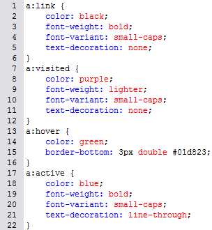

# 6.3.3 Pseudoklassen

Pseudoklassen (und auch Pseudoelemente) definieren HTML-Bestandteile, die sich nicht eindeutig durch ein Element ausdrücken lassen. So gibt es z. B. einen Link als HTML-Element, einen „noch nicht besuchten Link“ kann man jedoch nicht direkt ansprechen: Es gibt nur das HTML-Element `<a>`, nicht aber z. B. das Element `<a-noch-nicht-besucht>`. Dazu gibt es Pseudoklassen, die – wie auch richtige Klassen – eine spezielle Syntax haben.

---

## Pseudoklassen für Links (`<a>`)

Im Folgenden finden Sie die Pseudoklassen des Link-Elements `<a>`. Es gibt noch weitere Pseudoklassen und Pseudoelemente, die hier jedoch nicht genauer definiert sind:

- `:link` – Verweise auf noch nicht besuchte Seiten
- `:visited` – Verweise auf besuchte Seiten
- `:hover` – Formatierung beim Darüberfahren mit der Maus („Mouseover“)
- `:active` – gerade angeklickte Verweise
- `:focus` – Elemente, die gerade im Fokus sind (z. B. beim Durchklicken per Tabulator-Taste)

---

## Beispiel: Pseudoklassen für Links

Probieren Sie ein bisschen mit den Links herum! Das Beispiel zeigt, wie die Pseudoklassen in einer CSS-Datei angewandt werden.

### Sourcecode des Stylesheets
;;;css
a:link {
    color: blue;
}
a:visited {
    color: purple;
}
a:hover {
    color: red;
    text-decoration: underline;
}
a:active {
    color: orange;
}
;;;

### Sourcecode des HTML-Dokumentes
;;;html
<!doctype html>										
<html lang="de">
<head>
  <meta charset="utf-8">
  <title>Pseudoklassen</title>
  <link rel="stylesheet" type="text/css" 
	href="css_bsp_pseudoklassen.css">
</head>

<body>
  <h1>Pseudoklassen bei Links</h1>
    

      <a href="#1">Link 1</a> 
      <a href="#2">Link 2</a> 
      <a href="#3">Link 3</a> 
    

</body>
</html>
;;;

---

Durch die Verwendung dieser Pseudoklassen können Sie das Verhalten und die Darstellung von Links und anderen Elementen deutlich verbessern und interaktive Effekte hinzufügen.
