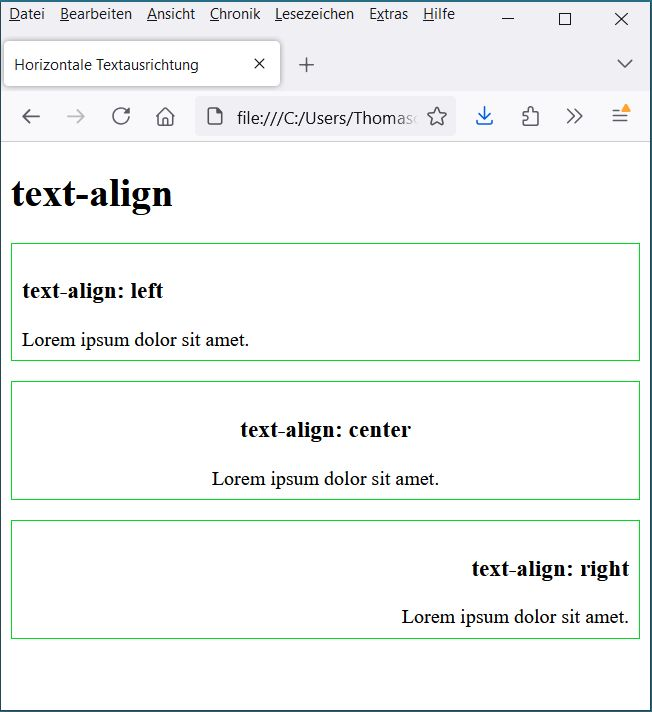

# 6.3.4 Absätze und Ausrichtungen

Um Texte zu formatieren, ist es hilfreich, für Absätze typische Eigenschaften zu definieren. Diese funktionieren ähnlich wie in einem Textverarbeitungsprogramm. Das gleiche gilt für Tabellen und weitere Elemente, die Text beinhalten. Häufig geht es hier um die Textausrichtung (horizontal oder vertikal), aber auch um Einzug und Zeilenhöhe.

---

## Zeilenhöhe (`line-height`)

Die Zeilenhöhe ist besonders für Elemente mit viel Fließtext geeignet, da eine größere Zeilenhöhe den Lesefluss bestärkt. Sie kennen das bestimmt aus Textdokumenten, denen Sie eine Zeilenhöhe von 1,5 Zeilen geben, um sie besser lesbar zu machen. Die Zeilenhöhe kann außerdem mit der Schriftgröße kombiniert werden (siehe Kapitel „Schriftformatierungen“).

;;;css
line-height: 120%;
;;;

Als Wert der Zeilenhöhe sind numerische Angaben oder Prozentwerte erlaubt. Prozentangaben beziehen sich auf die Schriftgröße des jeweiligen Textes.

---

## Texteinrückung (`text-indent`)

Mit `text-indent` können Sie bestimmen, wie stark die erste Zeile eines Fließtextes eingerückt werden soll. Diese Angabe kann nur mit numerischen Werten gemacht werden. Soll die erste Zeile des Textes ausgerückt werden (also vor dem Rest des Fließtextes stehen), erreichen Sie das durch einen negativen Wert.

;;;css
text-indent: 1em; /* erste Zeile eingerückt um 1em */
text-indent: -1em; /* erste Zeile ausgerückt um 1em */
;;;

---

## Textumbruch (`white-space`)

Der `white-space` legt fest, wie der Textumbruch erfolgen soll. Dabei gibt es folgende Optionen:

- `normal` – automatischer Zeilenumbruch
- `pre` – Zeilenumbruch wie im Texteditor eingegeben
- `pre-wrap` – wie `pre`, jedoch Umbruch bei zu geringer Breite des Elements
- `nowrap` – kein automatischer Zeilenumbruch (nur durch HTML möglich)

### Beispiel: Textumbrüche

Die roten Pfeile im Sourcecode markieren die Zeilenumbrüche, die im Editor vorgenommen wurden. Die Browseransicht zeigt, dass `pre-wrap` mehr Zeilenumbrüche vornimmt, wenn das Fenster zu klein ist.

---

## Horizontale Ausrichtung (`text-align`)

Die horizontale Ausrichtung bezieht sich auf alle Inline-Elemente innerhalb eines Block-Elements. Mögliche Werte:

- `left` – linksbündig
- `right` – rechtsbündig
- `center` – zentriert
- `justify` – Blocksatz

### Beispiel: Horizontale Ausrichtungen

---

## Vertikale Ausrichtung (`vertical-align`)

Mit `vertical-align` können Sie Elemente, die nebeneinander angeordnet sind, vertikal ausrichten. Beispiele sind Zellen in Tabellenzeilen oder Textpassagen mit unterschiedlichen Schriftgrößen. Werte:

- `top` – oben bündig
- `middle` – mittig
- `bottom` – unten bündig

Zusätzliche Werte:
- `baseline` – an der Basislinie ausgerichtet
- `sub` – tiefergestellt
- `super` – höhergestellt
- `text-top` – am oberen Textrand
- `text-bottom` – am unteren Textrand

### Beispiel: Vertikale Ausrichtungen

