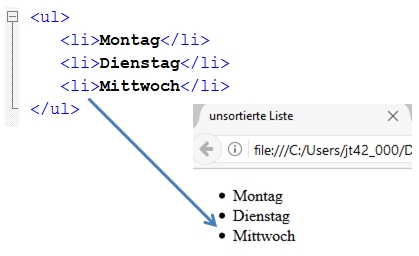
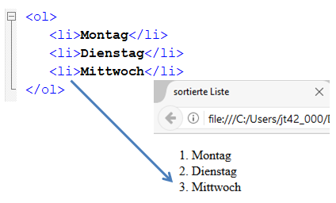
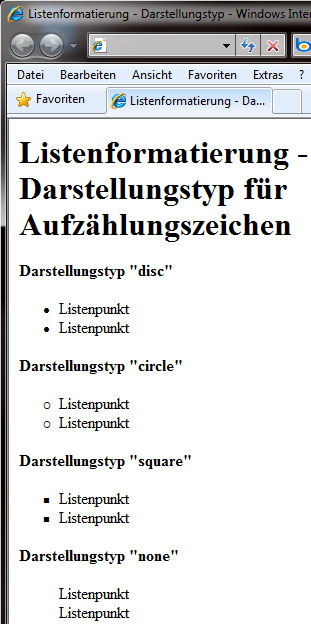
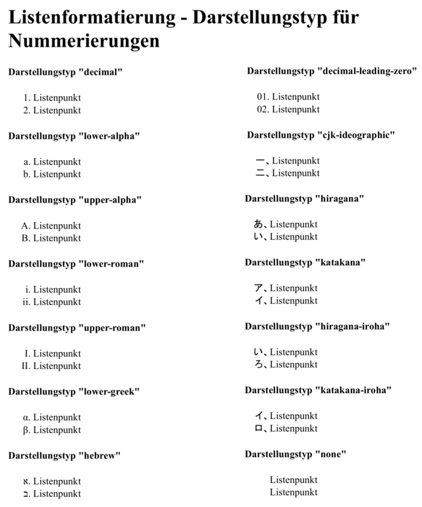
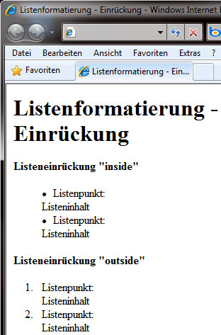
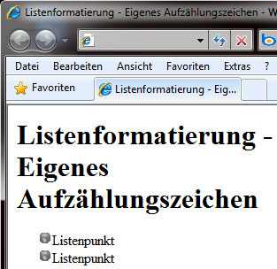
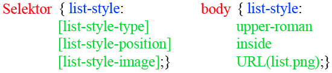

# 6.3.4 Listenformatierung

Wenn wir in einem HTML-Dokument eine Liste erstellen, kann diese entweder eine Aufzählungs- oder eine nummerierte Liste sein. Diese sehen standardmäßig so aus:

{width="40%"}

{width="40%"}

Solch eine Formatierung ist zwar zweckmäßig, jedoch nicht unbedingt optisch ansprechend. Um diese zu formatieren, haben wir folgende Möglichkeiten.

---

## Darstellungstyp (`list-style-type`)

Wir können das Erscheinungsbild des Aufzählungszeichens (Bullet) oder der Nummerierung näher bestimmen.

```css linenums="1"
ul { list-style-type: disc; }
ol { list-style-type: decimal; }
```

### Mögliche Werte für Aufzählungszeichen

| **Wert**   | **Beschreibung**                |
|------------|----------------------------------|
| `disc`     | Gefüllter Kreis (Standard)      |
| `circle`   | Leerer Kreis                    |
| `square`   | Rechteckiges Aufzählungszeichen |
| `none`     | Kein Aufzählungszeichen         |



### Mögliche Werte für Nummerierungen

| **Wert**               | **Beschreibung**                         |
|------------------------|-----------------------------------------|
| `decimal`             | Nummerierung mit Zahlen                 |
| `lower-alpha`         | Nummerierung mit Kleinbuchstaben (a, b, c…) |
| `upper-alpha`         | Nummerierung mit Großbuchstaben (A, B, C…) |
| `lower-roman`         | Römische Nummerierung (i, ii, iii…)      |
| `upper-roman`         | Römische Nummerierung (I, II, III…)      |
| `lower-greek`         | Kleine, griechische Buchstaben          |
| `hebrew`              | Hebräische Buchstaben                   |
| `decimal-leading-zero` | Zahlen mit führender Null               |
| `cjk-ideographic`     | Ideographische Zeichen                  |
| `hiragana`            | Nummerierung in Japanisch               |
| `katakana`            | Nummerierung in Japanisch (Großbuchstaben) |
| `none`                | Keine Nummerierung                      |

{width="50%"}

---

## Listeneinrückung (`list-style-position`)

Mit der Listeneinrückung bestimmen wir, an welcher Position die zweite Zeile des Inhalts eines Listenpunkts steht.

| **Wert**    | **Beschreibung**                             |
|-------------|---------------------------------------------|
| `inside`    | Die zweite Zeile ist mit dem Aufzählungszeichen bündig. |
| `outside`   | Die zweite Zeile beginnt unter dem Text des ersten Listenpunkts (Standard). |

### Beispiel: Listeneinrückung

```html linenums="1"
<!DOCTYPE html>
<html lang="de">
<head>
  <meta charset="UTF-8">
  <meta name="viewport" content="width=device-width, initial-scale=1.0">
  <title>Listeneinrückung</title>
  <style>
    ul.inside {
        list-style-position: inside;
    }

    ul.outside {
        list-style-position: outside;
    }
  </style>
</head>
<body>
  <h1>Listeneinrückung</h1>
  <h3>Inside</h3>
  <ul class="inside">
    <li>Erster Punkt mit Inside.</li>
    <li>Zweiter Punkt mit Inside.</li>
  </ul>
  <h3>Outside</h3>
  <ul class="outside">
    <li>Erster Punkt mit Outside.</li>
    <li>Zweiter Punkt mit Outside.</li>
  </ul>
</body>
</html>
```



---

## Eigene Grafik einbinden (`list-style-image`)

Haben wir eigene Ideen für Aufzählungszeichen, können wir diese in Form von Grafiken umsetzen:

```css linenums="1"
ul { list-style-image: url('bullet.png'); }
```

### Hinweise
- Wir können den Pfad zur Grafikdatei angeben oder den Wert `none`, um das Standardzeichen zu entfernen.
- Erlaubte Formate sind z. B. `png`, `jpg`, `gif`.
- **Achtung:** Große Dateien oder Bilder, die nicht für hochauflösende Displays optimiert sind, können die Ladezeit und Darstellung beeinträchtigen.



---

## Listenformatierung als Sammeleigenschaft

Auch für Listen können wir Sammeleigenschaften verwenden. Dabei ist die Reihenfolge der Eigenschaften unerheblich, und es müssen nicht alle Eigenschaften definiert sein. Die Eigenschaften werden mit Leerzeichen getrennt aufgeschrieben.

### Beispiel: Sammeleigenschaft

```css linenums="1"
ul {
    list-style: square inside url('bullet.png');
}
```

### Tabelle: Bestandteile der Sammeleigenschaft

| **Eigenschaft**        | **Beschreibung**                       |
|-----------------------|---------------------------------------|
| `list-style-type`     | Typ des Aufzählungszeichens           |
| `list-style-position` | Position des Aufzählungszeichens      |
| `list-style-image`    | Grafik als Aufzählungszeichen         |


