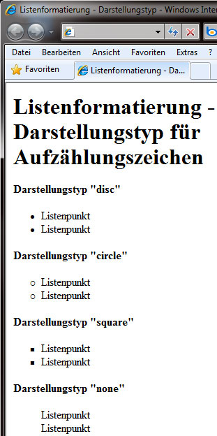

# 6.3.5 Listenformatierung

Wenn Sie in einem HTML-Dokument eine Liste erstellen, kann diese entweder eine Aufzählungs- oder eine nummerierte Liste sein. Diese sehen standardmäßig so aus:

Solch eine Formatierung ist zwar zweckmäßig, jedoch nicht unbedingt schön. Um diese zu formatieren, haben Sie die folgenden Möglichkeiten.

---

## Darstellungstyp (`list-style-type`)

Sie können das Erscheinungsbild des Aufzählungszeichens (Bullet) oder der Nummerierung näher bestimmen.

;;;css
ul { list-style-type: disc; }
ol { list-style-type: decimal; }
;;;

### Mögliche Werte für Aufzählungszeichen:
- `disc` – gefüllter Kreis (Standard)
- `circle` – leerer Kreis
- `square` – rechteckiges Aufzählungszeichen
- `none` – kein Aufzählungszeichen

### Mögliche Werte für Nummerierungen:
- `decimal` – Nummerierung mit Zahlen
- `lower-alpha` / `lower-latin` – Nummerierung mit Buchstaben (a, b, c…)
- `upper-alpha` / `upper-latin` – Nummerierung mit Großbuchstaben (A, B, C…)
- `lower-roman` – römische Nummerierung (i, ii, iii…)
- `upper-roman` – römische Nummerierung (I, II, III…)
- `lower-greek` – kleine, griechische Buchstaben
- `hebrew` – hebräische Buchstaben
- `decimal-leading-zero` – Zahlen mit führender Null
- `cjk-ideographic` – ideographische Zeichen
- `hiragana` / `hiragana-iroha` – Nummerierung in Japanisch
- `katakana` / `katakana-iroha` – Nummerierung in Japanisch (Großbuchstaben)
- `none` – keine Nummerierung

---

## Listeneinrückung (`list-style-position`)

Mit der Listeneinrückung bestimmen Sie, an welcher Position die zweite Zeile des Inhalts eines Listenpunktes steht. Werte:

- `inside` – eingerückt
- `outside` – ausgerückt (Standardeinstellung)

---

## Eigene Grafik einbinden (`list-style-image`)

Haben Sie eigene Ideen für Aufzählungszeichen, können Sie diese in Form von Grafiken verwirklichen:

;;;css
ul { list-style-image: URL([Pfad zur Datei]); }
;;;

Sie können hier sowohl den Pfad zur Datei als auch `none` angeben. Erlaubte Formate sind z. B. `png`, `jpg`, `gif`.

---

## Listenformatierung als Sammeleigenschaft

Auch zu Listen können Sie Sammeleigenschaften formulieren. Hierbei ist die Reihenfolge allerdings unerheblich, und es müssen nicht alle Eigenschaften definiert sein. Die Eigenschaften werden mit Leerzeichen getrennt aufgeschrieben.

