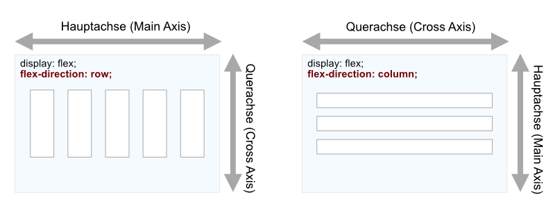

# 6.4.11 CSS Flexbox – Verteilung auf Hauptachse und Querachse


## CSS Flexbox-Eigenschaft `justify-content`

```css linenums="1"
justify-content: flex-start | flex-end | center | space-between | space-around | space-evenly;
```

Zur Verteilung der Elemente entlang der Hauptachse der Flexbox kann die Eigenschaft `justify-content` verwendet werden. Die verschiedenen Aufteilungen werden im folgenden Beispiel dargestellt.


<iframe id="static-preview-frame" style="width: 100%; height: 450px; border: 1px solid #ccc;"></iframe>
<script>
  const iframeContent = `
  <!DOCTYPE html>
  <html>
  <head>
    <meta charset="utf-8">
    <title>Beispiele zu justify-content</title>
    <style>
      p {
        text-align: center;
        margin: 14px 0 4px 0;
      }
      .flex-container {
        margin: auto;
        margin-top: 0;
        width: 400px;
        height: 30px;
        border: 1px solid gray;
        background-color: lightgray;
        display: flex;
      }
      /* Innere Element zur besseren Darstellung stylen */
      .flex-container>div {
        border: 1px solid darkblue;
        background-color: lightblue;
        text-align: center;
        min-width: 50px;
      }
      .jc-flex-end {
        justify-content: flex-end;
      }
      .jc-center {
        justify-content: center;
      }
      .jc-space-between {
        justify-content: space-between;
      }
      .jc-space-around {
        justify-content: space-around;
      }
      .jc-space-evenly {
        justify-content: space-evenly;
      }
    </style>
  </head>
  <body>
    <p>justify-content: flex-start</p>
    <div class="flex-container">
      <div class="a">A</div>
      <div class="b">B</div>
      <div class="c">C</div>
    </div>
    <p>justify-content: flex-end</p>
    <div class="flex-container jc-flex-end">
      <div class="a">A</div>
      <div class="b">B</div>
      <div class="c">C</div>
    </div>
    <p>justify-content: flex-center</p>
    <div class="flex-container jc-center">
      <div class="a">A</div>
      <div class="b">B</div>
      <div class="c">C</div>
    </div>
    <p>justify-content: space-between</p>
    <div class="flex-container jc-space-between">
      <div class="a">A</div>
      <div class="b">B</div>
      <div class="c">C</div>
    </div>
    <p>justify-content: space-around</p>
    <div class="flex-container jc-space-around">
      <div class="a">A</div>
      <div class="b">B</div>
      <div class="c">C</div>
    </div>
    <p>justify-content: space-evenly</p>
    <div class="flex-container jc-space-evenly">
      <div class="a">A</div>
      <div class="b">B</div>
      <div class="c">C</div>
    </div>
  </body>
  </html>
  `;
  const iframe = document.getElementById('static-preview-frame');
  iframe.srcdoc = iframeContent;
</script>


??? note "Sourcecode zum Beispiel"   
    ```html linenums="1"
    <!DOCTYPE html>
    <html>
    <head>
      <meta charset="utf-8">
      <title>Beispiele zu justify-content</title>
      <style>
        p {
          text-align: center;
          margin: 14px 0 4px 0;
        }
        .flex-container {
          margin: auto;
          margin-top: 0;
          width: 400px;
          height: 30px;
          border: 1px solid gray;
          background-color: lightgray;
          display: flex;
        }
        /* Innere Element zur besseren Darstellung stylen */
        .flex-container>div {
          border: 1px solid darkblue;
          background-color: lightblue;
          text-align: center;
          min-width: 50px;
        }
        .jc-flex-end {
          justify-content: flex-end;
        }
        .jc-center {
          justify-content: center;
        }
        .jc-space-between {
          justify-content: space-between;
        }
        .jc-space-around {
          justify-content: space-around;
        }
        .jc-space-evenly {
          justify-content: space-evenly;
        }
      </style>
    </head>
    <body>
      <p>justify-content: flex-start</p>
      <div class="flex-container">
        <div class="a">A</div>
        <div class="b">B</div>
        <div class="c">C</div>
      </div>
      <p>justify-content: flex-end</p>
      <div class="flex-container jc-flex-end">
        <div class="a">A</div>
        <div class="b">B</div>
        <div class="c">C</div>
      </div>
      <p>justify-content: flex-center</p>
      <div class="flex-container jc-center">
        <div class="a">A</div>
        <div class="b">B</div>
        <div class="c">C</div>
      </div>
      <p>justify-content: space-between</p>
      <div class="flex-container jc-space-between">
        <div class="a">A</div>
        <div class="b">B</div>
        <div class="c">C</div>
      </div>
      <p>justify-content: space-around</p>
      <div class="flex-container jc-space-around">
        <div class="a">A</div>
        <div class="b">B</div>
        <div class="c">C</div>
      </div>
      <p>justify-content: space-evenly</p>
      <div class="flex-container jc-space-evenly">
        <div class="a">A</div>
        <div class="b">B</div>
        <div class="c">C</div>
      </div>
    </body>
    </html>
    ```


---

## CSS Flexbox-Eigenschaften `align-items` und `align-self`

```css linenums="1"
align-items | align-self: flex-start | flex-end | center | stretch | baseline;
```

Auch die Ausrichtung rechtwinklig zur Hauptachse kann in einer Flexbox beeinflusst werden. Man spricht dabei auch von der Verteilung auf der Querachse (engl.: Cross Axis).



Wichtig ist, dass sich die Richtung der Querachse bei Änderungen der Richtung der Hauptachse auch ändert. Eine Flexbox bietet auch hier verschiedene Möglichkeiten. Mit der Eigenschaft `align-items` wird die generelle Ausrichtung der inneren Elemente zur Querachse gesetzt. An einzelnen Elementen innerhalb der Flexbox kann dieses mit der Eigenschaft `align-self` überschrieben werden, so dass auch unterschiedliche Ausrichtungen pro Element in einer Flexbox möglich sind. 

### Beispiel: Flexbox-Beispiel mit `align-items` und `align-self`

<iframe id="static-preview-frame2" style="width: 100%; height: 180px; border: 1px solid #ccc;"></iframe>
<script>
  const iframeContent2 = `
    <!DOCTYPE html>
    <html>
    <head>
      <meta charset="utf-8">
      <title>Beispiele align-self</title>
      <style>
        p {
          text-align: center;
          margin: 14px 0 4px 0;
        }
        .flex-container {
          margin: auto;
          margin-top: 0;
          width: 400px;
          height: 100px;
          border: 1px solid gray;
          background-color: lightgray;
          display: flex;
          justify-content: space-around;
        }
        /* Innere Element zur besseren Darstellung stylen */
        .flex-container>div {
          border: 1px solid darkblue;
          background-color: lightblue;
          text-align: center;
          min-width: 50px;
          min-height: 30px;
        }
        .as-stretch {
          align-self: stretch;
        }
        .as-flex-start {
          align-self: flex-start;
        }
        .as-flex-end {
          align-self: flex-end;
        }
        .as-center {
          align-self: center;
        }
        .as-baseline {
          align-self: baseline;
        }
      </style>
    </head>
    <body>
      <p>align-self:</p>
      <div class="flex-container">
        <div class="as-stretch">stretch</div>
        <div class="as-flex-start">flex-start</div>
        <div class="as-flex-end">flex-end</div>
        <div class="as-center">center</div>
        <div class="as-baseline">baseline</div>
      </div>
    </body>
    </html>
  `;
  const iframe2 = document.getElementById('static-preview-frame2');
  iframe2.srcdoc = iframeContent2;
</script>


??? note "Sourcecode zum Beispiel"
   
    ```html linenums="1"
    <!DOCTYPE html>
    <html>
    <head>
      <meta charset="utf-8">
      <title>Beispiele align-self</title>
      <style>
        p {
          text-align: center;
          margin: 14px 0 4px 0;
        }
        .flex-container {
          margin: auto;
          margin-top: 0;
          width: 400px;
          height: 100px;
          border: 1px solid gray;
          background-color: lightgray;
          display: flex;
          justify-content: space-around;
        }
        /* Innere Element zur besseren Darstellung stylen */
        .flex-container>div {
          border: 1px solid darkblue;
          background-color: lightblue;
          text-align: center;
          min-width: 50px;
          min-height: 30px;
        }
        .as-stretch {
          align-self: stretch;
        }
        .as-flex-start {
          align-self: flex-start;
        }
        .as-flex-end {
          align-self: flex-end;
        }
        .as-center {
          align-self: center;
        }
        .as-baseline {
          align-self: baseline;
        }
      </style>
    </head>
    <body>
      <p>align-self:</p>
      <div class="flex-container">
        <div class="as-stretch">stretch</div>
        <div class="as-flex-start">flex-start</div>
        <div class="as-flex-end">flex-end</div>
        <div class="as-center">center</div>
        <div class="as-baseline">baseline</div>
      </div>
    </body>
    </html>
    ```


Flexbox bietet viele Optionen zur flexiblen Gestaltung und Anpassung von Layouts entlang der Haupt- und Querachsen.
