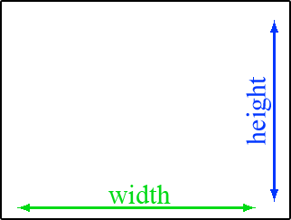

# 6.4.1 Größe von Elementen

Auch in der Größe lassen sich Elemente durch CSS verändern. Sie können die Breite von Elementen angeben und auch deren Höhe. Diese Informationen sind wichtig, um mit dem Box-Modell zu arbeiten. Sie sollten dieses Kapitel komplett verstanden haben, um mit dem Box-Modell anfangen zu können.

---

## Breite eines Elementes (`width`)

Die Eigenschaft `width` bestimmt, wie breit ein Element oder Bereich sein soll. Sie können diese Eigenschaft auf nahezu alle HTML-Elemente anwenden. Der eingesetzte Wert ist entweder eine Zahl oder `auto` für eine automatische Breite.

;;;css
width: 200px;
;;;

Sie können auch bestimmen, ob ein Element eine Mindestbreite haben soll, auch wenn der Inhalt kleiner ist, oder eine maximale Breite, auch wenn der Inhalt größer ist. Dazu benutzen Sie `min-width` oder `max-width`. Als Werte sind hier nur numerische Angaben erlaubt.

;;;css
min-width: 150px;
max-width: 425px;
;;;

---

## Höhe eines Elementes (`height`)

Ähnlich wie `width` bestimmt `height`, wie hoch ein Element oder Bereich sein soll. Auch `height` lässt sich auf viele HTML-Elemente anwenden. Der eingesetzte Wert ist auch hier entweder eine Zahl oder `auto` für die automatische Höhe.

;;;css
height: 800px;
;;;

Ebenso wie bei der Breite gibt es auch bei der Höhe eine Mindest- und Maximalhöhe. `min-height` oder `max-height` erlauben ebenfalls nur numerische Werte.

;;;css
min-height: 600px;
max-height: 768px;
;;;

---

