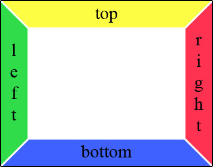
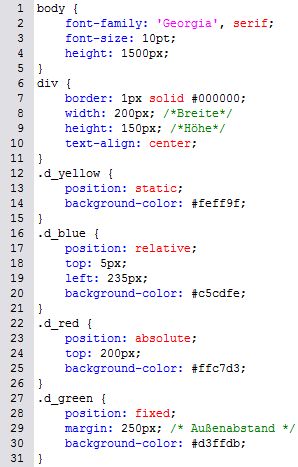

# 6.4.2 Positionierung von Elementen

Mit CSS können Sie HTML-Elemente nicht nur in eine bestimmte Richtung ausrichten, sondern auch frei positionieren. Zu den Eigenschaften der freien Positionierung gehören die Position, die Größe eines Elements und einige Anzeigeeigenschaften. In diesem Abschnitt lernen Sie die allgemeine Positionierung kennen. Die wichtigsten Eigenschaften dazu sind `top`, `right`, `bottom`, `left` und `position`.

---

## Positionierung von oben, rechts, unten oder links (`top`, `right`, `bottom`, `left`)

Mit `top`, `right`, `bottom` oder `left` bestimmen Sie, wo ein Element relativ zu oben, rechts, unten oder links beginnt. Der Wert kann numerisch oder `auto` (automatische Positionierung) sein.

Die Reihenfolge dieser Angaben entspricht der eines Kompasses:

---

## Positionsart (`position`)

Die Positionsart definiert, wie ein Element positioniert wird. Es gibt folgende Werte:

- **`absolute`**: Positionierung relativ zum nächstgelegenen Vorfahrenelement mit einer nicht-`static`-Position. Das Element scrollt mit.
- **`relative`**: Positionierung relativ zur Normalposition des Elements. Das Element wird verschoben.
- **`fixed`**: Absolute Positionierung relativ zum Browserfenster. Das Element bleibt beim Scrollen an Ort und Stelle.
- **`static`**: Normale Anzeige ohne spezielle Positionierung (Standardeinstellung).

Die eigentliche Positionierung wird durch die Eigenschaften `top`, `right`, `bottom` und `left` festgelegt.

---

### Beispiel: Positionsarten

#### Sourcecode des Stylesheets
;;;css
body {
	font-family: 'Georgia', serif;
	font-size: 10pt;
	height: 1500px;
}
div {
	border: 1px solid #000000;
	width: 200px;
	height: 150px;
	text-align: center;
}
.d_yellow {
	position: static;
	background-color: #feff9f;
}
.d_blue {
	position: relative;
	top: 5px;
	left: 235px;
	background-color: #c5cdfe;
}
.d_red {
	position: absolute;
	top: 200px;
	background-color: #ffc7d3;
}
.d_green {
	position: fixed;
	margin: 250px;
	background-color: #d3ffdb;
}
;;;

#### Sourcecode des HTML-Dokuments
;;;html
<!doctype html>										
<html lang="de">
<head>
  <meta charset="utf-8">
  <title>Positionierung von Elementen</title>
  <link rel="stylesheet" type="text/css" href="css_bsp_positionierungen.css">
</head>
<body>
  

    Position: fixed!
  

  

    Position: static!
  

  

    Position: relative!
  

  

    Position: absolute!
  

</body>
</html>
;;;

