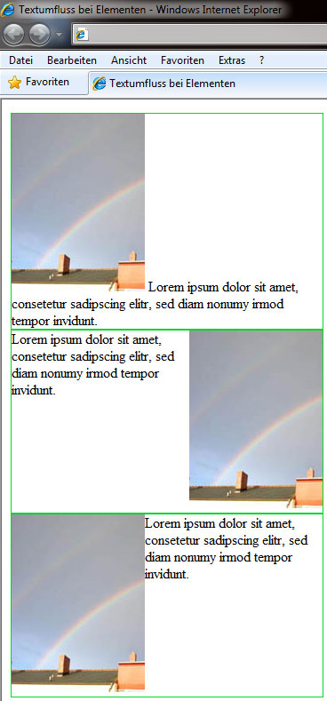
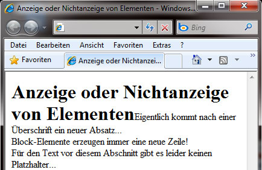
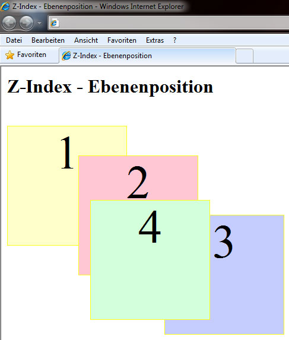

# 6.4.3 Anzeigeoptionen für Elemente

HTML-Elemente wie `div` können durch CSS verschiedene Anzeigeoptionen erhalten, um deren Verhalten bei Überlauf, Umfluss, Sichtbarkeit und Ebenenpositionierung zu steuern. Diese Optionen ermöglichen eine präzisere Kontrolle über das Layout und die Darstellung.

---

## Elementbereich kleiner als der Inhalt (`overflow`)

Wenn der Inhalt eines Elements größer als der vorgesehene Bereich ist, steuert `overflow`, wie damit umgegangen wird:

- `hidden` – Der überstehende Inhalt wird abgeschnitten und nicht angezeigt.
- `scroll` – Scroll-Leisten erscheinen, um den gesamten Inhalt zugänglich zu machen.
- `auto` – Der Browser entscheidet, wie mit dem Inhalt umgegangen wird.
- `visible` – Der Inhalt wird angezeigt, auch wenn er über den vorgesehenen Bereich hinausgeht.


### So sieht es im Browser aus

<iframe id="static-preview-frame" style="width: 100%; height: 400px; border: 1px solid #ccc;"></iframe>
<script>
  const iframeContent = `
    <!DOCTYPE html>
    <html lang="de">
	<head>
		<title>Elementbereich kleiner als der Inhalt</title>
		<style type="text/css">
			div {
				border: 1px solid #01d823;
				width: 275px;
				height: 100px;
			}
			.hidden {
				overflow: hidden;
			}
			.scroll {
				overflow: scroll;
			}
			.visible {
				overflow: visible;
			}
			.auto {
				overflow: auto;
			}
		</style>
	</head>
	<body>
		<h1>Elementbereich kleiner als der Inhalt </h1>
		<div>overflow: hidden</div>
		<div class="hidden">
			
		</div>
		<div>overflow: scroll</div>
		<div class="scroll">
			
		</div>
		<div>overflow: auto</div>
		<div class="auto">
			
		</div>
		<div>overflow: visible</div>
		<div class="visible">
			
		</div>
	</body>
</html>
  `;
  const iframe = document.getElementById('static-preview-frame');
  iframe.srcdoc = iframeContent;
</script>

??? note "Sourcecode zum Beispiel"

    ```html linenums="1"
        <!DOCTYPE html>
        <html lang="de">
            <head>
                <title>Elementbereich kleiner als der Inhalt</title>
                <style type="text/css">
                    div {
                        border: 1px solid #01d823;
                        width: 275px;
                        height: 100px;
                    }
                    .hidden {
                        overflow: hidden;
                    }
                    .scroll {
                        overflow: scroll;
                    }
                    .visible {
                        overflow: visible;
                    }
                    .auto {
                        overflow: auto;
                    }
                </style>
            </head>
            <body>
                <h1>Elementbereich kleiner als der Inhalt </h1>
                <div>overflow: hidden</div>
                <div class="hidden">
                    
                </div>
                <div>overflow: scroll</div>
                <div class="scroll">
                    
                </div>
                <div>overflow: auto</div>
                <div class="auto">
                    
                </div>
                <div>overflow: visible</div>
                <div class="visible">
                    
                </div>
            </body>
        </html>
    ```

---

## Textumfluss bei Elementen (`float`)

Mit `float` bestimmen Sie, wie ein Element von nachfolgenden Inhalten umflossen wird:

- `left` – Element steht links, nachfolgende Inhalte fließen rechts.
- `right` – Element steht rechts, nachfolgende Inhalte fließen links.
- `none` – Kein Umfluss.

### So sieht es im Browser aus


??? note "Sourcecode zum Beispiel"
   
    ```css linenums="1"
    div {
        border: 1px solid #01d823;
        width: 350px;
        min-height: 205px;
    }
    .left {
        float: left;
    }
    .right {
        float: right;
    }
    .none {
        float: none;
    }
    ```

    ```html linenums="1"
    <!doctype html>												
    <html lang="de">
    <head>
    <meta charset="utf-8">
    <title>Textumfluss bei Elementen </title>
    <link rel="stylesheet" type="text/css" 
        href="css_bsp_float.css">
    </head>
    <body>
    <div>
        
        Lorem ipsum dolor sit amet, consetetur 
        sadipscing elitr, sed diam nonumy
        irmod tempor invidunt.
    </div>
    <div>
        
        Lorem ipsum dolor sit amet, consetetur 
        sadipscing elitr, sed diam nonumy
        irmod tempor invidunt.
    </div>
    <div>
        
        Lorem ipsum dolor sit amet, consetetur 
        sadipscing elitr, sed diam nonumy
        irmod tempor invidunt.
    </div>
    </body>
    </html>
    ```
---

## Fortsetzung ohne Textumfluss (`clear`)

`clear` unterbricht den Textfluss und erzwingt die Fortsetzung unterhalb eines gefloateten Elements:

- `left` – Unterbricht, wenn `float: left;` vorher deklariert wurde.
- `right` – Unterbricht, wenn `float: right;` vorher deklariert wurde.
- `both` – Unterbricht unabhängig von der Richtung.

---

## Anzeige oder Nichtanzeige von Elementen ohne Platzhalter (`display`)

Mit `display` steuern Sie, ob ein Element angezeigt wird und wie es sich verhält:

- `block` – Element wird als Block dargestellt.
- `inline` – Element wird im Textfluss angezeigt.
- `list-item` – Element wird als Listenpunkt dargestellt.
- `none` – Element wird vollständig versteckt.

### So sieht es im Browser aus


??? note "Sourcecode zum Beispiel"
   
    ```css linenums="1"
    h1 { display: inline; }
    p {display: inline; }
    span { display: block; }
    ```

    ```html linenums="1"
    <!doctype html>												
    <html lang="de">
    <head>
        <title>Anzeige oder Nichtanzeige von Elementen</title>
        <link rel="stylesheet" type="text/css" href="style.css" />
    </head>
    <body>
        <h1>Anzeige oder Nichtanzeige von Elementen</h1>
        <p>Eigentlich kommt nach einer <u>Überschrift</u> ein neuer Absatz...</p>
        <span>Block-Elemente erzeugen immer eine neue Zeile!</span>
        <p>Für den Text vor diesem Abschnitt gibt es leider keinen Platzhalter...</p>
    </body>
    </html>
    ```
---

---

## Anzeige oder Nichtanzeige von Elementen mit Platzhaltern (`visibility`)

Mit `visibility` können Sie die Sichtbarkeit eines Elements steuern, Platzhalter bleiben jedoch erhalten:

- `visible` – Inhalt wird angezeigt.
- `hidden` – Inhalt wird verborgen, Platz bleibt erhalten.
- `collapse` – Bei Tabellen werden Spalten oder Zeilen versteckt, der Platz wird freigegeben.

---

## Ebenenposition bei Überlappung (`z-index`)

`z-index` steuert die Reihenfolge übereinanderliegender Elemente. Höhere Werte erscheinen weiter oben, niedrigere weiter unten. Negative Werte sind möglich.

- `z-index: 1;`
- `z-index: 2;`
- `z-index: -1;`

### So sieht es im Browser aus


??? note "Sourcecode zum Beispiel"
   
    ```css linenums="1"
    div {
        border: 1px solid #fcfe17;
        width: 200px;
        height: 200px;
        text-align: center;
        font-size: 500%;
    }
    #a {
        background-color: #ffffca;
        position: absolute;
        top: 100px;
        z-index: 1;
    }
    #b {
        background-color: #ffc7d3;
        position: absolute;
        top: 150px;
        left: 130px;
        z-index: 2;
    }
    #c {
        background-color: #c5ccff;
        position: absolute;
        top: 250px;
        left: 275px;
        z-index: 3;
    }
    #d {
        background-color: #d3ffdb;
        position: absolute;
        top: 225px;
        left: 150px;
        z-index: 4;
    }
    ```

    ```html linenums="1"
    <!doctype html>										
    <html lang="de">
    <head>
    <meta charset="utf-8">
    <title>Z-Index - Ebenenposition</title>
    <link rel="stylesheet" type="text/css" 
        href="css_bsp_zindex.css">
    </head>
    <body>
    <h1>Z-Index - Ebenenposition</h1>
    <div id="a">
        1
    </div>
    <div id="b">
        2
    </div>
    <div id="c">
        3
    </div>
    <div id="d">
        4
    </div>
    </body>
    </html>
    ```