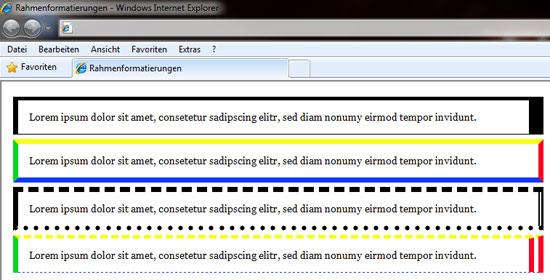
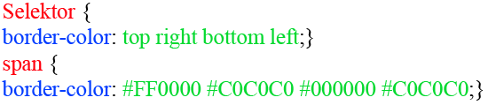
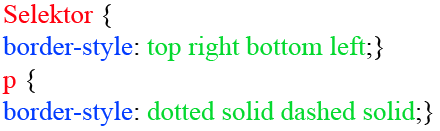

# 6.4.4 Rahmengestaltung

Es gibt zwei Möglichkeiten, wie Sie einen Rahmen um ein Element bringen können. Eine davon ist die Eigenschaft `border`, die andere heißt `outline`. Dieses Kapitel behandelt nur `border`, da diese Eigenschaft mehr Möglichkeiten bietet.



??? note "Sourcecode zum Beispiel"
   
    ```css linenums="1"
    body {
        font-family: 'Georgia', serif;
        font-size: 10pt;
    }
    .rahmen1 {
        width: 673px;
        border-top-width: 5px;
        border-right-width: 20px;
        border-bottom-width: 1px;
        border-left-width: 7px;
        border-color: #000000;
        border-style: solid;
        padding: 15px;
        margin: 6px;
    }
    .rahmen2 {
        width: 686px;
        border-width: 7px;
        border-top-color: #fcfe17;
        border-right-color: #ff0025;
        border-bottom-color: #0f39ff;
        border-left-color: #01d823;
        border-style: solid;
        padding: 15px;
        margin: 6px;
    }
    .rahmen3 {
        width: 686px;
        border-width: 7px;
        border-color: #000000;
        border-top-style: dashed;
        border-right-style: double;
        border-bottom-style: dotted;
        border-left-style: solid;
        padding: 15px;
        margin: 6px;
    }
    .rahmen4 {
        width: 673px;
        border-width: 5px 20px 1px 7px;
        border-color: #fcfe17 #ff0025 #0f39ff #01d823;
        border-style: dashed double dotted solid;
        padding: 15px;
        margin: 6px;
    }
    ```

    ```html linenums="1"
    <!doctype html>										
    <html lang="de">
    <head>
        <title>Rahmenformatierungen</title>
        <link rel="stylesheet" type="text/css" 
        href="css_bsp_rahmen.css" />
    </head>
    <body>
        <p class="rahmen1">
            Lorem ipsum dolor sit amet, consetetur 
            sadipscing elitr, sed diam nonumy
            eirmod tempor invidunt.
        </p>
        <p class="rahmen2">
            Lorem ipsum dolor sit amet, consetetur 
            sadipscing elitr, sed diam nonumy
            eirmod tempor invidunt.
        </p>
        <p class="rahmen3">
            Lorem ipsum dolor sit amet, consetetur 
            sadipscing elitr, sed diam nonumy
            eirmod tempor invidunt.
        </p>
        <p class="rahmen4">
            Lorem ipsum dolor sit amet, consetetur 
            sadipscing elitr, sed diam nonumy
            eirmod tempor invidunt.
        </p>
    </body>
    </html>
    ```

    Keine Sorge, wenn Sie den obigen Sourcecode noch nicht verstehen. Die nachfolgenden Informationen werden Ihnen dabei helfen. 


## Rahmendicke (`border-width`)

`border-width` bestimmt die Dicke des Rahmens. Erlaubte Werte sind sowohl numerische Angaben, als auch eines der Schlüsselwörter:

- `thin` – dünner Rahmen
- `medium` – mittelstarker Rahmen
- `thick` – dicker Rahmen

`border-width` verändert bzw. gestaltet den Rahmen des gesamten Elementes. Einzelne Seiten können Sie formatieren, indem Sie eine Untereigenschaft hinzufügen:

- `border-top-width` – Rahmendicke oben
- `border-right-width` – Rahmendicke rechts
- `border-bottom-width` – Rahmendicke unten
- `border-left-width` – Rahmendicke links

Diese Untereigenschaften können Sie abkürzen („sammeln“)

---

## Rahmenfarbe (`border-color`)

Außerdem ist es möglich, dem Rahmen eine Farbe zuzuweisen. Wird keine Angabe darüber gemacht, ist der Rahmen schwarz. Erlaubte Werte sind die üblichen Farbangaben (siehe Kapitel zu Farben). Außerdem ist der Wert `transparent` erlaubt, der einen durchsichtigen Rahmen ermöglicht.

- `border-color: #ff0000;`

border-color verändert bzw. gestaltet die Farbe des gesamten Elementrahmens. Einzelne Seiten können Sie formatieren, indem Sie eine Untereigenschaft hinzufügen: top, right, bottom oder left. 

- `border-top-color` – Rahmenfarbe oben
- `border-right-color` – Rahmenfarbe rechts
- `border-bottom-color` – Rahmenfarbe unten
- `border-left-color` – Rahmenfarbe links

Die Farbeigenschaften können ebenfalls gesammelt aufgeschrieben werden: 



---

## Rahmentyp (`border-style`)

Rahmen müssen nicht nur durchgehende Linien sein, Sie können für Ihr Element auch einen Schmuckrand definieren. Es empfiehlt sich bei manchen Schmuckrändern ein dickerer Rahmen, damit der Stil besser zur Geltung kommt. Folgende Schmuckränder sind möglich:

- `none` – kein Rahmen (unsichtbarer Rahmen)
- `hidden` – kein Rahmen (vor allem bei Tabellen genutzt)
- `solid` – durchgezogene Linie
- `dotted` – gepunktete Linie
- `dashed` – gestrichelte Linie
- `double` – doppelte, durchgezogene Linie
- `groove` – 3D-Effektlinie
- `ridge` – 3D-Effektlinie
- `inset` – 3D-Effektlinie
- `outset` – 3D-Effektlinie


`border-style` verändert bzw. gestaltet die Farbe des gesamten Elementrahmens. Einzelne Seiten können Sie formatieren indem Sie eine Untereigenschaft hinzufügen: top, right, bottom oder left.

- `border-top-style` – Rahmenstil oben
- `border-right-style` – Rahmenstil rechts
- `border-bottom-style` – Rahmenstil unten
- `border-left-style` – Rahmenstil links

Auch diese Untereigenschaften können Sie sammeln



---

## Rahmenformatierungen als Sammeleigenschaft

Wie schon bei der Schriftformatierung, können Sie auch beim Rahmen Sammeleigenschaften erstellen. Dazu haben Sie Variationsmöglichkeiten.

## 1. Formatierung des ganzen Rahmens


So können Sie den ganzen Rahmen formatieren, ohne jede Eigenschaft einzeln eingeben zu müssen. 

Beispiel:

```css linenums="1"
.rahmen {
    width: 690px;
    border: 5px double #01d823;
}
```

HTML-Code:

```html linenums="1"
<div class="rahmen">
    Lorem ipsum dolor sit amet, consetetur sadipscing elitr, 
    sed diam nonumy eirmod tempor invidunt.
</div>
```

### So sieht es im Browser aus

<iframe id="static-preview-frame" style="width: 100%; height: 50px; border: 1px solid #ccc;"></iframe>
<script>
  const iframeContent = `
    <!DOCTYPE html>
    <html lang="de">
    <head>
      <meta charset="UTF-8">
      <meta name="viewport" content="width=device-width, initial-scale=1.0">
      <style>
        .rahmen {
            width: 690px;
            border: 5px double #01d823;
        }
      </style>
    </head>
    <body>
        <div class="rahmen">
            Lorem ipsum dolor sit amet, consetetur sadipscing elitr, 
            sed diam nonumy eirmod tempor invidunt.
        </div>
    </body>
    </html>
  `;
  const iframe = document.getElementById('static-preview-frame');
  iframe.srcdoc = iframeContent;
</script>

---

## 2. Formatierung eines Teilstücks


Auch hier werden alle Eigenschaften auf einmal deklariert (hier jedoch nur für ein Teilstück des Rahmens). 

Beispiel:

```css linenums="1"
.rahmen_unten {
    width: 700px;
    border-bottom: 5px double #01d823;
}
```

HTML-Code:

```html linenums="1"
<div class="rahmen_unten">
    Lorem ipsum dolor sit amet, consetetur sadipscing elitr, 
    sed diam nonumy eirmod tempor invidunt.
</div>
```

### So sieht es im Browser aus

<iframe id="static-preview-frame2" style="width: 100%; height: 50px; border: 1px solid #ccc;"></iframe>
<script>
  const iframeContent2 = `
    <!DOCTYPE html>
    <html lang="de">
    <head>
      <meta charset="UTF-8">
      <meta name="viewport" content="width=device-width, initial-scale=1.0">
      <style>
        .rahmen_unten {
            width: 700px;
            border-bottom: 5px double #01d823;
        }
      </style>
    </head>
    <body>
        <div class="rahmen_unten">
            Lorem ipsum dolor sit amet, consetetur sadipscing elitr, 
            sed diam nonumy eirmod tempor invidunt.
        </div>
    </body>
    </html>
  `;
  const iframe2 = document.getElementById('static-preview-frame2');
  iframe2.srcdoc = iframeContent2;
</script>

Die Zugabe eines Rahmens wirkt sich immer auf die Breite (`width`) bzw. die Höhe (`height`) des gerahmten Elementes aus. Die Dicke des Rahmens wird zur Breite bzw. zur Höhe dazu addiert, das Element wird vergrößert. Darauf sollten Sie achten, wenn Sie Ihre Elemente erstellen.
