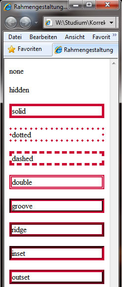
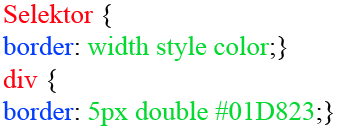
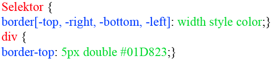

# 6.4.4 Rahmengestaltung

Es gibt zwei Möglichkeiten, wie Sie einen Rahmen um ein Element bringen können. Eine davon ist die Eigenschaft `border`, die andere heißt `outline`. Dieses Kapitel behandelt nur `border`, da diese Eigenschaft mehr Möglichkeiten bietet.

---

## Rahmendicke (`border-width`)

`border-width` bestimmt die Dicke des Rahmens. Erlaubte Werte sind sowohl numerische Angaben, als auch eines der Schlüsselwörter:

- `thin` – dünner Rahmen
- `medium` – mittelstarker Rahmen
- `thick` – dicker Rahmen

`border-width` verändert bzw. gestaltet den Rahmen des gesamten Elementes. Einzelne Seiten können Sie formatieren, indem Sie eine Untereigenschaft hinzufügen:

- `border-top-width` – Rahmendicke oben
- `border-right-width` – Rahmendicke rechts
- `border-bottom-width` – Rahmendicke unten
- `border-left-width` – Rahmendicke links

---

## Rahmenfarbe (`border-color`)

Außerdem ist es möglich, dem Rahmen eine Farbe zuzuweisen. Wird keine Angabe darüber gemacht, ist der Rahmen schwarz. Erlaubte Werte sind die üblichen Farbangaben (siehe Kapitel zu Farben). Außerdem ist der Wert `transparent` erlaubt, der einen durchsichtigen Rahmen ermöglicht.

;;;css
border-color: #ff0000;
;;;

---

## Rahmentyp (`border-style`)

Rahmen müssen nicht nur durchgehende Linien sein, Sie können für Ihr Element auch einen Schmuckrand definieren. Es empfiehlt sich bei manchen Schmuckrändern ein dickerer Rahmen, damit der Stil besser zur Geltung kommt. Folgende Schmuckränder sind möglich:

- `none` – kein Rahmen (unsichtbarer Rahmen)
- `hidden` – kein Rahmen (vor allem bei Tabellen genutzt)
- `solid` – durchgezogene Linie
- `dotted` – gepunktete Linie
- `dashed` – gestrichelte Linie
- `double` – doppelte, durchgezogene Linie
- `groove` – 3D-Effektlinie
- `ridge` – 3D-Effektlinie
- `inset` – 3D-Effektlinie
- `outset` – 3D-Effektlinie

---

## Rahmenformatierungen als Sammeleigenschaft

Wie schon bei der Schriftformatierung, können Sie auch beim Rahmen Sammeleigenschaften erstellen. Dazu haben Sie Variationsmöglichkeiten.

### 1. Formatierung des ganzen Rahmens

Beispiel:

;;;css
.rahmen {
    width: 690px;
    border: 5px double #01d823;
}
;;;

HTML-Code:

;;;html

    Lorem ipsum dolor sit amet, consetetur sadipscing elitr, sed diam nonumy eirmod tempor invidunt.

;;;

---

### 2. Formatierung eines Teilstücks

Beispiel:

;;;css
.rahmen_unten {
    width: 700px;
    border-bottom: 5px double #01d823;
}
;;;

HTML-Code:

;;;html

    Lorem ipsum dolor sit amet, consetetur sadipscing elitr, sed diam nonumy eirmod tempor invidunt.

;;;

---

Die Zugabe eines Rahmens wirkt sich immer auf die Breite (`width`) bzw. die Höhe (`height`) des gerahmten Elementes aus. Die Dicke des Rahmens wird zur Breite bzw. zur Höhe dazu addiert, das Element wird vergrößert. Darauf sollten Sie achten, wenn Sie Ihre Elemente erstellen.
