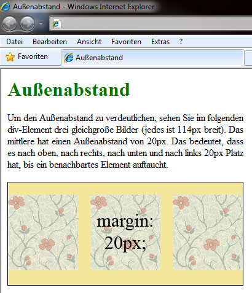
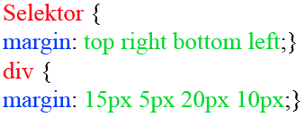

# 6.4.5 Außenabstand (`margin`)

Mit der Deklaration eines Außenabstandes `margin` erzwingen Sie einen Abstand zwischen dem aktuellen Element und dessen angrenzenden Elementen. Zu Anfang ein Beispiel:



---

Wichtiger Teil aus dem Stylesheet:

```css linenums="1"
div.gelb {
    width: 382px;
}
.marginbsp {
    margin: 20px;
}
```

Wichtiger Teil des HTML-Dokuments:

```html linenums="1"
<div class="gelb">
    
    
    
</div>
```

Sie sollten beachten, dass alle drei Bilder nebeneinander nur einen Platz von 342px benötigt hätten. Da jedoch jeweils 20px links und rechts hinzukommen, muss das `div`-Element eine Breite von 382px haben.

---

## Abstand zum oberen Nachbarn (`margin-top`)

Mit dieser Eigenschaft bestimmen Sie den Abstand, den das Element zu seinem Nachbarn darüber oder auch zu seinem umschließenden Element hat.

```css linenums="1"
margin-top: 50px;
```

Erlaubt sind hier numerische Angaben.

---

## Abstand zum rechten Nachbarn (`margin-right`)

Der rechte Nachbar rückt durch die Eigenschaft `margin-right` weiter weg. Auch hier sind numerische Werte sowie die Schlüsselwörter `auto` und `inherit` als Werte erlaubt.

```css linenums="1"
margin-right: 50px;
```

---

## Abstand zum unteren Nachbarn (`margin-bottom`)

`margin-bottom` gibt den Abstand zum unteren Nachbarn an. Ebenso sind hier numerische Werte und die beiden Schlüsselwörter erlaubt.

```css linenums="1"
margin-bottom: 400px;
```

Ist sowohl `margin-bottom` für ein Element als auch `margin-top` für dessen Nachbarelement deklariert, so ist der größere Abstand entscheidend. Dieser wird als tatsächlicher Abstand gezählt.

---

## Abstand zum linken Nachbarn (`margin-left`)

Als Gegenstück zu `margin-right` bestimmt `margin-left` den Abstand zum linken Nachbarn. Hier dürfen Sie ebenfalls numerische Werte sowie `auto` oder `inherit` einsetzen.

```css linenums="1"
margin-left: 50px;
```

Haben `margin-left` und `margin-right` den Wert `auto`, wird das Element mittig positioniert.

---

## Außenabstände als Sammeleigenschaft

Auch den Außenabstand kann man in einer Zeile zusammenfassen. Dazu werden die oben genannten Eigenschaften der Reihe nach hinter die Eigenschaft `margin` geschrieben:


