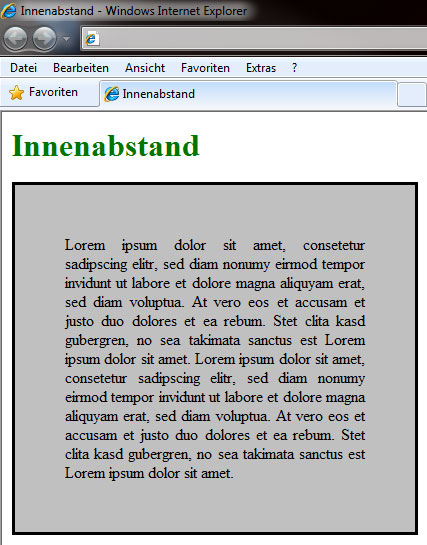
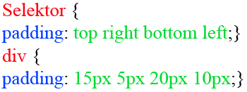

# 6.4.6 Innenabstand (`padding`)

Mit der Deklaration eines Innenabstandes `padding` erzwingen Sie einen Abstand zwischen dem aktuellen Element und dessen Inhalt. Zur Veranschaulichung dient folgendes Beispiel:



Formatierung des `div`-Tags

```css linenums="1"
div {
    border: 2px double #000000;
    background-color: #c0c0c0;
    text-align: justify;
    width: 600px;
    padding: 50px;
}
```

---

## Abstand von oben zum Inhalt (`padding-top`)

Diese Eigenschaft bestimmt den Abstand der oberen Elementgrenze zum Inhaltsanfang. Wie bei dem Außenabstand sind nur numerische Werte erlaubt.

```css linenums="1"
padding-top: 150px;
```

---

## Abstand von rechts zum Inhalt (`padding-right`)

`padding-right` bestimmt den Abstand zwischen Elementinhalt und rechter Elementgrenze. Auch hier sind nur numerische Angaben als Wert erlaubt.

```css linenums="1"
padding-right: 20px;
```

---

## Abstand von unten zum Inhalt (`padding-bottom`)

`padding-bottom` gibt den Abstand an, den der Elementinhalt zum unteren Elementrand hat. Auch hier dürfen Sie nur numerische Werte einsetzen.

```css linenums="1"
padding-bottom: 30px;
```

---

## Abstand von links zum Inhalt (`padding-left`)

Die Eigenschaft `padding-left` bestimmt den Abstand zwischen der linken Elementgrenze und dem Inhalt. Auch hier sind ebenfalls nur die numerischen Werte einsetzbar.

```css linenums="1"
padding-left: 15px;
```

---

## Innenabstände als Sammeleigenschaft

Gleich wie den Außenabstand können Sie auch den Innenabstand als Sammeleigenschaft schreiben.


