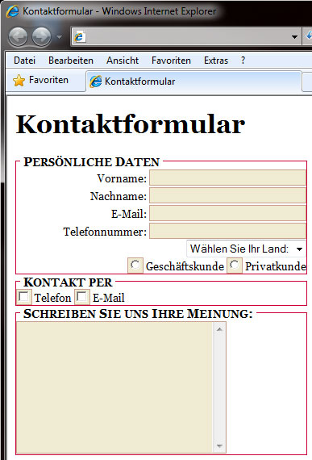

# 6.4.7 Formulare formatieren

Genau wie für Hintergründe und Listen gibt es auch für Formulare die Möglichkeit, dass Elemente gestaltet werden können. Allerdings gibt es bei Formularen keine speziellen CSS-Tags (wie z. B. `list-style-type` oder Ähnliches). Sie greifen hier lediglich darauf zurück, die „normalen“ HTML-Elemente mit CSS anzusprechen und zu formatieren.

## Beispiel: Ein Kontaktformular formatiert mit CSS

Sie können z. B. dem gesamten Formular eine einheitliche Schrift zuweisen oder den `input`-Elementen eine Hintergrundfarbe geben (siehe Beispielbild). Sie können Formulare in folgenden Bereichen formatieren:

- Außenabstände (`margin`)
- Innenabstände (`padding`)
- Schrift (`font`)
- Rahmen (`border`)
- Hintergründe (`background`)

---

## Sourcecode des Stylesheets

;;;css
body {
	font-family: Georgia;
}
form {
	font-size: small;
}
fieldset {
	text-align: right;
	width: 360px;
	border: 1px solid #cc0033;
}
fieldset.left {
	text-align: left;
}
legend {
	font-weight: bold;
	font-variant: small-caps;
	font-size: medium;
}
input {
	font-family: Georgia;
}
input, textarea {
	background-color: #f0ebd2;
	border: 1px solid #c9a18d;
}
;;;

---

## Sourcecode des HTML-Dokuments

;;;html
<!doctype html>										
<html lang="de">
<head>
  <meta charset="utf-8">  
  <title>Kontaktformular</title>
  <link rel="stylesheet" type="text/css" href="css_bsp_formulare.css">
</head>
<body>
  <h1>Kontaktformular</h1>
  <form action="datenaufnahmedatei.html" method="get">
    <fieldset>
      <legend>Persönliche Daten</legend>
      Vorname: <input type="text" name="vorname" size="30" maxlength="30"> 
      Nachname: <input type="text" name="nachname" size="30" maxlength="30"> 
      E-Mail: <input type="text" name="email" size="30" maxlength="30"> 
      Telefonnummer: <input type="text" name="telefon" size="30" maxlength="30"> 
      <select name="landauswahl" size="1">
        <option>Wählen Sie Ihr Land:</option>
        <option>Deutschland</option>
        <option>Österreich</option>
        <option>Schweiz</option>
      </select> 
      <input type="radio" name="geschaeftskunde" value="Geschaeftskunde"> Geschäftskunde 
      <input type="radio" name="privatkunde" value="Privatkunde"> Privatkunde
    </fieldset>
    <fieldset class="left">
      <legend>Kontakt per</legend>
      <input type="checkbox" name="telefon" value="telefon"> Telefon 
      <input type="checkbox" name="email" value="email"> E-Mail
    </fieldset>
    <fieldset class="left">
      <legend>Schreiben Sie uns Ihre Meinung:</legend>
      <textarea name="user_eingabe" cols="30" rows="10"></textarea>
    </fieldset>
  </form>
</body>
</html>
;;;
