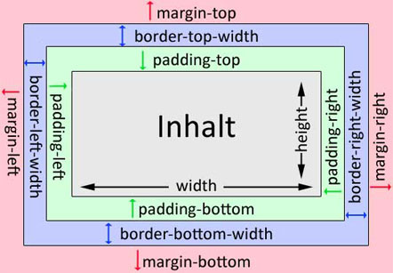
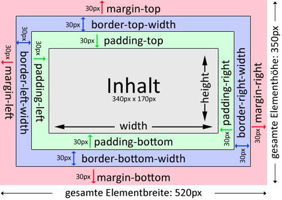
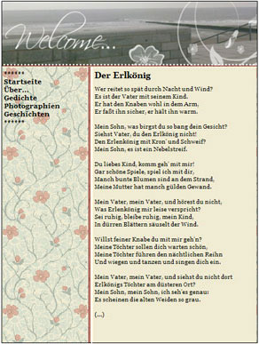

# 6.4.8 Das Box-Modell

Für die Erstellung eines Layouts mit CSS ist das Box-Modell sehr wichtig.

Stellen Sie sich das Box-Modell als einen Pappkarton vor, der an allen Seiten geschlossen ist, mit einem kleineren Karton im Innern, der den Inhalt darstellt. Der große Karton steht in einem Raum.

Die Gesamtgröße einer solchen „Box“ setzt sich zusammen aus Elementen, die Sie bereits kennen:

- **Breite des Inhalts** (`width`) und **Höhe des Inhalts** (`height`)
- **Innerer Abstand vom Rand zum Inhalt** (`padding`)
- **Breite des Rahmens** (`border-width`)
- **Abstand zum äußeren Raum** (`margin`)

---

Beim Box-Modell ist es wichtig, dass alle oben genannten Elemente addiert werden. Dazu wurde das obige Beispiel um folgende Ergänzungen erweitert:

Das Box-Modell ist die Anwendung der Eigenschaften, die Sie in den vorherigen Kapiteln gelernt haben. Mit CSS können Sie verschiedene „Boxen“ erstellen und so ein vielseitiges Design kreieren.

---

## Weiterführender Link

Bei [w3schools](https://www.w3schools.com/cssref/css3_pr_box-sizing.asp) können Sie die Auswirkungen leicht ausprobieren. Klicken Sie auf "Try it Yourself" und testen Sie verschiedene Einstellungen.

---

## Aufgabe: Eigenes Design

Versuchen Sie ein eigenes Design zu erstellen! Dazu gehören:

- Eine Headerzeile
- Eine Navigation
- Ein Inhaltsbereich

Probieren Sie es einfach aus.

