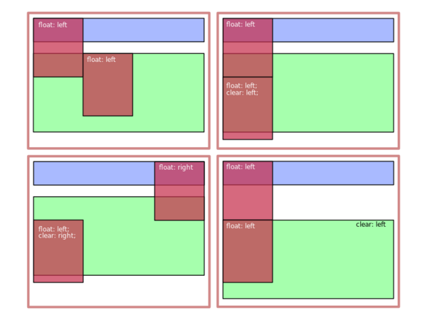

# 6.4.9 CSS Float

Mit der CSS-Eigenschaft `float` lassen sich Elemente innerhalb des normalen Elementflusses an den linken oder rechten Rand des umliegenden Elternelements verschieben.

```css linenums="1"
float: left | right | none
```

Ein per `float`-Eigenschaft verschobenes Element wird auch als Float bezeichnet. Ursprünglich war diese Eigenschaft zur Positionierung von Bildern in Textumgebungen gedacht, aber schnell entdeckten Entwickler, dass sich dieses Verhalten auf alle HTML-Elemente anwenden lässt. Durch Floats lassen sich so auch flexible Layouts per CSS realisieren.

### So sieht es im Browser aus

<iframe id="static-preview-frame" style="width: 100%; height: 220px; border: 1px solid #ccc;"></iframe>
<script>
  const iframeContent = `
  <!DOCTYPE html>
  <html>
    <head>
      <meta charset="utf-8">
      <title>Einfacher Float</title>
      <style>
        .container {
          margin: auto;
          padding: 5px;
          width: 300px;
          border: 1px solid darkblue;
          background-color: lightblue;
        }
        .picture {
          float: left;
          width: 80px;
          height: 120px;
          padding-right: 5px;
        }
      </style>
    </head>
    <body>
      <div class="container">
        <svg class="picture">
          <rect x="2" y="2" rx="10" ry="10" width="76" height="116"
                style="fill:red;stroke:black;stroke-width:4" />
        </svg>
        <p>
          Ich bin ein Text, der um eine Box herum fließt und fließt und fließt. 
          Und wenn der Text nicht gestorben ist, dann fließt er auch heute noch fleißig 
          um die Box herum und niemand weiß so recht, warum dies so ist. Ist es Zauberei oder 
          doch nur CSS? 
        <p>
      </div>
    </body>
  </html>
  `;
  const iframe = document.getElementById('static-preview-frame');
  iframe.srcdoc = iframeContent;
</script>


??? note "Sourcecode zum Beispiel"
   
    ```html linenums="1"
    <!DOCTYPE html>
    <html>
      <head>
        <meta charset="utf-8">
        <title>Einfacher Float</title>
        <style>
          .container {
            margin: auto;
            padding: 5px;
            width: 300px;
            border: 1px solid darkblue;
            background-color: lightblue;
          }
          .picture {
            float: left;
            width: 80px;
            height: 120px;
            padding-right: 5px;
          }
        </style>
      </head>
      <body>
        <div class="container">
          <svg class="picture">
            <rect x="2" y="2" rx="10" ry="10" width="76" height="116"
                  style="fill:red;stroke:black;stroke-width:4" />
            </svg>
          <p>
            Ich bin ein Text, der elegant um eine Box herum fließt und fließt und fließt. 
            Und wenn der Text nicht gestorben ist, dann fließt er auch heute noch um die Box 
            herum und niemand weiß so recht, warum dies so ist. Ist es Zauberei oder 
            doch nur CSS? 
          <p>
        </div>
      </body>
    </html>
    ```

Beim Lernen von HTML und CSS ist die Verwendung von float-Elementen für die meisten Lerner eine besondere Herausforderung. Leider wird zu oft ein Beispiel kopiert und solange angepasst bis das Ergebnis irgendwie dem geplanten Design entspricht. Besser ist es natürlich, sich mit dem Thema gezielt auseinander zu setzen und das Zusammenspiel von den Eigenschaften float und "dem kleinen Bruder" clear zu verstehen.

Zuerst ist ein Verständnis des normalen float-Verhaltens wichtig. Wie im obigen Beispiel zu sehen ist, wird ein Float aus dem normalen Elementfluss entfernt und an die linke Seite des Elternelements verschoben. Andere Inhalte des Elternelements verteilen sich um den Float. Dabei wird zeilenweise in Richtung des Elementflusses zwischen Float und Rand des Elternelements aufgefüllt. Sobald ein Element (bzw. bei Texten ein Wort) den Rand des Elternelements überragen würde, wird die Zeile umgebrochen und es beginnt eine neue Zeile am nächsten gegenüberliegenden Rand.

Es können aber auch mehrere Elemente innerhalb eines Elternelements die float-Eigenschaft gesetzt bekommen. In diesem Fall werden alle Floats der Reihenfolge nach in Richtung des Elementflusses aneinander gereiht. Auch hier wird umgebrochen, sobald ein Float über den Rand des Elternelements ragen würde. 


---

## Typisches Verhalten von Floats

Ein Float wird aus dem normalen Elementfluss entfernt und an den definierten Rand verschoben. Inhalte verteilen sich um das Float herum. Sobald ein Element den Rand überragt, erfolgt ein Umbruch in eine neue Zeile.

### Beispiel: Mehrere Floats


---

## Problem bei unterschiedlichen Höhen - Teil 1

Ein unerwartetes Verhalten tritt auf, wenn Floats unterschiedliche Höhen haben. Eine neue Zeile beginnt am gegenüberliegenden Rand, abhängig von der Höhe des Floats.


Woher kommt nun dieses Verhalten? Wie zu Beginn geschrieben, liegt der Ursprung von Floats in der Positionierung von Elementen im Text. Bei einem Text würde man genau das gezeigte Verhalten erwarten, denn ein Text soll beim Umbrechen immer den gleichen Zeilenabstand beibehalten. 

---

## Problem bei unterschiedlichen Höhen - Teil 1

Ein weiteres wissenswertes Verhalten kommt vor, wenn ein Float höher ist, als sein Elternelement. Wie im folgenden Beispiel zu sehen ist, ragt der Float über den unteren Rand des Elternelements hinaus und liegt damit auch über den nachfolgenden Elementen. Auch folgende Elemente beachten das Float-Verhalten und lassen ihre inneren Elemente um das Float des vorangegangenen Elements "fließen". Für den Text im Beispiel ist das auch gut nachvollziehbar. 

<iframe id="static-preview-frame2" style="width: 100%; height: 250px; border: 1px solid #ccc;"></iframe>
<script>
  const iframeContent2 = `
    <!DOCTYPE html>
    <html>
      <head>
        <meta charset="utf-8">
        <title>Zwei Floats fließen schlecht zusammen</title>
        <style>
          .container {
            border: 1px solid gray;
            background-color: lightgray;
            margin: auto;
            width: 300px;
          }
          .blue {
            border: 1px solid darkblue;
            background-color: lightblue;
          }
          .green {
            border: 1px solid darkgreen;
            background-color: lightgreen;
          }
          .picture {
            float: left;
            width: 80px;
            height: 120px;
          }
        </style>
      </head>
      <body>
        <div class="container">
          <p class="blue">
            <svg class="picture">
              <rect x="2" y="2" rx="10" ry="10" width="76" height="116"
                    style="fill:red;stroke:black;stroke-width:4" />
            </svg>
            Es war einmal eine blaue Box, die den Raum für sich beanspruchen wollte. 
            „Ich brauche Platz!“, rief sie und schob sich an den Rand. 
          </p>
          <p class="green">
            Die grüne Box hingegen war friedlicher. Sie flüsterte dem Text zu: 
            „Tanz ruhig um mich herum, ich werde dir nicht im Weg stehen.“ Und so 
            bewegte sich der Text sanft um die Ecken der grünen Box, als ob er einem 
            unsichtbaren Pfad folgte.
          </p>
        </div>
      </body>
    </html>
  `;
  const iframe2 = document.getElementById('static-preview-frame2');
  iframe2.srcdoc = iframeContent2;
</script>


??? note "Sourcecode zum Beispiel"
   
    ```html linenums="1"
    <!DOCTYPE html>
    <html>
      <head>
        <meta charset="utf-8">
        <title>Zwei Floats fließen schlecht zusammen</title>
        <style>
          .container {
            border: 1px solid gray;
            background-color: lightgray;
            margin: auto;
            width: 300px;
          }
          .blue {
            border: 1px solid darkblue;
            background-color: lightblue;
          }
          .green {
            border: 1px solid darkgreen;
            background-color: lightgreen;
          }
          .picture {
            float: left;
            width: 80px;
            height: 120px;
          }
        </style>
      </head>
      <body>
        <div class="container">
          <p class="blue">
            <svg class="picture">
              <rect x="2" y="2" rx="10" ry="10" width="76" height="116"
                    style="fill:red;stroke:black;stroke-width:4" />
            </svg>
            Es war einmal eine blaue Box, die den Raum für sich beanspruchen wollte. 
            „Ich brauche Platz!“, rief sie und schob sich an den Rand. 
          </p>
          <p class="green">
            Die grüne Box hingegen war friedlicher. Sie flüsterte dem Text zu: 
            „Tanz ruhig um mich herum, ich werde dir nicht im Weg stehen.“ Und so 
            bewegte sich der Text sanft um die Ecken der grünen Box, als ob er einem 
            unsichtbaren Pfad folgte.
          </p>
        </div>
      </body>
    </html>
    ```


Würde aber im zweiten Text-Block auch ein Float am linken Rand vorkommen, kommt wieder das weiter oben gezeigte Verhalten mit den unterschiedlichen Höhen bei Floats zum Tragen und das Ergebnis ist eine unschöne Darstellung. 

<iframe id="static-preview-frame3" style="width: 100%; height: 300px; border: 1px solid #ccc;"></iframe>
<script>
  const iframeContent3 = `
    <!DOCTYPE html>
    <html>
      <head>
        <meta charset="utf-8">
        <title>Drittes Beispiel</title>
        <style>
          .container {
            margin: auto;
            width: 300px;
          }
          .purple {
            border: 1px solid purple;
            background-color: lavender;
          }
          .orange {
            border: 1px solid orange;
            background-color: peachpuff;
          }
          .picture {
            float: left;
            width: 80px;
            height: 120px;
          }
        </style>
      </head>
      <body>
        <div class="container">
          <p class="purple">
            <svg class="picture">
              <rect x="2" y="2" rx="10" ry="10" width="76" height="116"
                    style="fill:red;stroke:black;stroke-width:4" />
            </svg>
            Die violette Box erzählt Geschichten aus der Welt der Kreativität. 
            Der Text, der sie umfließt, bringt Ideen zum Leben.
          </p>
          <p class="orange">
            <svg class="picture">
              <rect x="2" y="2" rx="10" ry="10" width="76" height="116"
                    style="fill:red;stroke:black;stroke-width:4" />
            </svg>
            Die orangefarbene Box steht für Abenteuerlust. Sie lädt den Text 
            ein, sich frei zu bewegen und die Grenzen des Designs zu erkunden.
          </p>
        </div>
      </body>
    </html>
  `;
  const iframe3 = document.getElementById('static-preview-frame3');
  iframe3.srcdoc = iframeContent3;
</script>


??? note "Sourcecode zum Beispiel"
   
    ```html linenums="1"
    <!DOCTYPE html>
    <html>
      <head>
        <meta charset="utf-8">
        <title>Drittes Beispiel</title>
        <style>
          .container {
            margin: auto;
            width: 300px;
          }
          .purple {
            border: 1px solid purple;
            background-color: lavender;
          }
          .orange {
            border: 1px solid orange;
            background-color: peachpuff;
          }
          .picture {
            float: left;
            width: 80px;
            height: 120px;
          }
        </style>
      </head>
      <body>
        <div class="container">
          <p class="purple">
            <svg class="picture">
              <rect x="2" y="2" rx="10" ry="10" width="76" height="116"
                    style="fill:red;stroke:black;stroke-width:4" />
            </svg>
            Die violette Box erzählt Geschichten aus der Welt der Kreativität. 
            Der Text, der sie umfließt, bringt Ideen zum Leben.
          </p>
          <p class="orange">
            <svg class="picture">
              <rect x="2" y="2" rx="10" ry="10" width="76" height="116"
                    style="fill:red;stroke:black;stroke-width:4" />
            </svg>
            Die orangefarbene Box steht für Abenteuerlust. Sie lädt den Text 
            ein, sich frei zu bewegen und die Grenzen des Designs zu erkunden.
          </p>
        </div>
      </body>
    </html>
    ```


---

## Clear-Eigenschaft

Um den zuvor gezeigten Darstellungen vorzubeugen, existiert zur Eigenschaft `float` noch eine weitere Eigenschaft `clear`. 
Mit `clear` kann der normale Elementfluss wiederhergestellt werden. Dabei kann auf linke, rechte oder beide Float-Varianten reagiert werden.

```css linenums="1"
clear: left | right | both | inherit | none
```

Eigenschaften von `clear`

| Eigenschaft     | Auswirkung                                     |
|-----------------|-----------------------------------------------|
| `clear: left`   | Unterhalb eines linken Floats fortsetzen      |
| `clear: right`  | Unterhalb eines rechten Floats fortsetzen     |
| `clear: both`   | Unterhalb von linken und rechten Floats fortsetzen |
| `clear: inherit`| Verhalten vom Elternelement übernehmen       |
| `clear: none`   | Keine Auswirkungen auf Floats                |


Wichtig ist zu wissen, dass mit der clear-Eigenschaft Elemente mit und ohne float-Verhalten gesteuert werden können. **Floats mit passendem clear-Wert werden unter den Rand des vorherigen Floats verschoben**. Elemente ohne float-Verhalten werden mit gesetzter clear-Eigenschaft zusammen mit allen Kindelementen und folgenden Elementen unterhalb des Floats verschoben. Im Folgenden werden Variationen mit unterschiedlichen float- und clear-Eigenschaften passen zum Beispiel mit den zwei Floats dargestellt.



Es gibt natürlich viele weitere Techniken und Konzepte um mit float- und clear-Eigenschaften Einfluss auf das Layout zu nehmen. Besonders wenn zusätzlich mit festen oder relativen Werten für Höhe und Breite gearbeitet wird. 

!!! important "Hier wurden die Probleme gezeigt"
    Mit Float zu arbeiten ist eine Kunst. Leichter wird es gleich, wenn wir uns die Flexbox ansehen.
