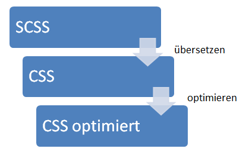
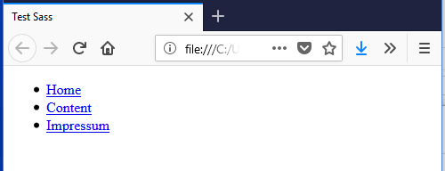
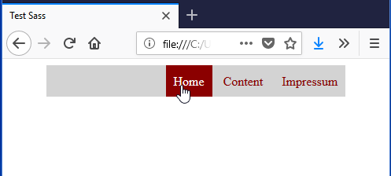

# 4.5.3 SCSS, Sass und Less

Es gibt zur Vereinfachung von CSS sogenannte Präprozessoren, denn die Pflege einer CSS-Datei wird mit zunehmender Größe komplexer und schwieriger. Präprozessoren ergänzen CSS um fehlende Eigenschaften, wie beispielsweise Variablen, Verschachtelung, Mixins, Vererbung, Operatoren und Funktionen. 

Bewährte Präprozessoren sind **Sass**, **Less** und das Sass-Derivat **SCSS**, das eine an CSS angelehnte Syntax hat und hier behandelt wird. Für SCSS wird auch ein [Sass-Compiler](http://sass-lang.com/install) benötigt. 

!!! note "Hinweis"
    In der Entwicklung wird der SASS-Interpreter oft automatisch beim Speichern einer SASS-Datei gestartet, so dass das CSS direkt bereitgestellt wird. Dies geschieht oft mit Frontend Build-Tools wie [Gulp](https://gulpjs.com/) oder [Grunt](https://gruntjs.com/).

Anstelle der direkten Erstellung einer CSS wird die Erstellung in SCSS vorgenommen und anschließend in CSS übersetzt. Danach kann eine Optimierung der CSS-Datei stattfinden.



Die folgenden Beispiele sind angelehnt an den [Sass Guide](http://sass-lang.com/guide).

## Kommentare in der SCSS-Syntax

Ein Ziel der Präprozessoren ist die Auslieferung einer schlanken CSS-Datei, da jedes eingesparte Byte an Sourcecode die Übertragungszeit verringert. Kommentare sind für die (Weiter-)Entwicklung einer CSS bzw. SCSS-Datei sehr sinnvoll. Aber bei der Übertragung der CSS-Datei an den Browser sind Kommentare überflüssige Zeichen.

- **SCSS-Syntax (`//`)**: Kommentare, die nicht in die CSS-Datei übernommen werden.
- **CSS-Syntax (`/* ... */`)**: Kommentare, die auch in der CSS-Datei enthalten sind.

```css linenums="1"
// Dies ist ein Kommentar in SCSS-Syntax 
// und er wird nicht in die CSS-Datei übernommen

/* Dies ist ein Kommentar in CSS-Syntax 
und er wird in die CSS-Datei übernommen */
```

## Variablen in der SCSS-Syntax

Variablen sind auch für CSS sehr sinnvoll, da bestimmte Werte immer wieder verwendet werden. Durch die Verwendung von Variablen müssen Änderungen nur an einer Stelle (und nicht mit copy&paste an vielen Stellen) vorgenommen werden. 

```css linenums="1"
$primary-font: Helvetica, sans-serif;
$primary-color: #333;

body {
    font: 100% $primary-font;
    color: $primary-color;
}
```

## Verschachteln

Eine an die HTML-Struktur angepasste Verschachtelung schafft eine gute Übersichtlichkeit, wie das folgende Beispiel zeigt. 

Gegeben sein ein HTML-Dokument mit einer Navigationsstruktur.

```html linenums="1"
<header>
  <nav>
    <ul>
      <li>
        <a href="#">Home</a>
      </li>
      <li>
        <a href="#">Content</a>
      </li>
      <li>
        <a href="#">Impressum</a>
      </li>
    </ul>
  </nav>
</header>
```

**Unformatiertes Beispiel**



**Formatiertes Beispiel**



So sieht die zugehörige Sass-Datei aus. Man kann sehr gut erkennen, dass die Verschachtelungsstruktur der HTML-Struktur sehr gut entspricht. 

```css linenums="1"
header {
  width: 80%;
  margin: 0 auto;
  vertical-align: middle;

  nav {
    background-color: lightgrey;

    ul {
      margin: 0;
      text-align: right;
      list-style-type: none;

      li {
        padding: 10px;
        margin: 0;
        display: inline-block;

        a {
          color: darkred;
          text-decoration: none;
        }

        &:hover {
          background-color: darkred;

          a {
            color: white;
          }
        }
      }
    }
  }
}
```

Die zugehörige CSS-Datei ist nicht mehr so leicht lesbar. Auch in der CSS-Datei kann man die HTML-Struktur natürlich wiederfinden. Problematisch wird es allerdings, wenn die Selektoren nicht so strukturiert untereinander stehen, denn man bedenke, dass dies nur ein ganz kleines Beispiel ist.

```css linenums="1"
header {
  width: 80%;
  margin: 0 auto;
  vertical-align: middle;
}

header nav {
  background-color: lightgrey;
}

header nav ul {
  margin: 0;
  text-align: right;
  list-style-type: none;
}

header nav ul li {
  padding: 10px;
  margin: 0;
  display: inline-block;
}

header nav ul li a {
  color: darkred;
  text-decoration: none;
}

header nav ul li:hover {
  background-color: darkred;
}

header nav ul li:hover a {
  color: white;
}
```

---

## Importieren von Dateien

Das Importieren von Teildateien erlaubt eine schöne Strukturierung in Unterverzeichnisse und Einzeldateien. Dateien die mit einem Unterstrich ( _ ) beginnen, sind sogenannte Partials und werden nicht in eigene CSS-Dateien übersetzt. Sie werden nur als "Importe" in normalen SCSS-Dateien verwendet. 

```css linenums="1"
// Importiert ./globals/_colors.scss
@import 'globals/colors';
```

---

## Mixins

Mixins sind Funktionen, die eine gute Wiederverwendbarkeit ermöglichen. Den Funktionen kann man Parameter übergeben. Im angegebenen Beispiel definieren wir das *@mixin border* (**Zeile 2**) für Rahmen um einen Bereich. Dieses Mixin wird mit *@include* in **Zeile 7** aufgerufen und der im Mixin definierte Variable *$radius* wird der Wert *10px* übergeben. 

```css linenums="1"
@mixin border($radius) {
    border: $radius dashed blue;
}

// Mixin anwenden
.box {
    @include border(10px);
}
```

---


## "Vererbung"

Die Vererbung ist nicht wie in anderen Programmiersprachen zu verstehen, da es keine Eigenschaften oder Objekte gibt. Hier heißt Vererbung, dass die z. B. in *.message* festgelegten Eigenschaften und Werte an andere Selektoren übertragen werden können. Im Beispiel erfolgt dies durch *@extend .message *(**Zeile 8**). Somit stehen die Eigenschaften und Werte nun auch in *.message-success* zur Verfügung und können dort weiter spezifiziert oder überschrieben werden. In dem Beispiel wird die Farbe "blue" durch "green" übersetzt. 

Die Vererbung in SCSS bedeutet also, das Eigenschaften von einem Selektor an einen anderen weiterzugeben.

```css linenums="1"
.message {
  border: 1px solid blue;
  padding: 10px;
  color: #333;
}

.message-success {
  @extend .message;
  border-color: green;
}
```

---

## Operatoren

Operatoren ermöglichen verständliche Darstellungen von Berechnungen.

Bei einem Wert in der CSS-Datei width: *62.5%* kann nicht nachvollzogen werden, wie der CSS-Entwickler auf diesen Wert gekommen ist. In SCSS hingegen kann width:* 300px / 960px * 100%* geschrieben werden und hierdurch kann de Berechnung verdeutlicht werden. 

```css linenums="1"
// SCSS
article {
  width: 300px / 960px * 100%;
}

/* Übersetzte CSS */
article {
  width: 62.5%;
}
```

---

## Vordefinierte Funktionen

SCSS bietet zahlreiche [vordefinierte Funktionen](https://sass-lang.com/documentation/modules/), z. B. zur Farbmanipulation oder Rundung:

```css linenums="1"
.high-light {
  color: lighten(#00ffff, 30%);
}

.sub-text {
  font-size: round(12 / 5)px;
}
```
---

## CSS-Dateien optimieren

Beim Übersetzen der SCSS-Datei in CSS gibt es verschiedene Optimierungsstufen:

- **nested**: Dies ist der SCSS-Default. Hier wird die CSS-Datei lesbar und gleichzeitig übersichtlich dargestellt.
- **expanded**: Expanded ist ein Programmierer-CSS-Stil, bei dem jede Eigenschaft und Regel eine Zeile einnimmt. Dies ergibt die längsten CSS-Dateien.
- **compact**: Jeder CSS-Selektor steht genau in einer Zeile. Aber Zeilenumbrüche und Leerzeichen bleiben enthalten. Hier kann man die CSS-Datei noch verstehen.
- **compressed**: enthält keinerlei überflüssige Zeichen mehr. Da auch Kommentare, Zeilenumbrüche und alle überflüssigen Leerzeichen entfernt wurden, ist diese Datei nicht mehr "lesbar".

Weitere Details in der [Sass-Dokumentation](https://sass-lang.com/documentation/#Output_Style).

!!! tip "Hinweis"
    Es gibt auch Online-Services, die optimierte CSS-Dateien wieder lesbar machen.
