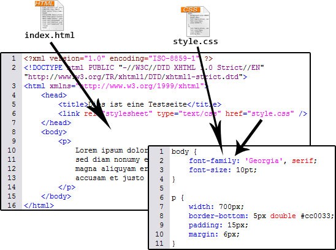

# 6 CSS

Gliederung

[6.1 Einführung in Cascading Style Sheets (CSS)](6.1_Einfuehrung_in_Cascading_Style_Sheets.md) 
[6.2 Grundlagen der CSS-Formatierung](6.2_Grundlagen_der_CSS_Formatierung.md) 
[6.3 Erweiterung der CSS-Formatierung](6.3_Erweiterung_der_CSS_Formatierung.md) 
[6.4 Positionieren von CSS-Elementen](6.4_Positionieren_von_CSS_Elementen.md) 
[6.5 CSS-Tipps](6.5_CSS_Tipps.md) 
[6.6 Selbsttest, Aufgabe und Zusammenfassung zum Kapitel CSS](6.6_Selbsttest_Aufgabe_und_Zusammenfassung_zum_Kapitel_CSS.md)   

**CSS (Cascading Style Sheets)** ist ein unverzichtbarer Standard, der vom [W3C](https://www.w3.org/) entwickelt wurde. Es ermöglicht, das Design und die Darstellung von HTML- oder XML-Dokumenten über einheitliche Formatvorlagen zu definieren. Professionelle Webseiten setzen konsequent auf CSS, um Inhalte optisch ansprechend und strukturiert zu präsentieren. Ohne Stylesheets wirken Webseiten oft leer und ungeordnet. In diesem Kapitel lernen wir CSS kennen und erfahren, wie wir CSS in unsere Webprojekte integrieren können.

Ein zentraler Vorteil von CSS ist die Trennung von Inhalt und Design: Während HTML die Struktur und den Inhalt eines Dokuments beschreibt, legt CSS fest, wie diese Inhalte dargestellt werden sollen. Man trennt hierbei quasi den Inhalt im HTML-Dokument von der optischen Gestaltung:

<figure>
  
  <figcaption>Aufteilung von Dokument und Stylesheet</figcaption>
</figure>

## Welches ist die aktuelle CSS-Version?

CSS wird kontinuierlich als **Living Standard** entwickelt, was bedeutet, dass es keine festen Versionsnummern wie "CSS4" gibt. Stattdessen werden neue Funktionen und Module nach ihrer Fertigstellung schrittweise hinzugefügt. Die aktuellsten Informationen zu CSS finden wir auf der [CSS-Übersichtsseite des W3C](https://www.w3.org/Style/CSS/).

### Wichtige moderne CSS-Module

Einige der bedeutendsten Entwicklungen im aktuellen CSS Living Standard umfassen:

- [**CSS Grid Layout**](https://developer.mozilla.org/en-US/docs/Web/CSS/CSS_Grid_Layout) 
  Ermöglicht flexible und präzise Layout-Strukturen mit Zeilen und Spalten.

- [**CSS Flexbox**](https://developer.mozilla.org/en-US/docs/Web/CSS/CSS_Flexible_Box_Layout) 
  Optimal für ein dynamisches Layout-Management, besonders bei responsiven Designs.

- [**CSS Custom Properties (Variablen)**](https://developer.mozilla.org/en-US/docs/Web/CSS/Using_CSS_custom_properties) 
  Einführung von Variablen in CSS, um Wiederverwendbarkeit und Wartbarkeit zu verbessern.

- [**CSS Scroll Snap**](https://developer.mozilla.org/en-US/docs/Web/CSS/CSS_Scroll_Snap) 
  Unterstützung für benutzerdefinierte Scroll-Positionen bei interaktiven Anwendungen.

- [**CSS Containment**](https://developer.mozilla.org/en-US/docs/Web/CSS/CSS_Containment) 
  Verbesserung der Performance durch Begrenzung von Stilen auf spezifische DOM-Elemente.

- [**CSS Subgrid**](https://developer.mozilla.org/en-US/docs/Web/CSS/CSS_Grid_Layout/Subgrid) 
  Erweiterung des Grid-Layouts für präzisere Kontrolle von verschachtelten Gitter-Layouts.

- [**CSS Houdini**](https://developer.mozilla.org/en-US/docs/Web/CSS/CSS_Houdini) 
  API zur Anpassung des Styling-Engines, um benutzerdefinierte Styling-Regeln zu implementieren.

Zusätzlich gibt es eine Vielzahl an experimentellen Features, die über [CSS Feature Queries](https://developer.mozilla.org/en-US/docs/Web/CSS/@supports) getestet werden können. Damit können wir prüfen, ob ein bestimmtes CSS-Feature vom Browser unterstützt wird, bevor es angewendet wird.

!!! info
    HTML ist mit seinen Attributen und Möglichkeiten schon etwas komplex. Aber CSS ist mit all seinen Regelwerken sehr komplex! Wer CSS gut beherrscht und auf dem aktuellen Stand ist, ist im Berufsleben sehr gefragt. Oder anders: Wenn wir einen wirklich guten CSS-Entwickler für unser Unternehmen suchen, dann sollten wir diesem Entwickler neben einem guten Gehalt auch ein sehr gutes Betriebsklima bieten.

---

## Live-Editor für CSS und HTML

Hier kannst du CSS- und HTML-Code eingeben, um direkt im Browser eine Vorschau zu sehen. Verwende die Textfelder unten, um deinen Code anzupassen. Klicke dann auf **Vorschau aktualisieren**, um das Ergebnis zu sehen.

  <!-- Eingabefeld für CSS -->
  <h3>CSS bearbeiten</h3>
  <textarea id="css-input" placeholder="Schreibe deinen CSS-Code hier..."></textarea>
  
  <!-- Eingabefeld für HTML -->
  <h3>HTML bearbeiten</h3>
  <textarea id="html-input" placeholder="Schreibe deinen HTML-Code hier..."></textarea>
  
  <!-- Button zur Aktualisierung -->
  <button id="update-preview">Vorschau aktualisieren</button>
  
  <!-- Vorschau Iframe -->
  <h3>Vorschau</h3>
  <iframe id="preview-frame"></iframe>

