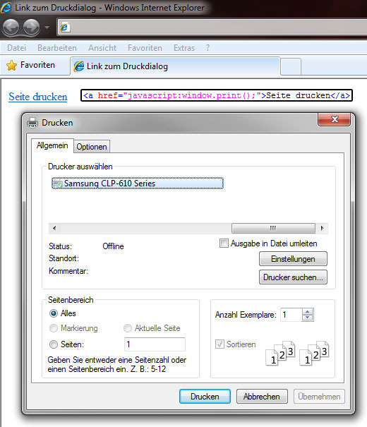

# 7.5.1 Navigieren mit JavaScript

Navigation innerhalb von Internetseiten ist nicht nur mit Hilfe der Navigationsleiste im Browser möglich.

<figure>
  
  <figcaption>Navigation im Firefox</figcaption>
</figure>

Auch JavaScript bietet Befehle, die Funktionalitäten wie „Zurück“, „Neu laden“ oder „Drucken“ abbilden.

---

## History-Objekte

Die History oder Chronik eines Browsers zeigt die Seiten, die der Benutzer in einem bestimmten Zeitabschnitt besucht hat. Mit dem JavaScript-Objekt `history` können Sie innerhalb dieser Chronik navigieren. Dazu gibt es die Funktionen `back()`, `forward()` und `go()`.

- **`back()`** – Mit `history.back()` springen Sie im Verlauf eine Seite nach hinten („zurück“).
- **`forward()`** – Mit `history.forward()` rücken Sie eine Seite nach vorne.
- **`go()`** – `history.go()` ist eine besondere Funktion, da sie noch einen Zahlen-Parameter erwartet, der angibt, wie viele Seiten zurück (negativer Parameter) oder vorwärts (positiver Parameter) gesprungen werden soll.
- **`go(0)`** – Mit `history.go(0)` laden Sie die Seite neu.

### Beispiel: Navigation
;;;html
<a href="javascript:history.back()">Zurück</a>
<a href="javascript:history.forward()">Vorwärts</a>
<a href="javascript:history.go(-2)">Vorletzte Seite</a>
<a href="javascript:history.go(0)">Neu laden</a>
;;;

---

## Drucken

Die Funktion `window.print()` bietet die Möglichkeit, den Druck-Dialog des Browserfensters zu starten. Dadurch erleichtern Sie dem Benutzer das Drucken der Website. Er muss nicht mehr über die Kontextmenüs zum Druck-Dialog gelangen.

<figure>
  
  <figcaption>Beispiel für einen Link auf den Druckdialog</figcaption>
</figure>
